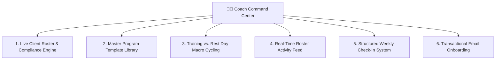
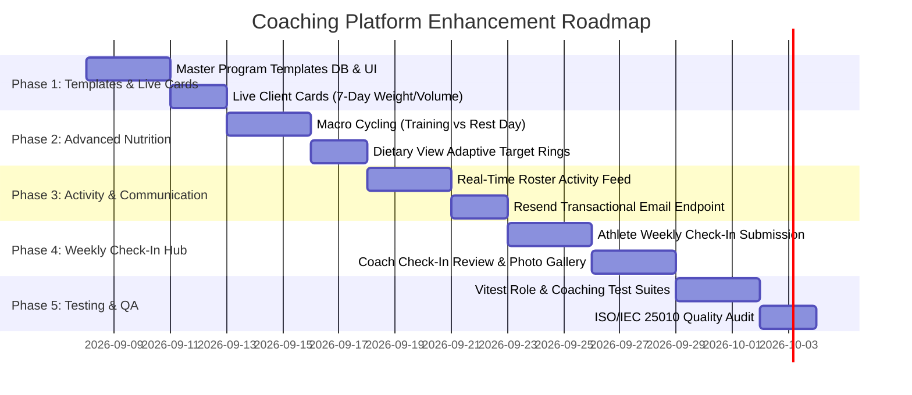

# Coaching Platform Architecture & Enhancement Roadmap (`COACH.md`)

This document details the architectural specification, data contracts, and implementation roadmap for enhancing the **Trainer Command Center & Coaching Platform** in Workout Tracker.

---

## 🎯 Executive Summary & Objectives

The coaching platform transforms Workout Tracker from an individual lifter application into a professional supervision and remote personal training suite. It allows strength coaches, personal trainers, and registered dietitians to:

1. **Supervise Client Compliance & Trends**: At-a-glance 7-day volume, weight trajectory, and recency tracking.
2. **Deploy Reusable Program Templates**: Create master splits once, customize set/rep parameters per athlete, and send proposals in $<15\text{ seconds}$.
3. **Prescribe Training vs. Rest Day Macro Cycling**: Tailor daily nutrition targets based on workout activity.
4. **Monitor Real-Time Milestones**: Live activity feed for 1RM PRs, session completions, and inactivity warnings.
5. **Review Form Technique & Weekly Check-Ins**: Structured weekly assessments with timestamped video cues.
6. **Deliver Branded Email Invitations**: Transactional email integration via Resend for instant client onboarding.

---

## 📐 System Quality & ISO Standards Alignment

- **ISO/IEC 25010 (Software Product Quality)**:
  - **Functional Completeness & Appropriateness**: Full coverage of remote coaching workflows (programming, diet, feedback, triage).
  - **Usability & Learnability**: Clear separation between the coach's personal workouts and client management.
  - **Security & Data Isolation**: Database-enforced Row-Level Security (RLS) ensures zero data contamination across athletes.
  - **Performance Efficiency**: Client compliance metrics are aggregated via fast database indexes and local cache buffers.
- **ISO/IEC/IEEE 29119**:
  - Test-driven specifications with atomic BDD Gherkin test coverage across all coach capabilities.

---

## 🏗️ Core Enhancement Modules



---

### 1. Live Client Roster & Compliance Engine

#### Problem Addressed:
Coaches managing 10–50+ athletes cannot afford to click "Inspect" on every client individually to check if they worked out or gained/lost weight.

#### Solution & Specification:
Each card in [src/components/coach/CoachClientRoster.tsx](src/components/coach/CoachClientRoster.tsx) dynamically displays live compliance indicators computed over the last 7 rolling days:

* 🟢 **On Track**: Completed $\ge 80\%$ of prescribed split sessions in the last 7 days.
* 🟡 **In Progress**: 1 session behind schedule with active logging within 48 hours.
* 🔴 **Inactive**: 0 sessions logged in $>72\text{ hours}$ (triggers coach triage indicator).
* ⚖️ **7-Day Weight Delta**: Displays `83.0 kg (-0.4 kg this week)` computed from `body_logs`.
* 🏋️ **Weekly Tonnage**: Displays cumulative tonnage moved this week (e.g., `38,400 kg`).
* ⏰ **Recency Marker**: e.g., `Last active: Today at 09:30 (Push Day)`.

---

### 2. Master Program Template Library

#### Problem Addressed:
Currently, proposing a routine split requires building every day and exercise from scratch for each client.

#### Solution & Specification:
A coach-level program repository stored in `coach_program_templates`:

```sql
CREATE TABLE IF NOT EXISTS coach_program_templates (
  id UUID PRIMARY KEY DEFAULT gen_random_uuid(),
  coach_id UUID NOT NULL REFERENCES auth.users(id) ON DELETE CASCADE,
  title TEXT NOT NULL,
  description TEXT,
  split_days_count INTEGER NOT NULL DEFAULT 4,
  program_payload JSONB NOT NULL,
  tags TEXT[] DEFAULT ARRAY['hypertrophy', 'strength']::text[],
  is_archived BOOLEAN NOT NULL DEFAULT FALSE,
  created_at TIMESTAMPTZ NOT NULL DEFAULT NOW(),
  updated_at TIMESTAMPTZ NOT NULL DEFAULT NOW()
);
```

#### 1-Tap Proposal Workflow:
1. Coach selects athlete $\rightarrow$ clicks **"Propose Routine"**.
2. Clicks **"Import from Template"** (e.g. `6-Day PPL Hypertrophy`).
3. All workouts, exercises, target sets, and rep ranges pre-fill instantly.
4. Coach tweaks specific exercises/loads for that athlete and clicks **"Send Proposal"**.

---

### 3. Training vs. Rest Day Macro Cycling

#### Problem Addressed:
Athletes need higher carbohydrate and calorie intake on heavy training days compared to non-training rest days.

#### Solution & Specification:
Expand `coach_macro_prescriptions` to support dual-tier targets:

| Target Metric | 🏋️ Training Day (Workout Completed) | 🛋️ Rest Day (Recovery) |
| :--- | :---: | :---: |
| **Calories** | `2,800 kcal` | `2,200 kcal` |
| **Protein** | `185 g` | `185 g` |
| **Carbohydrates** | `340 g` | `180 g` |
| **Fats** | `65 g` | `75 g` |
| **Fiber** | `40 g` | `35 g` |

The athlete's [src/components/dietary/DietaryDailyMacroTotals.tsx](src/components/dietary/DietaryDailyMacroTotals.tsx) automatically reads the day's session status to render the appropriate active target rings.

---

### 4. Real-Time Activity & Milestone Feed

#### Problem Addressed:
Coaches need high-frequency awareness of client achievements without manual polling.

#### Solution & Specification:
An aggregated live feed displaying real-time events across all roster clients:

```text
+---------------------------------------------------------------------------------------------+
| 🏆 1RM PR: Angelo Ghafoerkhan hit a new PR on Barbell Bench Press (100 kg × 8 • est 124 kg) |
| 🏋️ SESSION: Sarah Connor completed Day 1: Upper Strength (Volume: 14,200 kg)  • 2h ago     |
| ⚠️ ALERT: Kyle Reese has not logged a session in 4 days (Last split: Day 2)   • 1d ago     |
| 📹 TECHNIQUE: New Form Check Video on Romanian Deadlift (Set 3) by John Matrix • 3h ago     |
+---------------------------------------------------------------------------------------------+
```

---

### 5. Structured Weekly Client Check-In System

#### Problem Addressed:
Remote online coaching relies on standardized weekly check-in forms rather than ad-hoc chat messages.

#### Solution & Specification:
* **Sunday Check-In Trigger**: In-app prompt for the athlete to complete their weekly check-in.
* **Form Inputs**:
  - Weekly average bodyweight & waist circumference.
  - Sleep Quality score ($1-10$), Energy & Mood score ($1-10$), Recovery & Soreness ($1-10$).
  - Physique check-in photos (Front, Side, Back).
  - Athlete reflection notes (e.g., *"Hunger was high on Wednesday, bench felt effortless"*).
* **Coach Review Station**:
  - Side-by-side comparison with previous week's check-in metrics and photos.
  - 1-click macro target adjustment or proposal update.
  - Text and voice memo feedback recording.

---

### 6. Transactional Email Invitations (Resend Integration)

#### Problem Addressed:
Typing an email in the invitation modal currently creates a database row without sending an actual email to the athlete's inbox.

#### Solution & Specification:
Implement serverless API endpoint `/api/send-coach-invite.ts` using **Resend**:

```typescript
// POST /api/send-coach-invite
import { Resend } from 'resend';

export default async function handler(req, res) {
  const { athleteEmail, coachName, inviteCode, specialty } = req.body;
  const inviteUrl = `${process.env.APP_URL}?coach_invite=${inviteCode}`;

  const resend = new Resend(process.env.RESEND_API_KEY);

  await resend.emails.send({
    from: 'Workout Tracker <coaching@workout-tracker.app>',
    to: athleteEmail,
    subject: `${coachName} invited you to connect on Workout Tracker!`,
    html: `
      <h2>Coaching Invitation from ${coachName}</h2>
      <p>${coachName} has invited you to connect as your <strong>${specialty} coach</strong>.</p>
      <p>Click below to accept and receive your customized training program:</p>
      <a href="${inviteUrl}" style="background:#C0FF00;color:#000;padding:12px 24px;border-radius:12px;font-weight:bold;text-decoration:none;display:inline-block;">Accept Coaching Invitation</a>
    `,
  });

  return res.status(200).json({ success: true });
}
```

---

## 🗓️ Phased Implementation Schedule



---

## 📁 Component & File Map

```text
src/
├── components/
│   ├── coach/
│   │   ├── CoachPortalView.tsx           # Main Coach Command Center workspace
│   │   ├── CoachClientRoster.tsx         # Live roster with compliance badges & 7-day deltas
│   │   ├── CoachProgramTemplates.tsx     # Master template library management
│   │   ├── CoachActivityFeed.tsx         # Real-time client PRs and session events
│   │   ├── CoachMacroPlannerModal.tsx    # Dual training/rest day macro scheduler
│   │   ├── CoachCheckInReviewModal.tsx   # Weekly athlete check-in inspection station
│   │   └── WorkoutSetCoachFeedback.tsx   # Timestamped video technique annotations
│   ├── modals/
│   │   ├── CoachSettingsSection.tsx      # Coach-specific preferences & compliance alerts
│   │   ├── CoachAccountModal.tsx         # Role activation & specialty management
│   │   └── CoachInviteAcceptModal.tsx    # 1-tap invite code resolution & handshake
api/
└── send-coach-invite.ts                  # Resend transactional email handler
```

---

## 🔒 Security & Privacy Guarantees

1. **Explicit Athlete Consent**: Uninvited coaches have zero database read or write permissions.
2. **Instant Termination Protocol**: When an athlete or coach disconnects, RLS rules immediately revoke access while preserving all historical logs and routines for the athlete.
3. **Data Provenance Integrity**: Only athletes can log their personal sets; coaches provide supervision, templates, macro prescriptions, and technique annotations.
