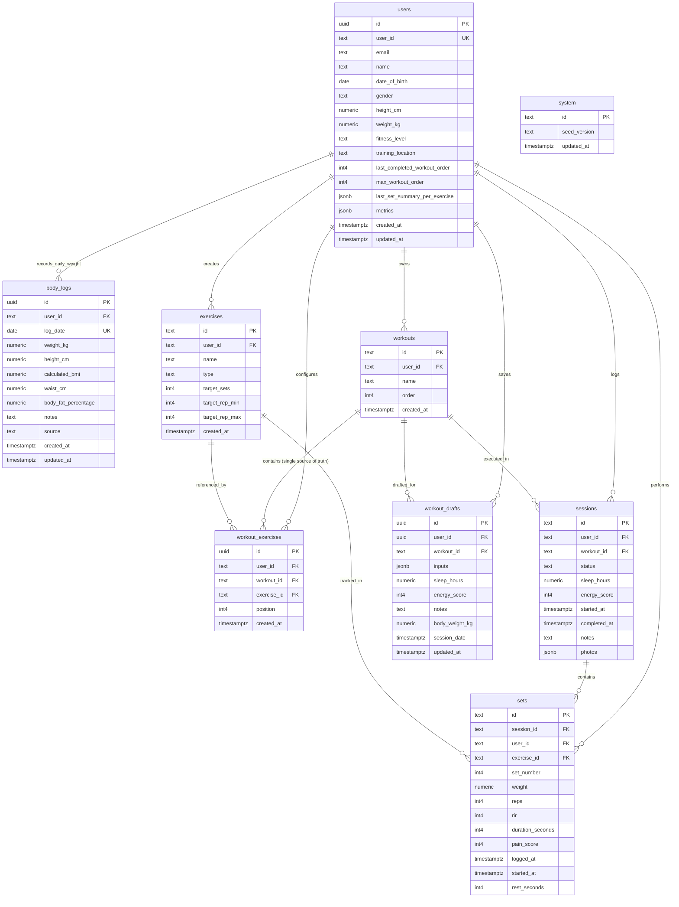

# Entity Relationship Diagram (ERD)

This document provides a comprehensive overview of the relational database schema, all entities, explicit attributes, data types, keys, and entity relationships for the Workout Tracker application.

---

## 📊 Visual Entity Relationship Diagram

---

## 🗄️ Tables & Attributes Specification

### 1. `users`
Represents athlete user accounts with **explicit profile & biometric columns**.

| Attribute | Data Type | Constraint | Description |
|---|---|---|---|
| `id` | `uuid` | **PK** | Internal unique identifier |
| `user_id` | `text` | **Unique / Indexed** | Supabase auth UID mapping |
| `email` | `text` | | User email address |
| `name` | `text` | | Athlete display name |
| `date_of_birth` | `date` | Nullable | Athlete birthdate |
| `gender` | `text` | Nullable | Gender identity (`male`, `female`, `other`, `prefer_not_to_say`) |
| `height_cm` | `numeric` | Nullable | Baseline height in centimeters |
| `weight_kg` | `numeric` | Nullable | Current baseline weight in kilograms |
| `fitness_level` | `text` | Nullable | Experience level (`beginner`, `intermediate`, `advanced`) |
| `training_location` | `text` | Nullable | Facility preference (`gym`, `home`, `hybrid`) |
| `last_completed_workout_order` | `int4` | Default `0` | Order index of the last completed workout split |
| `max_workout_order` | `int4` | Default `3` | Maximum split order before cycling back to Day 1 |
| `last_set_summary_per_exercise` | `jsonb` | | Fast write-through cache of latest exercise benchmarks |
| `metrics` | `jsonb` | | JSON fallback / extended biometric payload |
| `created_at` | `timestamptz` | Default `now()` | Timestamp of account creation |
| `updated_at` | `timestamptz` | Default `now()` | Timestamp of last profile modification |

---

### 2. `body_logs` (Daily Weight & BMI History)
Stores **time-series bodyweight and computed BMI entries** (1 unique entry per user per day).

| Attribute | Data Type | Constraint | Description |
|---|---|---|---|
| `id` | `uuid` / `text` | **PK** | Unique log record ID (`blog_{user_id}_{date}`) |
| `user_id` | `text` | **FK** $\rightarrow$ `users.user_id` | Athlete identifier |
| `log_date` | `date` | **UK (per user)** | Date of log (`YYYY-MM-DD`, unique with `user_id`) |
| `weight_kg` | `numeric` | Not Null | Bodyweight logged on this day in kg |
| `height_cm` | `numeric` | Nullable | Snapshot height used for BMI computation |
| `calculated_bmi` | `numeric` | Nullable | Historical BMI snapshot for this day |
| `waist_cm` | `numeric` | Nullable | Optional waist circumference measurement |
| `body_fat_percentage` | `numeric` | Nullable | Optional body fat % |
| `notes` | `text` | Nullable | Measurement reflection notes |
| `source` | `text` | Default `'profile'` | Origin (`'profile'`, `'workout_session'`, `'manual'`) |
| `created_at` | `timestamptz` | Default `now()` | Creation timestamp |
| `updated_at` | `timestamptz` | Default `now()` | Last modification timestamp |

---

### 3. `workouts`
Represents workout splits / routines (e.g., Day 1 Push, Day 2 Pull, Day 3 Legs).

| Attribute | Data Type | Constraint | Description |
|---|---|---|---|
| `id` | `text` | **PK** | Workout routine identifier (e.g. `w_1`) |
| `user_id` | `text` | **FK** $\rightarrow$ `users.user_id` | Owner athlete ID (or null for global defaults) |
| `name` | `text` | | Name of the workout routine |
| `order` | `int4` | | Sequence order index within the split cycle (1, 2, 3...) |
| `created_at` | `timestamptz` | Default `now()` | Creation timestamp |

> **Note:** Relational exercise ordering is managed entirely through `workout_exercises`.

---

### 4. `exercises`
Defines individual exercises, target parameters, and measurement types.

| Attribute | Data Type | Constraint | Description |
|---|---|---|---|
| `id` | `text` | **PK** | Exercise identifier (e.g. `ex_bench`) |
| `user_id` | `text` | **FK** $\rightarrow$ `users.user_id` | Owner athlete ID (or null for default exercises) |
| `name` | `text` | | Exercise name (e.g. "Barbell Bench Press") |
| `type` | `text` | | Movement type: `'strength'` or `'timed'` |
| `target_sets` | `int4` | | Recommended target set count |
| `target_rep_min` | `int4` | | Lower bound of rep target range |
| `target_rep_max` | `int4` | | Upper bound of rep target range |
| `created_at` | `timestamptz` | Default `now()` | Creation timestamp |

---

### 5. `workout_exercises`
**Single source of truth** connecting workouts to their ordered list of exercises.

| Attribute | Data Type | Constraint | Description |
|---|---|---|---|
| `id` | `uuid` | **PK** | Unique relation record ID |
| `user_id` | `text` | **FK** $\rightarrow$ `users.user_id` | User identifier |
| `workout_id` | `text` | **FK** $\rightarrow$ `workouts.id` | Target workout ID |
| `exercise_id` | `text` | **FK** $\rightarrow$ `exercises.id` | Target exercise ID |
| `position` | `int4` | | Execution sequence order (0, 1, 2...) |
| `created_at` | `timestamptz` | Default `now()` | Creation timestamp |

---

### 6. `sessions`
Logs workout execution instances (both in-progress and completed).

| Attribute | Data Type | Constraint | Description |
|---|---|---|---|
| `id` | `text` | **PK** | Session identifier (e.g. `s_1714000000000`) |
| `user_id` | `text` | **FK** $\rightarrow$ `users.user_id` | Athlete who performed the session |
| `workout_id` | `text` | **FK** $\rightarrow$ `workouts.id` | Workout routine executed |
| `status` | `text` | | Session state: `'in_progress'` or `'completed'` |
| `sleep_hours` | `numeric` | | Readiness sleep duration (hours) |
| `energy_score` | `int4` | | Athlete energy rating (1–10) |
| `started_at` | `timestamptz` | Default `now()` | Workout start timestamp |
| `completed_at` | `timestamptz` | Nullable | Workout finish timestamp |
| `notes` | `text` | Nullable | Session reflection / workout notes |
| `photos` | `jsonb` | Nullable | Array of uploaded progress photo URLs |

---

### 7. `sets`
Individual sets executed during a workout session.

| Attribute | Data Type | Constraint | Description |
|---|---|---|---|
| `id` | `text` | **PK** | Set identifier (e.g. `set_1714000000000_1`) |
| `session_id` | `text` | **FK** $\rightarrow$ `sessions.id` | Associated workout session |
| `user_id` | `text` | **FK** $\rightarrow$ `users.user_id` | Athlete identifier |
| `exercise_id` | `text` | **FK** $\rightarrow$ `exercises.id` | Exercise performed |
| `set_number` | `int4` | | Sequential set index (1, 2, 3...) |
| `weight` | `numeric` | Nullable | Weight lifted in kg (`null` for timed exercises) |
| `reps` | `int4` | Nullable | Repetitions completed (`null` for timed exercises) |
| `rir` | `int4` | Nullable | Reps in Reserve (0–4) |
| `duration_seconds` | `int4` | Nullable | Duration in seconds (for timed holds / planks) |
| `pain_score` | `int4` | Nullable | Pain / joint discomfort score (0–10) |
| `logged_at` | `timestamptz` | Default `now()` | Timestamp when set was recorded |
| `started_at` | `timestamptz` | Nullable | Start timestamp for assisted set execution |
| `rest_seconds` | `int4` | Nullable | Actual rest duration in seconds before next set |

---

### 8. `workout_drafts`
Local-first / autosaved draft sessions in progress.

| Attribute | Data Type | Constraint | Description |
|---|---|---|---|
| `id` | `uuid` | **PK** | Draft identifier |
| `user_id` | `uuid` | **FK** $\rightarrow$ `users.id` | Athlete identifier |
| `workout_id` | `text` | **FK** $\rightarrow$ `workouts.id` | Workout routine being drafted |
| `inputs` | `jsonb` | | Uncommitted set inputs and field state |
| `sleep_hours` | `numeric` | Nullable | Pre-workout readiness sleep hours |
| `energy_score` | `int4` | Nullable | Pre-workout energy rating |
| `notes` | `text` | Nullable | Draft workout notes |
| `body_weight_kg` | `numeric` | Nullable | Pre-filled / customized session bodyweight |
| `session_date` | `timestamptz` | Nullable | Scheduled or started date |
| `updated_at` | `timestamptz` | Default `now()` | Last autosave timestamp |

---

### 9. `system`
Global system state and seeding tracking.

| Attribute | Data Type | Constraint | Description |
|---|---|---|---|
| `id` | `text` | **PK** | System config key (e.g. `'singleton'`) |
| `seed_version` | `text` | | Applied database schema / seed version |
| `updated_at` | `timestamptz` | Default `now()` | Last updated timestamp |

---

## 🔗 Foreign Key & Cardinality Summary

1. **`users` (1) $\rightarrow$ (N) `workouts`**: A user can create and customize multiple workout routines.
2. **`users` (1) $\rightarrow$ (N) `exercises`**: A user can create custom exercises alongside defaults.
3. **`users` (1) $\rightarrow$ (N) `sessions`**: A user logs numerous workout sessions over time.
4. **`users` (1) $\rightarrow$ (N) `sets`**: Every recorded set is attributed directly to an athlete.
5. **`users` (1) $\rightarrow$ (N) `body_logs`**: One entry per day tracking weight changes and historical BMI.
6. **`workouts` (1) $\rightarrow$ (N) `workout_exercises` $\leftarrow$ (1) `exercises`**: Single source of truth junction connecting routines with ordered exercises.
7. **`workouts` (1) $\rightarrow$ (N) `sessions`**: Multiple workout execution logs reference a routine template.
8. **`sessions` (1) $\rightarrow$ (N) `sets`**: A session contains multiple completed sets across various exercises.
9. **`exercises` (1) $\rightarrow$ (N) `sets`**: An exercise has historical performance records across sessions.
10. **`workouts` (1) $\rightarrow$ (N) `workout_drafts`**: Temporary autosaved work-in-progress state.

