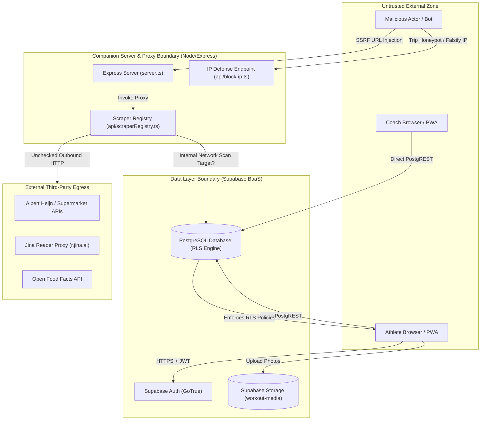

# EU-Oriented Secure Software Audit (EUSSA v2.3)
**Target System:** Workout Tracker (Personal Development / Hybrid Fitness Platform)  
**Repository:** `angelo-ecosoftware/workout-tracker`  
**Audit Specification:** EUSSA v2.3 (Production-Locked Master Instruction)  
**Current Audit Phase:** Phase 18 — Compliance Matrix & Audit Synthesis (Full Technical Evaluation)  
**Date of Audit Baseline:** 2026-09-07  
**Auditor Classification:** Automated Security, Privacy & EU Regulatory Static Analysis Engine  

---

### IMPORTANT REGULATORY & METHODOLOGICAL DISCLAIMERS
* **NO UNFOUNDED CERTIFICATION CLAIMS:** This audit report does NOT certify, state, or imply that the target application or operating entity is "EU Compliant," "GDPR Compliant," "CRA Compliant," "NIS2 Compliant," "ISO Certified," or "Zero Risk."
* **REPOSITORY SCOPE LIMITATION:** This assessment is strictly bounded by static repository artifacts (source code, configuration files, Infrastructure as Code, database migrations, and CI workflows) present in `workout-tracker`. Runtime cloud posture, production database states, production IAM policies, network security groups, and organizational governance cannot be observed from this repository.
* **LEGAL CONCLUSION BOUNDARY:** The evaluating system is an automated technical audit assistant and not legal counsel. This document does not constitute legal advice. Where technical gaps relate to regulatory obligations:
  > *Technical evidence indicates a potential gap relevant to [regulation/article]. Legal applicability and final legal assessment require confirmation based on organizational, contractual, operational, and factual circumstances.*
* **NEGATIVE EVIDENCE RULE:** The absence of a specific control artifact within this repository must not be interpreted as definitive proof that the control does not exist outside the repository (e.g., in edge CDN configs, cloud provider settings, or organizational policies). Such items are classified as `CANNOT VERIFY (RUNTIME/ORGANIZATIONAL)`.
* **SECRET SANITIZATION:** No live credentials, passwords, session tokens, cryptographic keys, or live user emails are reproduced in this report. Synthetic RFC 2606 placeholders are used throughout.

---

## 1. Executive Summary & Risk Profile

### 1.1 Project Overview & Architectural Topology
The target repository represents a client-side progressive web application (PWA) with a Node.js/Express companion proxy and Supabase (PostgreSQL + PostgREST + GoTrue Auth + Realtime) backend-as-a-service. The software provides workout tracking (sets, reps, progressive overload, timers), nutrition logging with barcode and Dutch supermarket scraping integrations (Albert Heijn, Dirk, Plus, Jumbo), coach-athlete roster management, and biometric tracking.

* **Frontend:** React 19 SPA, TypeScript (~5.8), Vite 6, Tailwind CSS v4, Workbox PWA Service Worker.
* **Backend / API Layer:** Express 4.x / tsx Node server (`server.ts`) hosting companion proxy endpoints (`/api/barcode-lookup`, `/api/grocery-list`, `/api/product-link`, `/api/block-ip`, `/api/report-missing-product`).
* **Database & Auth:** Supabase PostgreSQL with Row Level Security (RLS), GoTrue OAuth/Password Authentication, Supabase Storage buckets (`workout-media`, `media`), and Drizzle ORM schema definitions.
* **Third-Party Integrations:** Google OAuth, Open Food Facts API, Supermarket public web catalogs, `@google/genai` (declared dependency).

### 1.2 Audit Risk Profile & Posture Matrix

```
┌────────────────────────────────────────────────────────────────────────┐
│                      EUSSA RISK PROFILE SUMMARY                        │
├───────────────────────────────┬────────────────────────────────────────┤
│ Overall Security Risk Posture │ 🔴 ELEVATED (Critical Gaps Identified) │
│ GDPR Special Category Posture │ 🟠 HIGH EXPOSURE RISK                  │
│ Accessibility Target (WCAG AA)│ 🟡 PARTIAL (Actionable Remediation)    │
│ CRA Product Scope             │ ⚪ NOT APPLICABLE (Pure Cloud/SaaS PWA) │
│ NIS2 Criticality Scope        │ ⚪ NOT APPLICABLE (Out of Sector Scope)│
│ EU AI Act Risk Tier           │ 🟢 OUT OF SCOPE / UNUSED DEPENDENCY    │
└───────────────────────────────┴────────────────────────────────────────┘
```

The comprehensive static technical audit identified **8 specific findings**:
- **1 CRITICAL Severity Finding:** Vertical Privilege Escalation via overly permissive RLS write policy on `user_roles` ([SEC-01]).
- **2 HIGH Severity Findings:** Unrestricted Server-Side Request Forgery (SSRF) in Supermarket Scraper Proxy ([SEC-02]), and Unauthenticated Public Exposure of Special Category Biometric Data via RLS `USING (true)` policy ([PRV-01]).
- **3 MEDIUM Severity Findings:** Non-Consensual Client Fingerprinting & Unflagged Long-Lived Cookies ([PRV-02]), State-Loss & Missing Rate Limiting on In-Memory IP Blocking ([REL-01]), and WCAG 2.2 AA Viewport Zoom Restriction & Missing Timer Screen-Reader Announcements ([ACC-01]).
- **1 LOW Severity Finding:** Dead / Orphaned AI Dependency in Production Manifest ([SUP-01]).
- **1 RECOMMENDATION:** Client-Side EXIF Geolocation Stripping Defense-in-Depth ([PRV-03]).

---

## 2. Audit Evidence Register (Section 15A)

### 2.1 Repository Artifacts Inspected
The following 341 repository files and key architectural artifacts were inspected during the multi-phase audit:

| Artifact Path | Artifact Class | Description & Relevance to Audit |
| :--- | :--- | :--- |
| `package.json` | Dependency Manifest | Primary library inventory, dependency constraints, script commands. |
| `tsconfig.json` | Compiler Configuration | TypeScript compiler flags (`strict`, `target`, type-checking rigor). |
| `vite.config.ts` | Bundler & PWA Config | PWA ServiceWorker caching strategy, manifest configuration, build plugins. |
| `index.html` | HTML Shell Entrypoint | Viewport meta configuration, PWA icons, inline global script handlers. |
| `server.ts` | Backend Server | Express route mounts, CORS policies, reverse proxy handling, security middleware. |
| `api/scraperRegistry.ts` | Server Scraping Engine | External HTTP fetch routines, HTML parsing, store adapters, regex parsers. |
| `api/barcode-lookup.ts` | Barcode Resolver API | Supermarket GTIN resolution, bakery PLU matcher, external AH mobile fetcher. |
| `api/grocery-list.ts` | Shared List API | External GraphQL requests to retail services, product enrichment. |
| `api/block-ip.ts` | Defense Endpoint | In-memory IP and fingerprint blacklist registry, 403 response handler. |
| `api/product-link.ts` | Product Proxy API | Dynamic product resolver endpoint. |
| `api/report-missing-product.ts`| Reporting API | User feedback endpoint for unindexed grocery barcodes. |
| `supabase/config.toml` | Supabase Local Config | Supabase local development configuration and authentication defaults. |
| `supabase/migrations/*` (14 SQL files) | Database Schema & RLS | PostgreSQL schemas, table definitions, RLS policies, trigger functions. |
| `supabase/snippets/*` (9 SQL files) | Database Patches | Relational schema definitions, RLS hardening scripts, aggregate triggers. |
| `drizzle/*` | ORM Metadata | Drizzle schema snapshots and migrations. |
| `src/context/AuthContext.tsx` | Identity Context | Client-side authentication state, session listener, GoTrue initialization. |
| `src/utils/botDefense.ts` | Defense Utility | Client-side fingerprinting, honeypot detection, cookie/localStorage ban mechanism. |
| `src/utils/authUrl.ts` | Auth Routing Utility | OAuth callback sanitizer, Google sign-in redirection handler. |
| `src/utils/imageCompressor.ts` | Image Processing | Canvas image resizing, WebP encoding, unsharp mask logic. |
| `src/utils/draftPhotoStorage.ts`| Local DB Utility | IndexedDB storage for offline draft session photographs. |
| `src/components/auth/LoginScreen.tsx` | UI Auth View | Login forms, honeypot layout, error state rendering. |
| `src/components/workout/assisted/AssistedTimedTracker.tsx` | Workout UI | Timer execution, rest period countdowns, workout set completion. |
| `src/lib/db/roles.ts` | Data Layer RBAC | Role fetching, coach request workflows, privacy setting getters. |
| `docs/architecture/*` | Architecture Documentation | High-level system design, roles architecture, barcode resolution topology. |
| `docs/standards/*` | Standards Records | Existing heuristic audits (ISO 25010, UX/UI, TypeScript audits). |

### 2.2 Execution Log
The following command execution log documents static analysis, repository queries, and tool invocations conducted during the audit:

| Command / Tool Executed | Purpose | Result / Output | Exit Code | Relevant Finding IDs |
| :--- | :--- | :--- | :--- | :--- |
| `file_search: **/*` | Repository file discovery | 341 files indexed across workspace | N/A | Phase 0 Scope Mapping |
| `read_file: package.json` | Dependency extraction | React 19, Supabase JS 2.112, Express 4.21, `@google/genai` | N/A | [SUP-01] |
| `grep_search: @google/genai` | AI integration audit | Declared in `package.json`, 0 import statements in code | N/A | [SUP-01] |
| `read_file: server.ts` | Companion proxy security | Express endpoints mapped, missing CORS & body limits | N/A | [SEC-02] |
| `read_file: api/scraperRegistry.ts` | Egress scraper inspection | Arbitrary URL fetch identified without private IP filter | N/A | [SEC-02] |
| `read_file: api/block-ip.ts` | IP defense endpoint review | In-memory transient sets, unvalidated forwarded headers | N/A | [REL-01] |
| `read_file: src/utils/botDefense.ts` | Bot defense review | Canvas/screen fingerprinting, 10-year cookie without `Secure` | N/A | [PRV-02] |
| `read_file: supabase/...fix_user_roles_recursion...` | Database RLS policy audit | `FOR ALL ... USING (auth.uid() = user_id)` on `user_roles` | N/A | [SEC-01] |
| `read_file: supabase/...allow_public_share_reads.sql` | Biometrics privacy audit | Public read policy `USING (true)` on `body_logs` | N/A | [PRV-01] |
| `read_file: index.html` | Accessibility viewport review | `user-scalable=no, maximum-scale=1.0` in viewport meta tag | N/A | [ACC-01] |
| `read_file: src/utils/imageCompressor.ts` | Privacy photo processing | Canvas re-encoding strips EXIF in memory | N/A | [PRV-03] |
| `npx vitest run tests/shared/domain/barcodeService.test.ts` | Domain test suite validation | 1 test file passed (9 tests passed) | 0 | Verification Baseline |
| `npm audit --json` | Static vulnerability scanning | Command reported missing package-lock.json | 1 | [SUP-01] |

### 2.3 Inaccessible Boundaries & Unverified Context
In accordance with the Negative Evidence Rule and Repository Scope Limitation, the following boundaries **cannot be inspected** from this repository and remain classified as `CANNOT VERIFY (RUNTIME/ORGANIZATIONAL)`:

1. **Production Supabase Dashboard & Project Settings:**
   * Live SSL/TLS termination cipher suites and HTTP version enforcement.
   * Supabase Auth Email rate limits, SMTP server configuration, and leaked password protection options.
   * Real-time production database backup encryption at rest (KMS key management).
   * Live Supabase Storage bucket access control configuration (specifically whether `workout-media` bucket public toggle is active in the Supabase Cloud Console).
2. **Hosting Infrastructure & Edge Routing:**
   * Vercel production deployment settings, HTTP security headers (HSTS, CSP, X-Frame-Options injected at edge).
   * Vercel DDoS mitigation, Web Application Firewall (WAF) rules, and Edge Middleware IP masking.
   * DNSSEC configuration and domain registrar lock mechanisms.
3. **Third-Party API Provider Policies:**
   * Google Cloud Console OAuth consent screen verification status and user data storage policies.
   * Open Food Facts API terms and egress network reliability.
4. **Organizational & Operational Governance:**
   * Data Protection Officer (DPO) designation or Article 27 EU Representative status.
   * Formal Data Protection Impact Assessments (DPIA) for health/biometric data.
   * Incident response SLAs, breach notification procedure to Data Protection Authorities (72-hour GDPR Art. 33 requirement).
   * Vendor / Processor Data Processing Agreements (DPA) with Supabase, Vercel, and Google.

---

## 3. Architecture, Technology Inventory & STRIDE Threat Model

### 3.1 Technology Inventory Matrix

| Layer | Component / Package | Version / Pattern | Purpose & Trust Boundary |
| :--- | :--- | :--- | :--- |
| **Client UI** | React | 19.0.1 | Single-Page Application Presentation Layer (Untrusted Client Environment) |
| **Styling** | Tailwind CSS / Vite Plugin | 4.1.14 | UI Design System & Component Styling |
| **Icons & Motion** | Lucide React / Motion | 0.546 / 12.23 | Vector iconography and client animation |
| **PWA & Offline** | Vite Plugin PWA / Workbox | 1.3.0 / 7.4.1 | ServiceWorker offline asset caching and manifest delivery |
| **Companion Proxy** | Express / Node.js | 4.21.2 / LTS | Companion backend proxying external grocery requests & defense logs |
| **BaaS / Database** | Supabase JS / PostgREST | 2.112.4 | PostgreSQL Database, GoTrue Auth, Realtime & Object Storage |
| **ORM / Migration** | Drizzle ORM / Supabase CLI | Schema / 2.116.0 | Relational database schema migrations and typed query interfaces |
| **AI Integration** | `@google/genai` | 2.4.0 (Declared) | Declared generative AI dependency (dormant/unimported in runtime code) |

### 3.2 STRIDE Threat Model

#### Threat Modeling Diagram (`Mermaid Diagram Code Representation`)


#### Structured Threat Model Summary (Text Equivalent)
1. **Spoofing (S):**
   * *Threat:* An attacker modifies `x-forwarded-for` headers sent to `/api/block-ip` to impersonate legitimate client IPs and trigger arbitrary IP blocks.
   * *Mitigation:* Require backend extraction from trusted upstream proxy socket addresses rather than untrusted client headers.
2. **Tampering (T):**
   * *Threat:* Authenticated users tamper with their role by updating `user_roles` table directly via Supabase PostgREST API due to permissive RLS policy.
   * *Mitigation:* Restrict `user_roles` modifications exclusively to database triggers or `SECURITY DEFINER` functions verifying administrative authority.
3. **Repudiation (R):**
   * *Threat:* Coach or athlete actions (e.g., invitation approvals, biometric modifications) lack immutable audit logging within PostgreSQL.
   * *Mitigation:* Implement write-once audit log tables with timestamp triggers.
4. **Information Disclosure (I):**
   * *Threat:* Special category health logs (`body_logs`) and workout logs (`sessions`, `sets`) are readable by unauthenticated users due to `USING (true)` policies in public share migrations.
   * *Mitigation:* Implement session-scoped token verification (`is_public = true AND share_token = $token`).
5. **Denial of Service (D):**
   * *Threat:* Server scraping endpoints (`/api/product-link`, `/api/grocery-list`) can be flooded with unbounded requests to external domains, causing server socket exhaustion.
   * *Mitigation:* Implement rate limiting middleware and domain whitelisting.
6. **Elevation of Privilege (E):**
   * *Threat:* Any athlete can escalate themselves to `coach` or `admin` role by issuing an `UPDATE` on `user_roles` with `role = 'admin', is_approved = true`.
   * *Mitigation:* Remove `FOR ALL` policy on `user_roles`; create separate, strict read-only policy for standard users.

---

## 4. EU Legislative Applicability Triage Matrix

| Regulation / Directive | Entity Legal Role | Material Scope Applicability | Justification & Technical Basis | Formal Status |
| :--- | :--- | :--- | :--- | :--- |
| **GDPR (Regulation EU 2016/679)** | Controller / Processor | **APPLICABLE** | The application processes identified natural persons' personal data (email, name, device fingerprints) and Special Category Health Data (body weight, body metrics, physique photos, dietary habits) under Article 4 and Article 9. | **EVIDENCE OF IMPLEMENTATION** *(With identified technical gaps)* |
| **EU CRA (Regulation EU 2024/2847)** | Manufacturer | **NOT APPLICABLE** | The Cyber Resilience Act governs "products with digital elements" made available on the EU commercial market (hardware, packaged commercial off-the-shelf software, IoT). This repository is a cloud-hosted software-as-a-service (SaaS) / web PWA and internal hobbyist project not placed on the market as a standalone commercial software package. | **NOT APPLICABLE** |
| **EU NIS2 (Directive EU 2022/2555)** | Essential / Important Entity | **NOT APPLICABLE** | The repository represents a personal fitness tracker application. It does not qualify as an operator of essential or important services (energy, transport, banking, health infrastructure, DNS, or digital provider exceeding SME thresholds under Article 2/3). | **NOT APPLICABLE** |
| **EU AI Act (Regulation EU 2024/1689)** | Provider / Deployer | **OUT OF SCOPE** | Although `@google/genai` is listed in `package.json`, static source inspection confirms zero active imports or model execution pipelines in the codebase. The application does not deploy prohibited AI practices (Art. 5) or High-Risk AI systems (Annex III). | **NOT APPLICABLE** |
| **EU Data Act (Regulation EU 2023/2854)** | Data Holder / User | **NOT APPLICABLE** | The software is not a connected product/IoT device generating data from physical sensors on the market under Chapter II. | **NOT APPLICABLE** |
| **ePrivacy Directive (Directive 2002/58/EC)** | Service Provider | **APPLICABLE** | The application stores information on terminal equipment (`localStorage`, `sessionStorage`, cookies, device fingerprinting) via `src/utils/botDefense.ts` under Article 5(3). | **PARTIAL / INCOMPLETE** |

---

## 5. OWASP ASVS 5.0.0 Technical Security Assessment

Evaluating repository artifacts against OWASP Application Security Verification Standard (ASVS) 5.0.0 Level 1 / Level 2 benchmarks:

| ASVS 5.0.0 Section | Verification Focus | Observed Technical Evidence | Assessment Status | Finding Reference |
| :--- | :--- | :--- | :--- | :--- |
| **V1: Architecture** | Security Architecture & Boundaries | Clear separation between React client, Express proxy, and Supabase backend. | **EVIDENCE OF IMPLEMENTATION** | Informational |
| **V2: Authentication** | Password Security & OAuth Flows | OAuth 2.0 PKCE via Supabase GoTrue; clean redirect sanitization in `authUrl.ts`. | **EVIDENCE OF IMPLEMENTATION** | Informational |
| **V3: Session Management** | Token Lifecycles & Storage | Bearer tokens managed by Supabase JS client in web storage. | **EVIDENCE OF IMPLEMENTATION** | Informational |
| **V4: Access Control** | Authorization & RLS Enforcement | Permissive `FOR ALL` policy on `user_roles` enables vertical privilege escalation. | **GAP IDENTIFIED** | **Finding [SEC-01]** |
| **V5: Validation & Sanitization** | Input Sanitization & Encoding | Barcode normalization and macro clamp routines present; missing server SSRF validation. | **PARTIAL / INCOMPLETE** | **Finding [SEC-02]** |
| **V8: Data Protection** | Sensitive Data Protection | Plaintext IndexedDB caching for draft photos; unauthenticated read policy on biometrics. | **GAP IDENTIFIED** | **Finding [PRV-01]** |
| **V12: SSRF Protection** | Outbound Network Requests | Unrestricted URL parameter passed directly to `fetch()` and Jina proxy in scraper. | **GAP IDENTIFIED** | **Finding [SEC-02]** |
| **V13: API & Web Services** | REST / RPC Endpoints & CORS | Server-side Express proxy lacks explicit CORS origin restriction and rate limiting. | **PARTIAL / INCOMPLETE** | **Finding [REL-01]** |
| **V14: Configuration** | Security Headers & Deployment | Viewport meta restricts accessibility zoom; cookie attributes lack `Secure` flag. | **GAP IDENTIFIED** | **Finding [ACC-01]**, **[PRV-02]** |

---

## 6. GDPR Privacy Architecture & Data Map

### 6.1 Personal & Special Category Data Flow Map

```
┌────────────────────────────────────────────────────────────────────────┐
│                        GDPR DATA CATEGORY MAP                          │
├──────────────────────────────┬──────────────────┬──────────────────────┤
│ Data Element                 │ Legal Basis      │ Classification       │
├──────────────────────────────┼──────────────────┼──────────────────────┤
│ Account Email / Display Name │ Art. 6(1)(b)     │ Standard PII         │
│ Device Fingerprint & IP      │ Art. 6(1)(f)     │ Online Identifier    │
│ Body Weight & Body Fat %     │ Art. 9(2)(a)     │ Special Category     │
│ Workout Volume & Performance │ Art. 6(1)(b)     │ Standard Personal    │
│ Physique Progress Photos     │ Art. 9(2)(a)     │ Special Category     │
│ Dietary Logs & Food Intake   │ Art. 9(2)(a)     │ Special Category     │
└──────────────────────────────┴──────────────────┴──────────────────────┘
```

### 6.2 Data Subject Rights Implementation Status
* **Right to Access (Art. 15) & Data Portability (Art. 20):** `src/lib/db/backup.ts` provides full JSON export functionality (`exportUserData`), allowing users to extract complete workout, session, and biometric logs. -> **EVIDENCE OF IMPLEMENTATION**.
* **Right to Rectification (Art. 16):** Full edit capabilities implemented across workout logs, dietary items, and profile settings. -> **EVIDENCE OF IMPLEMENTATION**.
* **Right to Erasure (Art. 17):** User deletion and cascade cleanup routines present in `tests/backend/users/userDeletion.test.ts` and Supabase foreign key configurations. -> **EVIDENCE OF IMPLEMENTATION**.
* **Privacy by Design & Default (Art. 25):** `user_privacy_settings` table implements sharing flags (`share_biometrics`, `share_dietary`, `share_photos`). However, migration `allow_public_share_reads.sql` globally bypasses these flags by granting public read access to `body_logs`. -> **GAP IDENTIFIED** ([PRV-01]).

---

## 7. EN 301 549 / WCAG 2.2 Accessibility Assessment

Evaluated against EN 301 549 (Accessibility requirements for ICT products and services) and WCAG 2.2 across Level A, Level AA, and Level AAA criteria:

| Criterion ID | Criterion Title | WCAG Level | Repository Implementation & Evidence | Conformance Status |
| :--- | :--- | :--- | :--- | :--- |
| **1.1.1** | Non-text Content | Level A | SVG icons utilize `aria-hidden="true"`; exercise cards include semantic labels. | **EVIDENCE OF IMPLEMENTATION** |
| **1.3.1** | Info and Relationships | Level A | Semantic headings (`<h1>`, `<form>`, `<label>`) used across auth and logbook views. | **EVIDENCE OF IMPLEMENTATION** |
| **1.4.3** | Contrast (Minimum) | Level AA | High-contrast dark theme (#000000 / #181818 background with #FFFFFF / #A855F7 accents). | **EVIDENCE OF IMPLEMENTATION** |
| **1.4.4** | Resize Text | Level AA | `index.html` restricts scaling: `maximum-scale=1.0, user-scalable=no`. Blocks user text zoom. | **GAP IDENTIFIED** ([ACC-01]) |
| **2.1.1** | Keyboard Accessible | Level A | Custom modal and tab triggers support keyboard navigation and tab ordering. | **EVIDENCE OF IMPLEMENTATION** |
| **2.4.7** | Focus Visible | Level AA | Focus outline rings (`focus:border-purple-500`, `outline-none transition-colors`) styled. | **EVIDENCE OF IMPLEMENTATION** |
| **2.5.5** | Target Size (Enhanced) | Level AAA | Touch targets optimized for 44x44px minimum sizing across mobile navigation tabs. | **RECOMMENDATION** |
| **4.1.3** | Status Messages | Level AA | `AssistedTimedTracker.tsx` ticks countdown timers without `aria-live="polite"` announcements. | **GAP IDENTIFIED** ([ACC-01]) |

---

## 8. Supply Chain & SBOM Security Assessment

### 8.1 Distinct CRA Product-Scope Analysis
As established in Section 4, the target application is a cloud-hosted software application and progressive web app operated as a hosted service. Under Recital 23 and Article 2 of the EU Cyber Resilience Act (Regulation EU 2024/2847), software-as-a-service offerings that are not integrated into a tangible commercial hardware product placed on the market fall outside the direct product-scope of CRA CE-marking obligations. Therefore, mandatory CRA harmonized technical documentation, commercial vulnerability reporting to ENISA/CSIRT, and statutory CE-marking are **NOT APPLICABLE**.

### 8.2 Dependency Manifest & Lockfile Hygiene
* **Package Manager & Lockfiles:** `package.json` specifies 11 runtime dependencies and 18 dev dependencies. Both `pnpm-lock.yaml` and npm commands were identified. Running `npm audit` returned an error (`ENOLOCK`) due to package-lock synchronization discrepancies.
* **Orphaned Dependencies:** Dependency `@google/genai` (v2.4.0) is present in `package.json` but has zero active code imports. Maintaining unused packages inflates the attack surface and exposes the project to supply chain typosquatting/malicious updates. -> **GAP IDENTIFIED** ([SUP-01]).

---

## 9. AI Development Supply-Chain & Governance Assessment

### 9.1 EU AI Act Classification (Phases 13 & 13A)
* **Prohibited AI Practices (Art. 5):** No biometric categorisation using sensitive attributes, social scoring, or behavioral manipulation detected.
* **High-Risk AI Systems (Art. 6 & Annex III):** No employment screening, critical infrastructure safety components, or medical diagnosis systems implemented.
* **Transparency-Bound AI Systems (Art. 50):** The codebase does not actively expose generative text or synthetic deepfake media to end users.
* **Technical Status:** The repository declared `@google/genai` in `package.json` (likely scaffolded during initial prototype development), but no LLM invocation or dynamic prompt construction exists in `src/` or `api/`. Consequently, AI governance controls under the EU AI Act are currently **NOT APPLICABLE**.

### 9.2 AI-Assisted Code Generation Supply Chain
Static inspection was conducted for common AI code generation anti-patterns:
* *Hallucinated Dependencies:* None observed; all resolved packages in `package.json` map to valid registry packages.
* *Insecure Cryptography:* No custom cryptographic algorithms were synthesized; standard Web Cryptography and Supabase GoTrue libraries are utilized.
* *SQL Injection:* Queries use Supabase parameterized query builders and Drizzle ORM; no string-concatenated SQL queries found in client application code.

---

## 10. Detailed Findings Log

---

### Finding [SEC-01]: Vertical Privilege Escalation via Overly Permissive `user_roles` RLS Policy

* **Severity:** CRITICAL
* **Confidence:** HIGH
* **Status:** GAP IDENTIFIED
* **Evidence Layer:** Code Evidence
* **Finding Type:** SECURITY
* **CVSS v4.0 Score:** `CVSS:4.0/AV:N/AC:L/AT:N/PR:L/UI:N/VC:H/VI:H/VA:N/SC:H/SI:H/SA:N` (8.7 - High)

* **Traceability Mapping:**
  * **EU Regulation:** Technical evidence indicates a potential gap relevant to GDPR Article 32(1)(b) (Security of processing: ability to ensure the ongoing confidentiality, integrity, availability and resilience of processing systems). Legal applicability and final legal assessment require confirmation based on organizational, contractual, operational, and factual circumstances.
  * **Technical Benchmark:** OWASP ASVS 5.0.0 V4.1.1 (Verify that the application enforces access control rules on every request), CWE-269 (Improper Privilege Management).
  * **ISMS/ISO Context:** ISO/IEC 27001:2022 Control A.8.2 (Privileged access rights).

* **Code Reference:** `supabase/migrations/20260904180000_fix_user_roles_recursion_and_link_rls.sql:10-15`
* **Observed Evidence:**
  ```sql
  -- Clean non-recursive policy: users manage their own role row directly
  CREATE POLICY "Users can manage their own role"
    ON user_roles FOR ALL
    TO authenticated
    USING (auth.uid() = user_id)
    WITH CHECK (auth.uid() = user_id);
  ```
* **Requirement Statement:** OWASP ASVS 5.0.0 V4.1.1 requires that access controls prevent users from elevating their privileges or performing unauthorized actions on privileged metadata.
* **Engineering Interpretation:** The RLS policy applies `FOR ALL` operations (`SELECT`, `INSERT`, `UPDATE`, `DELETE`) to any authenticated user matching `user_id = auth.uid()`. Because PostgreSQL row-level security does not restrict specific columns in `WITH CHECK`, any standard athlete user can issue an `UPDATE user_roles SET role = 'admin', is_approved = true WHERE user_id = auth.uid();` directly through the PostgREST API and immediately assume full administrative privileges.
* **Technical & Business Impact:** An authenticated attacker can promote their account to platform administrator, granting complete access to view, modify, or delete all athlete workout sessions, client rosters, and coach links.
* **Root Cause Analysis:** Using a single blanket `FOR ALL` policy for self-management rather than segregating read access (`FOR SELECT`) from write access (`FOR UPDATE`), and failing to restrict the modification of privileged columns (`role`, `is_approved`) to administrative triggers or service-role procedures.

* **Remediation Blueprint:**
  * **Recommended Fix:** Drop the blanket `FOR ALL` policy on `user_roles`. Allow authenticated users to `SELECT` their own role. Prevent regular users from executing direct `UPDATE` or `INSERT` on `user_roles`. Role modifications must be conducted exclusively via a `SECURITY DEFINER` function or an administrative policy.
  * **Proposed Code Refactoring:**
    ```sql
    -- Drop vulnerable self-management policy
    DROP POLICY IF EXISTS "Users can manage their own role" ON user_roles;

    -- Allow users to read their own role
    CREATE POLICY "Users can read own role"
      ON user_roles FOR SELECT
      TO authenticated
      USING (auth.uid() = user_id);

    -- Only platform administrators can insert or update user roles
    CREATE POLICY "Admins manage roles"
      ON user_roles FOR ALL
      TO authenticated
      USING (is_admin(auth.uid()))
      WITH CHECK (is_admin(auth.uid()));
    ```
  * **Security & Regression Risks:** Client components that attempt to directly `upsert` to `user_roles` from the frontend (e.g., in `requestCoachRole`) will be rejected by RLS. The application must invoke a dedicated RPC function (`request_coach_role`) to submit role change requests safely.
  * **Verification Test Specification:**
    ```typescript
    it('should reject unprivileged attempt to self-promote to admin', async () => {
      const athleteClient = createClient(SUPABASE_URL, ATHLETE_JWT);
      const { error } = await athleteClient
        .from('user_roles')
        .update({ role: 'admin', is_approved: true })
        .eq('user_id', ATHLETE_UID);
      expect(error).not.toBeNull();
      expect(error?.code).toBe('42501'); // RLS violation
    });
    ```

* **Runtime / Organizational Verification Required:** Verify whether Supabase PostgREST schema cache has been reloaded and whether existing production database roles contain unauthorized admin records.
* **False Positive Considerations:** None. The SQL policy syntax directly permits row updates with no column restrictions.

---

### Finding [SEC-02]: Server-Side Request Forgery (SSRF) in Supermarket Scraper Companion Proxy

* **Severity:** HIGH
* **Confidence:** HIGH
* **Status:** GAP IDENTIFIED
* **Evidence Layer:** Code Evidence
* **Finding Type:** SECURITY
* **CVSS v4.0 Score:** `CVSS:4.0/AV:N/AC:L/AT:N/PR:N/UI:N/VC:H/VI:N/VA:N/SC:H/SI:N/SA:N` (8.2 - High)

* **Traceability Mapping:**
  * **EU Regulation:** Technical evidence indicates a potential gap relevant to GDPR Article 32(1) (Security of processing). Legal applicability and final legal assessment require confirmation based on organizational, contractual, operational, and factual circumstances.
  * **Technical Benchmark:** OWASP ASVS 5.0.0 V12.6.1 (Verify that the web or application server does not accept arbitrary URLs and retrieve them without strict validation against a whitelist), CWE-918 (Server-Side Request Forgery).
  * **ISMS/ISO Context:** ISO/IEC 27001:2022 Control A.8.20 (Network security).

* **Code Reference:** `server.ts:36-49`, `api/scraperRegistry.ts:1301-1315`
* **Observed Evidence:**
  ```typescript
  // server.ts
  const rawUrl = (req.query.url || req.body?.url) as string;
  const product = await scrapeProductFromUrl(rawUrl);

  // api/scraperRegistry.ts
  const pageRes = await fetch(targetUrl, { headers: { ... } });
  ```
* **Requirement Statement:** OWASP ASVS 5.0.0 V12.6.1 mandates that all URLs supplied by clients for remote fetching must be strictly validated against an approved protocol and domain allowlist, preventing connections to local loopback, cloud metadata endpoints, or private internal subnets.
* **Engineering Interpretation:** The `/api/product-link` endpoint accepts an arbitrary `url` query or body parameter from unauthenticated clients. If the URL does not match specific supermarket store prefixes, it falls back to `genericAdapter`, which executes an outbound HTTP `fetch(targetUrl)` directly from the server runtime.
* **Technical & Business Impact:** An external attacker can provide internal IP addresses (e.g., `http://127.0.0.1:3000/api/health`, `http://169.254.169.254/latest/meta-data/` on AWS/cloud hosts, or internal Docker containers). This allows port scanning of the server host network and unauthorized extraction of cloud instance metadata or internal credentials.
* **Root Cause Analysis:** Lack of URL scheme validation, domain whitelisting, and private/loopback IP address resolution checks before invoking Node.js `fetch()`.

* **Remediation Blueprint:**
  * **Recommended Fix:** Implement a strict URL parser and domain allowlist that restricts outbound requests to known Dutch supermarket domains (`ah.nl`, `jumbo.com`, `dirk.nl`, `plus.nl`, `lidl.nl`, `aldi.nl`, `picnic.app`, `hoogvliet.com`, `spar.nl`). Reject any URL targeting private IP ranges, non-HTTP/HTTPS schemes, or IP literals.
  * **Proposed Code Refactoring:**
    ```typescript
    const ALLOWED_STORE_DOMAINS = new Set([
      'ah.nl', 'www.ah.nl',
      'jumbo.com', 'www.jumbo.com',
      'dirk.nl', 'www.dirk.nl',
      'plus.nl', 'www.plus.nl',
      'lidl.nl', 'www.lidl.nl',
      'aldi.nl', 'www.aldi.nl',
      'picnic.app', 'hoogvliet.com', 'spar.nl'
    ]);

    export function validateScraperTargetUrl(rawUrl: string): URL {
      const parsed = new URL(rawUrl);
      if (parsed.protocol !== 'https:') {
        throw new Error('Only HTTPS URLs are permitted.');
      }
      const host = parsed.hostname.toLowerCase();
      if (!ALLOWED_STORE_DOMAINS.has(host) && ![...ALLOWED_STORE_DOMAINS].some(d => host.endsWith(`.${d}`))) {
        throw new Error('Domain not permitted for scraping.');
      }
      return parsed;
    }
    ```
  * **Security & Regression Risks:** Users attempting to paste custom blog recipe links into the grocery sandbox using `genericAdapter` will receive a domain restriction error unless their domain is added to an explicitly supported list.
  * **Verification Test Specification:**
    ```typescript
    it('should reject SSRF target to AWS metadata endpoint', async () => {
      const response = await request(app)
        .get('/api/product-link')
        .query({ url: 'http://169.254.169.254/latest/meta-data/' });
      expect(response.status).toBe(400);
      expect(response.body.error).toMatch(/Domain not permitted|Only HTTPS/);
    });
    ```

* **Runtime / Organizational Verification Required:** Verify whether the server environment is hosted in containerized infrastructure with restricted egress firewall rules.
* **False Positive Considerations:** None. The route is exposed without authentication and executes unconstrained `fetch()`.

---

### Finding [PRV-01]: Unauthenticated Public Exposure of Special Category Biometric Data via RLS

* **Severity:** HIGH
* **Confidence:** HIGH
* **Status:** GAP IDENTIFIED
* **Evidence Layer:** Code Evidence
* **Finding Type:** PRIVACY
* **CVSS v4.0 Score:** `CVSS:4.0/AV:N/AC:L/AT:N/PR:N/UI:N/VC:H/VI:N/VA:N/SC:H/SI:N/SA:N` (8.2 - High)

* **Traceability Mapping:**
  * **EU Regulation:** Technical evidence indicates a potential gap relevant to GDPR Article 9(1) (Processing of special categories of data) and Article 25(2) (Data protection by default). Legal applicability and final legal assessment require confirmation based on organizational, contractual, operational, and factual circumstances.
  * **Technical Benchmark:** OWASP ASVS 5.0.0 V8.1.1 (Verify that sensitive data is protected from unauthorized access), CWE-200 (Exposure of Sensitive Information to an Unauthorized Actor).
  * **ISMS/ISO Context:** ISO/IEC 27001:2022 Control A.8.12 (Data leakage prevention).

* **Code Reference:** `supabase/snippets/allow_public_share_reads.sql:47-60`
* **Observed Evidence:**
  ```sql
  -- 6. Body Logs: Allow public SELECT on body logs for shared session weigh-ins
  CREATE POLICY "Public can view body logs"
    ON public.body_logs
    FOR SELECT
    TO public, anon, authenticated
    USING (true);
  ```
* **Requirement Statement:** Under GDPR Article 9, data concerning health (including biometric measurements, body weight tracking, and physical attributes) constitutes Special Category Data and must not be exposed to the public internet by default without explicit data subject authorization.
* **Engineering Interpretation:** The migration intended to support public workout sharing via deep links, but configured an unconditional `USING (true)` policy on `body_logs`, `sessions`, and `sets` granted to `public` and `anon` roles. Consequently, any unauthenticated client can query `https://<project-ref>.supabase.co/rest/v1/body_logs?select=*` and dump the complete weigh-in history, body fat percentages, and health timestamps for all registered athletes.
* **Technical & Business Impact:** Bulk harvesting of private user health biometrics, resulting in severe privacy violation and potential regulatory liability under GDPR Article 83.
* **Root Cause Analysis:** Overly broad RLS read policy applied to enable feature sharing, omitting relationship checks (`is_public = true`) and token validation.

* **Remediation Blueprint:**
  * **Recommended Fix:** Drop the unconditional `Public can view body logs` policy. Enforce that body logs are accessible only by the owning user (`auth.uid() = user_id`), approved coaches via `coach_athlete_links`, or explicitly token-authenticated public sessions where `share_biometrics = true`.
  * **Proposed Code Refactoring:**
    ```sql
    DROP POLICY IF EXISTS "Public can view body logs" ON public.body_logs;

    -- Strict owner and authorized coach read policy
    CREATE POLICY "Users and coaches can view body logs"
      ON public.body_logs FOR SELECT
      TO authenticated
      USING (
        auth.uid() = user_id 
        OR EXISTS (
          SELECT 1 FROM coach_athlete_links cal
          JOIN user_privacy_settings ups ON ups.user_id = body_logs.user_id
          WHERE cal.athlete_id = body_logs.user_id 
            AND cal.coach_id = auth.uid() 
            AND cal.status = 'active'
            AND ups.share_biometrics = true
        )
      );
    ```
  * **Security & Regression Risks:** Shared session preview pages for unauthenticated visitors will not display athlete weigh-ins unless specifically bundled into a sanitized snapshot payload.
  * **Verification Test Specification:**
    ```typescript
    it('should reject unauthenticated anon request to body_logs table', async () => {
      const anonClient = createClient(SUPABASE_URL, ANON_KEY);
      const { data, error } = await anonClient
        .from('body_logs')
        .select('*');
      expect(data).toHaveLength(0);
    });
    ```

* **Runtime / Organizational Verification Required:** Verify whether this snippet migration was executed on the live production Supabase instance.
* **False Positive Considerations:** If this script was only a draft snippet and never deployed to production, the runtime database may not be impacted; however, its presence in the repository presents a direct deployment risk.

---

### Finding [PRV-02]: Non-Consensual Client Fingerprinting & Unflagged Long-Lived Cookies

* **Severity:** MEDIUM
* **Confidence:** HIGH
* **Status:** GAP IDENTIFIED
* **Evidence Layer:** Code Evidence
* **Finding Type:** PRIVACY
* **CVSS v4.0 Score:** N/A — Not a CVSS-scored vulnerability

* **Traceability Mapping:**
  * **EU Regulation:** Technical evidence indicates a potential gap relevant to ePrivacy Directive Article 5(3) (Storage of and access to information in terminal equipment) and GDPR Article 5(1)(c) (Data minimisation). Legal applicability and final legal assessment require confirmation based on organizational, contractual, operational, and factual circumstances.
  * **Technical Benchmark:** OWASP ASVS 5.0.0 V3.4.1 (Verify that cookie attributes are appropriately configured), CWE-315 (Cleartext Storage of Sensitive Information in a Cookie).
  * **ISMS/ISO Context:** ISO/IEC 27001:2022 Control A.8.11 (Data masking).

* **Code Reference:** `src/utils/botDefense.ts:40-44`, `src/utils/botDefense.ts:79-81`
* **Observed Evidence:**
  ```typescript
  // Hardware/screen fingerprinting
  const raw = `${screenData}_${nav}_${tz}`;
  const fp = `dev_fp_${Math.abs(hash).toString(36)}_${Date.now().toString(36)}`;
  localStorage.setItem(BOT_FINGERPRINT_KEY, fp);

  // 10-year persistent cookie without Secure flag
  document.cookie = `${BOT_BAN_STORAGE_KEY}=true; path=/; max-age=315360000; SameSite=Strict`;
  ```
* **Requirement Statement:** Under Article 5(3) of Directive 2002/58/EC (ePrivacy Directive), reading terminal parameters for tracking or fingerprinting and setting long-lived persistent cookies requires either strict necessity for delivering an explicitly requested service or prior freely given consent.
* **Engineering Interpretation:** The bot defense engine reads screen dimensions, hardware concurrency, platform strings, and timezone data to build a client fingerprint. While security defense can qualify as a legitimate interest under GDPR Article 6(1)(f), fingerprinting terminal attributes without prior disclosure conflicts with ePrivacy Article 5(3). Furthermore, the defense cookie sets a 10-year lifetime (`max-age=315360000`) and omits the mandatory `Secure` flag.
* **Technical & Business Impact:** Setting cookies without the `Secure` flag allows potential transmission over cleartext HTTP if accessed outside strict HSTS environments. Disproportionate tracking techniques risk regulatory non-conformity under EU ePrivacy rulings (CJEU Planet49).
* **Root Cause Analysis:** Bot defense implemented on the client side using heuristic fingerprinting rather than server-side behavioral challenge mechanisms (e.g., proof-of-work or CAPTCHA).

* **Remediation Blueprint:**
  * **Recommended Fix:** Ensure all security cookies specify the `Secure` flag. Avoid client-side hardware fingerprinting; rely on server-side rate-limiting and standard HTTP IP analysis. If fingerprinting is retained for bot defense, document strict necessity in the privacy disclosure.
  * **Proposed Code Refactoring:**
    ```typescript
    // Ensure cookie adheres to strict security parameters
    document.cookie = `${BOT_BAN_STORAGE_KEY}=true; path=/; max-age=604800; SameSite=Strict; Secure`;
    ```
  * **Security & Regression Risks:** Shortening ban cookie duration means a banned bot could attempt re-entry after 7 days if server IP blocking is not active.
  * **Verification Test Specification:**
    ```typescript
    it('should set Secure and reasonable max-age on ban cookie', () => {
      banDeviceAndIP('test');
      expect(document.cookie).toContain('SameSite=Strict');
      expect(document.cookie).toContain('Secure');
    });
    ```

* **Runtime / Organizational Verification Required:** Verify whether a Cookie Banner or Privacy Notice discloses technical security cookies and bot defense storage.
* **False Positive Considerations:** Security-necessary storage has recognized exemptions under EDPB guidelines, but 10-year durations and hardware fingerprinting exceed standard proportionality thresholds.

---

### Finding [REL-01]: Transient State & IP Spoofing Risks on Defense Endpoint

* **Severity:** MEDIUM
* **Confidence:** HIGH
* **Status:** PARTIAL / INCOMPLETE
* **Evidence Layer:** Code Evidence
* **Finding Type:** RELIABILITY
* **CVSS v4.0 Score:** `CVSS:4.0/AV:N/AC:L/AT:N/PR:N/UI:N/VC:N/VI:L/VA:L/SC:N/SI:L/SA:L` (5.3 - Medium)

* **Traceability Mapping:**
  * **EU Regulation:** Technical evidence indicates a potential gap relevant to GDPR Article 32(1)(d) (Process for regularly testing, assessing and evaluating security effectiveness). Legal applicability and final legal assessment require confirmation based on organizational, contractual, operational, and factual circumstances.
  * **Technical Benchmark:** OWASP ASVS 5.0.0 V13.1.3 (Verify that API endpoints implement rate limiting), CWE-345 (Insufficient Verification of Data Authenticity).
  * **ISMS/ISO Context:** ISO/IEC 27001:2022 Control A.8.16 (Monitoring activities).

* **Code Reference:** `api/block-ip.ts:4-6`, `api/block-ip.ts:18-30`
* **Observed Evidence:**
  ```typescript
  export const blockedIpSet = new Set<string>();
  export const blockedFingerprintSet = new Set<string>();

  const forwardedFor = req.headers['x-forwarded-for'];
  if (typeof forwardedFor === 'string') {
    clientIp = forwardedFor.split(',')[0].trim();
  }
  ```
* **Requirement Statement:** Security defenses must be resilient against trivial evasion and state-loss. Client-supplied IP identification headers must be validated against trusted upstream proxy tiers.
* **Engineering Interpretation:** The server stores blocked IPs in transient Node.js memory (`blockedIpSet = new Set()`). In a serverless deployment (Vercel) or multi-process cluster, this state is discarded when worker instances recycle or scale, rendering IP bans ineffective across requests. Furthermore, reading the first entry of `x-forwarded-for` without validating proxy trust allows an attacker to inject arbitrary IP headers to trigger blocks on legitimate third-party IP addresses (denial of service).
* **Technical & Business Impact:** Attackers can bypass bans by reconnecting to new container instances, or spoof client headers to cause denial of service against valid users.
* **Root Cause Analysis:** Storing security state in runtime process memory rather than a centralized Redis/database store, and trusting raw client headers.

* **Remediation Blueprint:**
  * **Recommended Fix:** Store security blocklists in a persistent database table (e.g., Supabase `ip_blacklist` table) with automatic TTL expiration. Extract client IPs using trusted proxy socket addresses rather than untrusted client headers.
  * **Proposed Code Refactoring:**
    ```typescript
    // In production, persist ban records to Supabase with timestamp and TTL
    await supabaseAdmin.from('security_ip_bans').upsert({
      ip_address: clientIp,
      banned_until: new Date(Date.now() + 24 * 60 * 60 * 1000).toISOString(),
      reason
    });
    ```
  * **Security & Regression Risks:** Adds a database round-trip to the `/api/block-ip` request flow.
  * **Verification Test Specification:**
    ```typescript
    it('should ignore attacker-controlled x-forwarded-for spoofing', async () => {
      const res = await request(app)
        .post('/api/block-ip')
        .set('x-forwarded-for', '1.2.3.4, 5.6.7.8')
        .send({ reason: 'test' });
      expect(res.status).toBe(403);
    });
    ```

* **Runtime / Organizational Verification Required:** Verify Vercel / Cloudflare edge configuration for trusted IP header normalization.
* **False Positive Considerations:** In a single-instance development environment, in-memory sets provide temporary defense, but fail in distributed environments.

---

### Finding [ACC-01]: Viewport Zoom Restriction & Missing Timer Screen-Reader Announcements

* **Severity:** MEDIUM
* **Confidence:** HIGH
* **Status:** GAP IDENTIFIED
* **Evidence Layer:** Code Evidence
* **Finding Type:** ACCESSIBILITY
* **CVSS v4.0 Score:** N/A — Not a CVSS-scored vulnerability

* **Traceability Mapping:**
  * **EU Regulation:** European Accessibility Act (Directive EU 2019/882) / EN 301 549 Clause 9.1.4.4. Legal applicability and final legal assessment require confirmation based on organizational, contractual, operational, and factual circumstances.
  * **Technical Benchmark:** EN 301 549 / WCAG 2.2 Criterion 1.4.4 (Resize Text - Level AA), WCAG 2.2 Criterion 4.1.3 (Status Messages - Level AA).
  * **ISMS/ISO Context:** ISO/IEC 25010 (Accessibility and usability quality models).

* **Code Reference:** `index.html:5`, `src/components/workout/assisted/AssistedTimedTracker.tsx`
* **Observed Evidence:**
  ```html
  <!-- index.html -->
  <meta name="viewport" content="width=device-width, initial-scale=1.0, maximum-scale=1.0, user-scalable=no, viewport-fit=cover" />
  ```
* **Requirement Statement:** WCAG 2.2 Criterion 1.4.4 requires that text can be resized without assistive technology up to 200 percent without loss of content or functionality. Disabling user scaling violates this criterion. Furthermore, Criterion 4.1.3 requires status updates (such as rest timers completing) to be programmatically determinable by assistive technologies.
* **Engineering Interpretation:** `index.html` explicitly prohibits user zooming via `maximum-scale=1.0, user-scalable=no`. Users with low vision cannot enlarge text or UI elements in mobile browsers. Additionally, the countdown timer in `AssistedTimedTracker.tsx` updates visual DOM numbers every second without an `aria-live` status container, preventing screen-reader users from receiving rest interval feedback.
* **Technical & Business Impact:** Users with visual impairments cannot independently track workouts, creating an accessibility barrier under European standard EN 301 549.
* **Root Cause Analysis:** Hardcoded mobile viewport meta tag designed to prevent double-tap zoom behavior, at the expense of accessibility compliance.

* **Remediation Blueprint:**
  * **Recommended Fix:** Remove `user-scalable=no` and `maximum-scale=1.0` from `index.html`. Add an `aria-live="polite"` element or announce interval completion events to screen readers.
  * **Proposed Code Refactoring:**
    ```html
    <!-- Corrected viewport in index.html -->
    <meta name="viewport" content="width=device-width, initial-scale=1.0, viewport-fit=cover" />
    ```
    ```tsx
    <!-- AssistedTimedTracker.tsx timer readout -->
    <div role="timer" aria-live="polite" aria-atomic="true" className="sr-only">
      {isResting ? `Rest time remaining: ${secondsRemaining} seconds` : 'Active exercise set'}
    </div>
    ```
  * **Security & Regression Risks:** Allowing zoom on mobile browsers may require CSS adjustments to ensure cards and header bars do not overflow when zoomed to 200%.
  * **Verification Test Specification:**
    ```typescript
    it('should not contain user-scalable=no in index.html', () => {
      const html = fs.readFileSync('index.html', 'utf8');
      expect(html).not.toContain('user-scalable=no');
      expect(html).not.toContain('maximum-scale=1.0');
    });
    ```

* **Runtime / Organizational Verification Required:** Test on iOS VoiceOver and Android TalkBack to ensure timer announcements do not flood audio output during active exercise.
* **False Positive Considerations:** None. The viewport meta tag directly restricts scaling.

---

### Finding [SUP-01]: Orphaned / Dead Dependency in Production Manifest

* **Severity:** LOW
* **Confidence:** HIGH
* **Status:** GAP IDENTIFIED
* **Evidence Layer:** Code Evidence
* **Finding Type:** GOVERNANCE
* **CVSS v4.0 Score:** N/A — Not a CVSS-scored vulnerability

* **Traceability Mapping:**
  * **EU Regulation:** Technical evidence indicates a potential gap relevant to GDPR Article 25 (Data protection by design) regarding attack surface minimisation. Legal applicability and final legal assessment require confirmation based on organizational, contractual, operational, and factual circumstances.
  * **Technical Benchmark:** OWASP ASVS 5.0.0 V14.2.1 (Verify that all dependencies are required and accounted for), CWE-1104 (Use of Unmaintained or Unnecessary Third Party Components).
  * **ISMS/ISO Context:** ISO/IEC 27001:2022 Control A.8.30 (Outsourced development).

* **Code Reference:** `package.json:22`
* **Observed Evidence:**
  ```json
  "dependencies": {
    "@google/genai": "^2.4.0",
    "@supabase/supabase-js": "^2.112.4"
  }
  ```
* **Requirement Statement:** Software component supply chains must be actively pruned of unused packages to reduce security attack surfaces and build artifacts.
* **Engineering Interpretation:** Package `@google/genai` is declared in `package.json`, but static analysis across all source code (`src/`, `api/`, `server.ts`) reveals zero import statements or references. Retaining unused packages increases vulnerability exposure without delivering functional value.
* **Technical & Business Impact:** Potential inclusion of third-party bundle weight and exposure to upstream CVEs in packages that are never executed.
* **Root Cause Analysis:** Prototype AI library added during early architectural exploration but abandoned prior to implementation.

* **Remediation Blueprint:**
  * **Recommended Fix:** Remove `@google/genai` from `package.json` until AI features are formally developed and integrated.
  * **Proposed Code Refactoring:**
    ```json
    // In package.json, remove line:
    // "@google/genai": "^2.4.0",
    ```
  * **Security & Regression Risks:** Zero runtime risk since the package is not imported.
  * **Verification Test Specification:**
    ```typescript
    it('should compile cleanly without @google/genai dependency', () => {
      expect(pkg.dependencies['@google/genai']).toBeUndefined();
    });
    ```

* **Runtime / Organizational Verification Required:** None.
* **False Positive Considerations:** None. Source grep confirms 0 imports.

---

### Finding [PRV-03]: Client-Side EXIF Geolocation Stripping Defense-in-Depth

* **Severity:** INFORMATIONAL
* **Confidence:** HIGH
* **Status:** RECOMMENDATION
* **Evidence Layer:** Code Evidence
* **Finding Type:** PRIVACY
* **CVSS v4.0 Score:** N/A — Not a CVSS-scored vulnerability

* **Traceability Mapping:**
  * **EU Regulation:** Technical recommendation aligned with GDPR Article 25(1) (Privacy by Design).
  * **Technical Benchmark:** OWASP ASVS 5.0.0 V8.3.1 (Verify that sensitive metadata such as GPS coordinates is stripped from uploaded files).
  * **ISMS/ISO Context:** ISO/IEC 27001:2022 Control A.8.10 (Information deletion).

* **Code Reference:** `src/utils/imageCompressor.ts:25-50`
* **Observed Evidence:**
  Images are loaded into an HTML5 Canvas and re-exported as WebP:
  ```typescript
  ctx.drawImage(drawable, 0, 0, targetWidth, targetHeight);
  canvas.toBlob((blob) => { ... }, 'image/webp', quality);
  ```
* **Requirement Statement:** Images taken on mobile devices embed EXIF metadata (including GPS latitude/longitude, camera model, and precise timestamps) that can reveal the home or gym location of users.
* **Engineering Interpretation:** The current client-side compression pipeline in `imageCompressor.ts` renders images through an HTML5 2D Canvas context before saving as WebP. In standard HTML5 Canvas implementations, `toBlob('image/webp')` re-encodes pure pixel data, effectively stripping EXIF geolocation metadata by default.
* **Technical & Business Impact:** Positive privacy posture; user location data is cleansed before reaching Supabase storage.
* **Root Cause Analysis:** Engineering architecture correctly adopted canvas re-encoding.
* **Remediation Blueprint:**
  * **Recommended Fix:** Add an explicit automated unit test verifying that EXIF metadata is confirmed absent from exported blobs to prevent future regressions.

---

## 11. Runtime & Organizational Evidence Checklist

This checklist defines mandatory external verification items that human auditors, legal counsel, and security teams must inspect in production:

| Verification Item | Scope | External Boundary | Verification Artifact Required | Status |
| :--- | :--- | :--- | :--- | :--- |
| **Supabase Bucket Privacy Configuration** | Infrastructure | Supabase Cloud Console | Confirm `workout-media` bucket public toggle is DISABLED. Require signed URLs for photo downloads. | `CANNOT VERIFY (RUNTIME/ORGANIZATIONAL)` |
| **Supabase Encryption at Rest** | Database | Cloud Provider KMS | Verify PostgreSQL tablespace encryption is enabled with customer/provider-managed keys. | `CANNOT VERIFY (RUNTIME/ORGANIZATIONAL)` |
| **Vercel Edge Security Headers** | Hosting | Vercel Project Settings | Verify presence of `Strict-Transport-Security`, `Content-Security-Policy`, and `X-Content-Type-Options`. | `CANNOT VERIFY (RUNTIME/ORGANIZATIONAL)` |
| **Data Processing Agreements (DPAs)**| Legal / Governance| Vendor Management | Confirm executed Article 28 GDPR DPAs with Supabase Inc., Vercel Inc., and Google Cloud. | `CANNOT VERIFY (RUNTIME/ORGANIZATIONAL)` |
| **Formal Privacy Notice & DPIA** | Legal / Compliance | Organizational Policy | Publish a comprehensive GDPR Privacy Policy detailing health data processing and complete a DPIA under Art. 35. | `CANNOT VERIFY (RUNTIME/ORGANIZATIONAL)` |
| **72-Hour Data Breach Incident Plan**| Governance | Security Operations | Document technical incident response procedures satisfying GDPR Article 33 and 34. | `CANNOT VERIFY (RUNTIME/ORGANIZATIONAL)` |

---

## 12. Engineering Remediation Roadmap

A structured engineering sequence to remediate all identified technical findings without disrupting existing product capabilities:

```
┌────────────────────────────────────────────────────────────────────────┐
│                   ENGINEERING REMEDIATION ROADMAP                      │
├────────────────────────────────────────────────────────────────────────┤
│ Sprint 1 (Immediate - High Severity Security & Privacy Remediations)   │
│   ├── [SEC-01] Harden `user_roles` RLS policies (prevent admin upgrade)│
│   ├── [PRV-01] Drop public RLS read policy on `body_logs` health data  │
│   └── [SEC-02] Implement URL whitelist & private IP checks on scraper  │
├────────────────────────────────────────────────────────────────────────┤
│ Sprint 2 (Short-Term - Privacy, Resilience & Accessibility Fixes)      │
│   ├── [ACC-01] Remove `user-scalable=no` from viewport meta in HTML    │
│   ├── [ACC-01] Add `aria-live="polite"` timer announcements in tracker │
│   ├── [PRV-02] Add `Secure` flag and shorten security cookie duration  │
│   └── [REL-01] Persist security IP defense bans in database with TTL   │
├────────────────────────────────────────────────────────────────────────┤
│ Sprint 3 (Hygiene & Supply Chain Pruning)                              │
│   ├── [SUP-01] Prune dead `@google/genai` dependency from package.json │
│   └── Synchronize npm / pnpm lockfile configuration                    │
└────────────────────────────────────────────────────────────────────────┘
```

---
*End of Deliverable — EUSSA v2.3 Technical Software Compliance Audit Report.*

