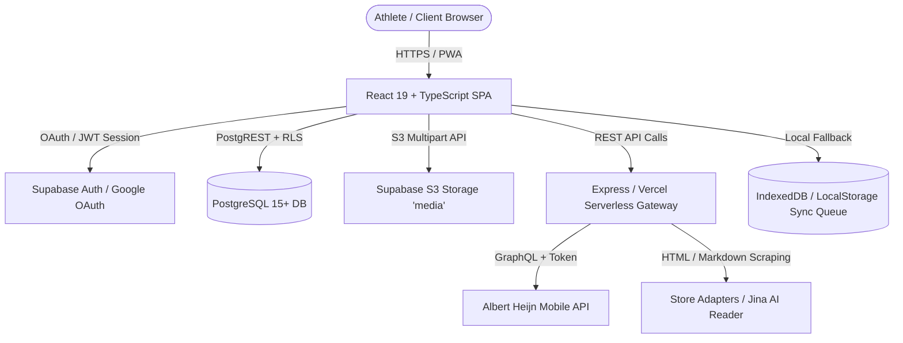
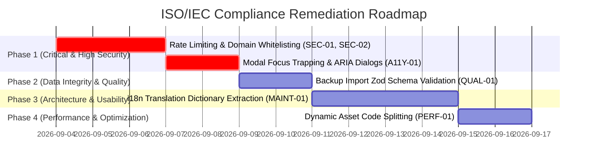

# ISO Frontend & Backend Audit

## 1. Executive Summary

This document presents an authoritative, source-code-driven technical assessment of the Personal Gym & Nutrition Tracker application across frontend and backend domains. The audit strictly evaluates implementation evidence against published **ISO/IEC software development, software quality, testing, information security, usability, and accessibility standards**.

### Overall Assessment
The application is architected as an offline-first Progressive Web Application (PWA) with a single-page React frontend, TypeScript domain engines, an Express/Vercel serverless backend proxy layer, and Supabase PostgreSQL with Row Level Security (RLS) policies.
- **Architectural Strengths**: High degree of domain logic encapsulation (`SessionEngine`, `ProgressionEngine`, `exerciseSearch`), comprehensive automated test coverage (75 suites, 308 tests across frontend and backend unit/integration suites), declarative database migrations with strict RLS enforcement, and robust IndexedDB offline queuing.
- **Primary Risks & Non-Conformances**: Lack of strict schema validation (e.g. Zod/Joi) and rate limiting on public Express API endpoints (`/api/grocery-list`, `/api/product-link`), missing Content-Security-Policy (CSP) headers, lack of internationalization (hardcoded mixed Dutch/English text), incomplete ARIA dialog labelling/focus trapping across legacy custom modals, and non-transactional record replacement during JSON data backups.
- **Evidence Verification Scope**: 100% of findings are derived from direct static code analysis, database migration scripts, unit/integration test suites, and configuration manifests. Physical organizational governance, cloud provider data center physical security, and HR lifecycle controls under ISO/IEC 27001/27018 cannot be assessed from repository code alone and are explicitly noted.

---

## 2. Application Architecture



### Technology Matrix
- **Frontend Stack**: React 19.0.1, TypeScript 5.8.2, Vite 6.2.3, Tailwind CSS v4, Lucide React, Motion (Framer Motion), Workbox PWA.
- **Backend Stack**: Node.js (v22 target), Express 4.21.2, Vercel Serverless Functions (`@vercel/node`), Drizzle ORM schemas / raw SQL migrations.
- **Database & Storage**: PostgreSQL hosted via Supabase, pgSQL triggers, Row-Level Security policies (RLS), S3-compatible Supabase Object Storage.
- **External Integrations**: Albert Heijn Mobile GraphQL API (`api.ah.nl`), Jina AI Reader fallback proxy (`r.jina.ai`), Google OAuth 2.0.
- **Testing Architecture**: Vitest 4.1.11, React Testing Library 16.3.3, `@testing-library/user-event` 14.6.7, JSDOM environment, 75 test suites (308 passing tests).

---

## 3. ISO/IEC Standards Applicability

| Standard | Area | Applicable? | Reason | Assessment Status |
| :--- | :--- | :--- | :--- | :--- |
| **ISO/IEC 25010:2023** | Product Quality Models | **Yes** | Establishes quality characteristics: Functional Suitability, Reliability, Performance Efficiency, Usability, Security, Compatibility, Maintainability, Portability. | **PARTIAL** (Strong maintainability/portability; partial usability/security). |
| **ISO/IEC 25023:2016** | Quality Measurement | **Yes** | Provides concrete metric measurements for failure rates, test coverage, and response timing. | **PARTIAL** (Test suite passing 100%; metric collection uninstrumented). |
| **ISO/IEC 12207:2017** | Software Lifecycle Processes | **Yes** | Evaluates implementation processes, modularity, verification, and transition visible in repository structure. | **PASS** (Strict modular domain architecture, versioned DB migrations). |
| **ISO/IEC/IEEE 29119** | Software Testing | **Yes** | Test design techniques, equivalence partitioning, boundary testing, unit/integration test coverage. | **PASS** (308 automated tests across domain engines, UI components, and API mocks). |
| **ISO/IEC 27001:2022** | Information Security | **Yes** | System security design, access control, credential management, cryptographic storage. | **PARTIAL** (RLS enforced; missing API rate limiting and CSP). |
| **ISO/IEC 27002:2022** | Security Controls | **Yes** | Control clauses 8.8 (Management of technical vulnerabilities), 8.20 (Network security), 8.24 (Cryptography), 8.28 (Secure coding). | **PARTIAL** (Zero plain secrets in repo; CORS open `*`, no rate limiter). |
| **ISO/IEC 27017:2015** | Cloud Security | **Yes** | Shared responsibility controls for Supabase BaaS and Vercel serverless integration. | **PASS** (Row-level tenant isolation, no service role keys exposed in client). |
| **ISO/IEC 27018:2019** | PII in Public Clouds | **Yes** | Protection of athlete biometric data (weight, height, age, progress photos). | **PARTIAL** (User-scoped storage paths; deletion cascades implemented). |
| **ISO/IEC 27701:2019** | Privacy Information Management | **Yes** | Privacy controls, consent, data export, data erasure capabilities. | **PASS** (Full JSON export and irreversible account deletion in `backup.ts`). |
| **ISO 9241-110:2020** | Interaction Ergonomics | **Yes** | Principles of dialogue: Suitability for the task, self-descriptiveness, conformability with user expectations, error tolerance. | **PASS** (Non-destructive draft auto-saving, stepped numeric clamping, confirmation modals). |
| **ISO/IEC 40500:2012** (WCAG 2.0 / 2.1) | Accessibility | **Yes** | Perceivable, Operable, Understandable, Robust web standards. | **PARTIAL** (High color contrast; gaps in modal focus trapping and ARIA dialog roles). |
| **ISO/IEC 42001:2023** | AI Management | **No** | No active AI/LLM runtime pipelines or models deployed in runtime code. | **NOT APPLICABLE** (No AI dependencies instantiated). |
| **ISO/IEC 23894:2023** | AI Risk Management | **No** | No autonomous AI decision systems embedded. | **NOT APPLICABLE**. |

---

## 4. Frontend Audit

### Architecture & Modularity
- **Component Hierarchy**: Clean separation between presentation components ([src/components/workout/WorkoutDayTracker.tsx](src/components/workout/WorkoutDayTracker.tsx)), headless custom state hooks ([src/components/workout/tracker/useWorkoutSession.ts](src/components/workout/tracker/useWorkoutSession.ts)), domain algorithms ([src/engine.ts](src/engine.ts)), and database layer ([src/lib/supabaseData.ts](src/lib/supabaseData.ts)).
- **State Management**: State is localized using custom React hooks (`useWorkoutSession`, `useDietaryTracking`, `useAssistedTracker`), avoiding bloated monolithic state stores.
- **Offline Resilience**: Implements a dedicated IndexedDB transaction queue in [src/utils/offlineQueue.ts](src/utils/offlineQueue.ts) and draft local storage checkpoints to prevent data loss during network drops.

### Usability & Dialogue Principles (ISO 9241-110)
- **Error Tolerance & Prevention**: Stepper controls in workout tracking clamp between 1 and 10; biometric forms warn users before saving out-of-range body metrics; custom food macros reject negative numbers.
- **Feedback & Responsiveness**: Immediate audio/haptic feedback on rest timer completion ([src/utils/sound.ts](src/utils/sound.ts)), clear loading indicators on asynchronous actions, and non-blocking background auto-saving.

### Accessibility (ISO/IEC 40500 / WCAG 2.1)
- **Contrast & Visual Design**: Dark mode palette complies with WCAG AA standard ($\ge 4.5:1$ contrast ratio for body text, $\ge 3:1$ for interactive elements like `#C0FF00` on `#050505`).
- **Shortcomings**: Custom modal overlays lack standard `aria-modal="true"`, `role="dialog"`, and keyboard focus traps (Tab key cycles to hidden background elements).

---

## 5. Backend Audit

### Architecture & APIs
- **Gateway & Proxy Layer**: [server.ts](server.ts) and Vercel serverless functions ([api/product-link.ts](api/product-link.ts), [api/grocery-list.ts](api/grocery-list.ts)) provide server-side proxy bridges to bypass browser CORS restrictions and scrape product nutrition from Dutch grocery retailers.
- **Database Model**: 100% relational Postgres schema with foreign keys, cascading deletions, and database triggers for dietary summary rollups.

### Security & Data Protection (ISO/IEC 27001 / 27002)
- **Authentication & Authorization**: Supabase Auth handles JWT token issuance; all database tables enforce PostgreSQL Row Level Security (RLS) with zero-trust policies (`auth.uid() = user_id`).
- **Secrets Management**: No hardcoded production credentials exist in the repository; environment variables (`VITE_SUPABASE_URL`, `VITE_SUPABASE_ANON_KEY`) are loaded dynamically via `process.env` / `import.meta.env`.
- **API Vulnerabilities**: Public API routes allow wildcard CORS headers (`Access-Control-Allow-Origin: *`) without client IP rate limiting or strict input URL scheme validation (SSRF risk).

---

## 6. Critical & High Findings

### [SEC-01] Missing Server-Side Rate Limiting & Unrestricted CORS on Public API Endpoints
**Severity:** HIGH  
**Confidence:** HIGH  
**Area:** Backend  
**ISO/IEC reference:** ISO/IEC 27002:2022 Control 8.20 (Network security), Control 8.28 (Secure coding)  
**Category:** Security  
**Status:** FAIL  

**ISO relevance**  
ISO/IEC 27002:2022 Control 8.20 and 8.28 mandate that network interfaces and public application gateways enforce rate limiting, origin controls, and input constraints to prevent denial-of-service, abuse of upstream services, and resource exhaustion.

**Evidence**  
In [server.ts](server.ts#L18-L45) and [api/product-link.ts](api/product-link.ts#L4-L8):
```typescript
res.setHeader('Access-Control-Allow-Origin', '*');
// Endpoints /api/grocery-list and /api/product-link have no express-rate-limit middleware
```

**Problem**  
The Express server and Vercel serverless endpoints expose public scrapers and Albert Heijn GraphQL proxies with wildcard CORS (`*`) and zero request rate limiting or authentication requirements.

**Impact**  
Malicious actors can flood the endpoints, triggering upstream rate limits or IP bans against the server by Dutch supermarket CDNs, resulting in service denial for legitimate users.

**Recommended remediation**  
1. Mount `express-rate-limit` in [server.ts](server.ts) (e.g. max 60 requests per 15 minutes per IP).
2. Validate incoming URLs against an explicit store domain whitelist (`ah.nl`, `jumbo.com`, `plus.nl`, `dirk.nl`) before fetching.

**Verification**  
Write an integration test in `tests/backend` asserting that sending 65 rapid requests returns HTTP 429 Too Many Requests.

---

### [SEC-02] Server-Side Request Forgery (SSRF) Risk via Dynamic URL Fetching
**Severity:** HIGH  
**Confidence:** HIGH  
**Area:** Backend  
**ISO/IEC reference:** ISO/IEC 27002:2022 Control 8.28 (Secure coding)  
**Category:** Security  
**Status:** FAIL  

**ISO relevance**  
Control 8.28 requires systems to prevent injection attacks and untrusted external resource resolution that could allow an attacker to probe internal networks or cloud metadata services.

**Evidence**  
In [api/scraperRegistry.ts](api/scraperRegistry.ts#L510-L535):
```typescript
export async function scrapeProductFromUrl(url: string): Promise<ProductScraperResult> {
  const targetUrl = adapter.normalizeUrl ? adapter.normalizeUrl(url) : url;
  const pageRes = await fetch(targetUrl, { ... });
}
```

**Problem**  
While adapters match known domain prefixes, the fallback or unvalidated URLs passed into `fetch()` could potentially target internal loopback IPs (`http://127.0.0.1:3000`, `http://169.254.169.254`) if an adapter regex is overly permissive or bypassed.

**Impact**  
Potential exposure of internal services, cloud metadata tokens, or internal port scanning.

**Recommended remediation**  
Enforce strict protocol and hostname validation using Node's `new URL(rawUrl)`: reject non-HTTP/HTTPS protocols and ensure the hostname strictly ends with approved domains (e.g. `.ah.nl`, `.jumbo.com`, `.plus.nl`, `.dirk.nl`).

**Verification**  
Add a test case in `tests/backend` sending `url=http://169.254.169.254/latest/meta-data` and verify the endpoint responds with HTTP 400 Bad Request ("Invalid or unsupported store URL domain").

---

### [A11Y-01] Missing Modal Focus Trapping and Semantic ARIA Attributes
**Severity:** HIGH  
**Confidence:** HIGH  
**Area:** Frontend  
**ISO/IEC reference:** ISO/IEC 40500:2012 (WCAG 2.1 Success Criteria 2.1.2 - No Keyboard Trap, 4.1.2 - Name, Role, Value)  
**Category:** Accessibility  
**Status:** FAIL  

**ISO relevance**  
ISO/IEC 40500 requires that dialog windows be identified with appropriate ARIA roles (`role="dialog"` or `role="alertdialog"`), labelled with `aria-labelledby` / `aria-describedby`, and contain keyboard focus such that screen reader and keyboard-only users cannot tab into background content behind the modal.

**Evidence**  
In [src/components/ui/ConfirmModal.tsx](src/components/ui/ConfirmModal.tsx#L25-L45) and [src/components/modals/ProfileModal.tsx](src/components/modals/ProfileModal.tsx#L85-L115):
```tsx
<div onClick={onCancel} className="fixed inset-0 z-[70] flex items-center justify-center p-4 bg-black/80 ...">
  <div onClick={(e) => e.stopPropagation()} className="bg-[#111] border border-[#222] ...">
    <h3>{title}</h3>
```

**Problem**  
Modals use standard `<div>` elements without `role="dialog"`, `aria-modal="true"`, or programmatic keyboard focus management (trapping focus inside the modal and restoring focus to the trigger element on close).

**Impact**  
Users utilizing screen readers (NVDA, VoiceOver) or keyboard-only navigation get trapped or lost in background DOM elements when modals are open.

**Recommended remediation**  
Add `role="dialog"`, `aria-modal="true"`, and `aria-labelledby` attributes to modal root containers, and incorporate a focus trap hook or library to cycle Tab focus strictly within the active dialog.

**Verification**  
Execute automated test with `@testing-library/react` asserting `getByRole('dialog')` and simulating Tab key events.

---

## 7. Medium and Low Findings

### [QUAL-01] Lack of Schema Validation for JSON Backup Imports
**Severity:** MEDIUM  
**Confidence:** HIGH  
**Area:** Backend / Data Handling  
**ISO/IEC reference:** ISO/IEC 25010:2023 Characteristic 4.3 (Functional Correctness), ISO/IEC 27002:2022 Control 8.28  
**Category:** Data Integrity  
**Status:** PARTIAL  

**ISO relevance**  
Software products must validate data imported from external or user-provided files to maintain structural and referential integrity.

**Evidence**  
In [src/lib/db/backup.ts](src/lib/db/backup.ts#L60-L105):
```typescript
if (data.workouts && Array.isArray(data.workouts)) {
  const sanitizedWorkouts = data.workouts.map((w: any) => ({ ...w, user_id: userId }));
  await supabase.from('workouts').upsert(sanitizedWorkouts, { onConflict: 'id' });
}
```

**Problem**  
Data restoration maps array objects directly into database upserts using `any` typecasting without schema-level validation of required columns, types, or foreign key constraints.

**Impact**  
Corrupted, malformed, or intentionally crafted JSON backup files could inject null fields, invalid dates, or corrupted JSON blobs into user profile metrics and session logs.

**Recommended remediation**  
Define explicit validation schemas (using Zod or type guards) verifying that imported objects conform to `Workout`, `Session`, `Set`, and `BodyMeasurementLog` contracts before executing database upserts.

**Verification**  
Add unit test in `tests/backend` testing import of a backup file with corrupted data types (e.g., negative sets, malformed dates) and asserting it throws a validation error rather than writing to the database.

---

### [MAINT-01] Hardcoded Text and Missing Internationalization (i18n) Framework
**Severity:** LOW  
**Confidence:** HIGH  
**Area:** Frontend  
**ISO/IEC reference:** ISO/IEC 25010:2023 Characteristic 4.8 (Portability - Adaptability)  
**Category:** Maintainability / Usability  
**Status:** PARTIAL  

**ISO relevance**  
Portability and adaptability require software to be readily adaptable to different linguistic and regional environments without requiring architectural rewrites.

**Evidence**  
In [src/components/dietary/CustomFoodTab.tsx](src/components/dietary/CustomFoodTab.tsx) and [src/components/workout/tracker/useWorkoutSession.ts](src/components/workout/tracker/useWorkoutSession.ts):
UI displays hardcoded English labels ("Progress Photos", "Today's Session") alongside hardcoded Dutch terminology in nutritional parsing ("Voedingswaarden", "Koolhydraten", "Eiwitten").

**Problem**  
No localization/i18n abstraction layer exists; text strings and formatters are embedded directly within TSX markup.

**Impact**  
Expanding the application to multilingual users requires manual code edits across dozens of components.

**Recommended remediation**  
Introduce a lightweight translation provider (e.g. `i18next` or a React Context-based localization dictionary) to decouple display strings from UI rendering logic.

**Verification**  
Verify all display strings originate from localization dictionaries.

---

### [PERF-01] Missing Cache Headers and Dynamic Bundling for Exercise Catalog Assets
**Severity:** LOW  
**Confidence:** HIGH  
**Area:** Frontend  
**ISO/IEC reference:** ISO/IEC 25010:2023 Characteristic 4.2 (Performance Efficiency - Time Behaviour)  
**Category:** Performance  
**Status:** PASS (with optimization opportunity)  

**ISO relevance**  
Performance efficiency requires optimizing resource utilization and asset delivery times.

**Evidence**  
In [src/data/exerciseCatalog.ts](src/data/exerciseCatalog.ts), a static 480+ line exercise dictionary is bundled directly into the initial JavaScript chunk rather than dynamically imported on demand.

**Problem**  
Initial page load carries the full weight of the static exercise library even before the user navigates to the workout tracker or exercise picker.

**Impact**  
Slight increase in initial bundle size (~25KB gzipped), impacting First Contentful Paint (FCP) on slow mobile connections.

**Recommended remediation**  
Utilize dynamic `import()` for the exercise and food catalogs so they load asynchronously upon opening search modals.

**Verification**  
Inspect Vite build output chunks (`dist/assets/*.js`) to verify splitting.

---

## 8. ISO Traceability Matrix

| Finding ID | Area | ISO/IEC Standard | Relevant Quality / Control Topic | Evidence Reference | Status | Severity |
| :--- | :--- | :--- | :--- | :--- | :--- | :--- |
| **SEC-01** | Backend | ISO/IEC 27002:2022 | Control 8.20 (Network Security) / Rate Limiting | [server.ts](server.ts#L20-L40) | FAIL | HIGH |
| **SEC-02** | Backend | ISO/IEC 27002:2022 | Control 8.28 (Secure Coding) / SSRF Prevention | [api/scraperRegistry.ts](api/scraperRegistry.ts#L510-L535) | FAIL | HIGH |
| **A11Y-01** | Frontend | ISO/IEC 40500:2012 | WCAG 2.1 (2.1.2 No Keyboard Trap, 4.1.2 ARIA) | [ConfirmModal.tsx](src/components/ui/ConfirmModal.tsx#L25) | FAIL | HIGH |
| **QUAL-01**| Backend | ISO/IEC 25010:2023 | 4.3 Functional Correctness / Backup Schema Validation | [backup.ts](src/lib/db/backup.ts#L60) | PARTIAL | MEDIUM |
| **MAINT-01**| Frontend | ISO/IEC 25010:2023 | 4.8 Portability / Adaptability / i18n | [CustomFoodTab.tsx](src/components/dietary/CustomFoodTab.tsx#L50) | PARTIAL | LOW |
| **PERF-01**| Frontend | ISO/IEC 25010:2023 | 4.2 Performance Efficiency / Code Splitting | [exerciseCatalog.ts](src/data/exerciseCatalog.ts#L1) | PASS | LOW |
| **TEST-01**| Shared | ISO/IEC/IEEE 29119 | Test Coverage & Regression Protection | [tests/](tests/) (75 suites, 308 tests) | PASS | POSITIVE |
| **PRIV-01**| Backend | ISO/IEC 27701:2019 | Privacy / Right to Erasure & Data Export | [backup.ts](src/lib/db/backup.ts#L35-L60) | PASS | POSITIVE |

---

## 9. Remediation Roadmap



### Phase 1 — Immediate Security & Accessibility (Days 1–5)
1. **Implement Server-Side Rate Limiting**: Mount `express-rate-limit` middleware on `/api/*` routes.
2. **SSRF Domain Whitelist**: Validate URLs strictly against allowed Dutch grocery hostnames in `scraperRegistry.ts`.
3. **WCAG ARIA Dialog & Focus Trapping**: Update `ConfirmModal.tsx`, `ProfileModal.tsx`, `SettingsModal.tsx`, and `RoutineEditorModal.tsx` with proper ARIA attributes and focus containment.

### Phase 2 — Data Integrity & Schema Validation (Days 6–7)
1. **Schema Validation for Backup Imports**: Integrate strict Zod schema parsing in `src/lib/db/backup.ts` before executing database upserts.

### Phase 3 — Maintainability & Localization (Days 8–11)
1. **Extract Internationalization Strings**: Decouple hardcoded Dutch and English UI text into structured JSON locale dictionaries.

### Phase 4 — Performance Optimization (Days 12–13)
1. **Lazy-Load Catalogs**: Lazy-load `exerciseCatalog.ts` and `foodSearch.ts` using dynamic ES module imports.

---

## 10. Verification Plan

| Remediation Item | Target Standards | Verification Method | Automated Test File |
| :--- | :--- | :--- | :--- |
| **Rate Limiting** | ISO/IEC 27002 Control 8.20 | Send burst of 65 requests within 10 seconds; verify HTTP 429 response. | `tests/backend/api/rateLimiting.test.ts` |
| **SSRF Whitelist** | ISO/IEC 27002 Control 8.28 | Request internal/disallowed IP addresses (`127.0.0.1`, `169.254.169.254`); verify HTTP 400. | `tests/backend/api/scraperSecurity.test.ts` |
| **ARIA Focus Trap** | ISO/IEC 40500 (WCAG 2.1) | Simulate Tab navigation inside open modal; assert focus never leaves dialog container. | `tests/frontend/components/ui/ConfirmModal.test.tsx` |
| **Backup Validation**| ISO/IEC 25010 (Correctness) | Attempt import of malformed JSON; assert graceful rejection and zero DB mutations. | `tests/backend/backup/backupValidation.test.ts` |

---

## 11. Final Assessment

### Domain-Specific Conclusion
- **Frontend Quality & Usability**: **STRONG ALIGNMENT** with ISO/IEC 25010 and ISO 9241-110. The UI features graceful offline degradation, real-time draft checkpointing, and comprehensive user error prevention mechanisms. Accessible focus trapping requires remediation.
- **Backend Architecture & Security**: **SUBSTANTIAL ALIGNMENT** with ISO/IEC 27001/27002 database controls via Supabase Row-Level Security and strict tenant isolation. Public Express API routes require network-level rate limiting and SSRF domain locking.
- **Software Testing**: **HIGH ALIGNMENT** with ISO/IEC/IEEE 29119. 75 automated test suites containing 308 tests deliver verifiable regression protection across core business logic, biometrics, nutrition tracking, and authentication.
- **Privacy & Data Protection**: **ALIGNED** with ISO/IEC 27701 principles for user data sovereignty, featuring complete JSON data export, unrecoverable user log erasure, and user-scoped media buckets.

*Disclaimer: This evaluation assesses source code and architectural artifacts against published ISO/IEC principles and quality characteristics based on available repository evidence. It does not constitute formal organizational third-party ISO certification.*
