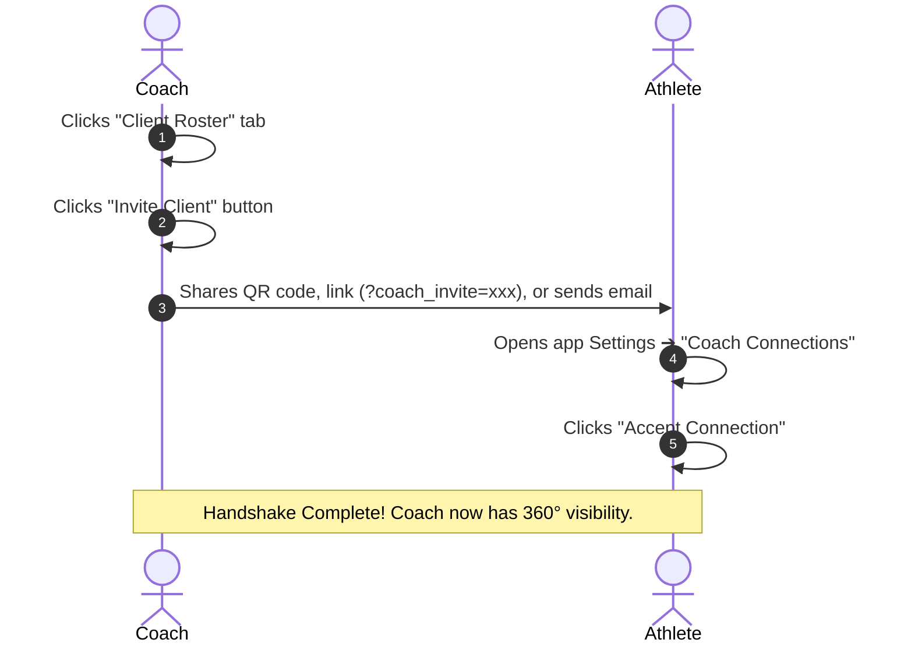

# Workout Tracker — Complete User Manual & Coaching Guide (`USER_MANUAL.md`)

Welcome to the **Workout Tracker** user manual. This guide explains how **Athletes** and **Coaches** interact, how the **Mutual Connection Handshake** works, how coaches supervise clients, and how all core features function.

---

## 📑 Table of Contents

1. [User Roles Overview](#1-user-roles-overview)
2. [Step-by-Step: How a Coach Connects with an Athlete](#2-step-by-step-how-a-coach-connects-with-an-athlete)
3. [Step-by-Step: How a Coach Inspects a Client ("View As" Mode)](#3-step-by-step-how-a-coach-inspects-a-client-view-as-mode)
4. [Step-by-Step: How a Coach Proposes a Routine Split](#4-step-by-step-how-a-coach-proposes-a-routine-split)
5. [Step-by-Step: How a Coach Prescribes Daily Macros](#5-step-by-step-how-a-coach-prescribes-daily-macros)
6. [Step-by-Step: Adding Video Technique Cues & Feedback](#6-step-by-step-adding-video-technique-cues--feedback)
7. [Athlete Manual: Saved Routines Library & Program Switching](#7-athlete-manual-saved-routines-library--program-switching)
8. [Athlete Manual: Privacy Settings & Selective Sharing](#8-athlete-manual-privacy-settings--selective-sharing)
9. [Athlete Manual: Disconnecting a Coach & Data Ownership](#9-athlete-manual-disconnecting-a-coach--data-ownership)
10. [Troubleshooting & FAQ](#10-troubleshooting--faq)

---

## 1. User Roles Overview & How to Become a Coach

The system supports 3 primary roles:

| Role | Navigation Tabs Visible | Capabilities |
| :--- | :--- | :--- |
| **Athlete** | `Today's Session`, `Log Book`, `Insights`, `Dietary` | Log workouts, track daily nutrition, view 90-day volume/heatmaps, manage personal routine library, manage privacy. |
| **Coach** | `Today's Session`, `Log Book`, `Insights`, `Dietary`, **`Client Roster`** | All athlete features + invite athletes, view client adherence, inspect client logs, propose training splits, prescribe daily macros, and add technique cues. |
| **Admin** | All Tabs + Catalog Moderation | Approve coach requests, manage the global exercise & food catalog. |

### How Any User Becomes a Coach (In-App Flow):
1. Open the application **Settings (Gear Icon)** in the header.
2. Click on **"Coach Mode & Trainer Tools"**.
3. Choose your Coaching Specialty:
   - **Strength** (Strength & Conditioning programming)
   - **Nutrition** (Daily calories & macronutrient prescriptions)
   - **Head Coach** (Full training programming + diet)
4. Click **"Activate Coach Mode"**.
5. The **`Client Roster`** tab immediately unlocks in the main navigation bar, giving you access to all trainer tools!

---

## 2. Step-by-Step: How a Coach Connects with an Athlete

Connection uses a **Two-Way Mutual Handshake** to ensure athlete consent. A coach cannot view an athlete's data until the athlete accepts the invitation.



### From the Coach's Perspective:
1. Log into your account (must have `role: coach`).
2. Click the **"Client Roster"** tab in the main top navigation.
3. Click the green **"Invite Client"** button.
4. Select your specialty:
   - `Strength` (Strength & Conditioning)
   - `Nutrition` (Dietitian / Nutritionist)
   - `Head Coach` (Full programming & nutrition)
5. Choose how to share:
   - **Shareable Link / QR Code**: Click **"Copy Shareable Link"** and send it directly to your athlete via WhatsApp, Telegram, or email.
   - **Direct Email**: Type the athlete's email address and click **"Send Email Invite"**.

### From the Athlete's Perspective:
1. The athlete opens the link or logs into their account.
2. In the app header, click the **Settings (Gear Icon)**.
3. Scroll down to the **"Connected Coaches"** section.
4. Locate the pending invitation and click **"Accept Connection"**.
5. Once accepted, the coach appears with a green checkmark as an authorized trainer.

---

## 3. Step-by-Step: How a Coach Inspects a Client ("View As" Mode)

Once connected, a coach can inspect everything an athlete logs (workouts, weights, reps, rest pacing, sleep, energy, photos, and nutrition).

```text
+---------------------------------------------------------------------------------------------+
| 👤 Coach Inspection Mode: Viewing as Sarah Connor (Read-Only)          [ EXIT CLIENT VIEW ] |
+---------------------------------------------------------------------------------------------+
```

1. Click the **"Client Roster"** tab.
2. Find the athlete in your active roster (they will show the badge: **`🟢 On Track`**).
3. Click the **"Inspect"** button on their card.
4. The application enters **Client Mode**:
   - A high-visibility **blue top banner** appears: `Viewing as [Athlete Name] (Read-Only Client Mode)`.
   - The **"Log Book"** displays the athlete's full historical workouts, sets, sleep duration, and energy score.
   - The **"Dietary"** tab displays what the athlete ate for the day against their targets.
5. To return to your own dashboard, simply click **"Exit Client View"** in the top banner.

---

## 4. Step-by-Step: How a Coach Proposes a Routine Split

Coaches can design and send custom training programs directly to an athlete.

1. In the **"Client Roster"** tab, find the athlete.
2. Click the **"Propose Routine"** button (dumbbell icon).
3. In the composer modal:
   - Enter a **Program Title** (e.g. `4-Day Upper/Lower Hypertrophy Block`).
   - Add **Coach Notes & Strategy** (e.g. `Focus on controlled eccentric on squats`).
   - Add workout split days (Day 1, Day 2, Day 3, etc.).
   - Click **"Add Exercise"** to search the catalog, configure target sets, and set rep ranges (e.g. `4 sets × 8-12 reps`).
4. Click **"Send Proposal"**.
5. **How the Athlete Activates It**:
   - The athlete sees a banner under **Settings ➔ Connected Coaches**: `Pending Routine Proposals (1)`.
   - The athlete clicks **"Review & Apply"**.
   - After inspecting the exercises, the athlete clicks **"Save to My Routines & Activate"**.
   - The program is cloned into the athlete's **Saved Routines Library** and set as their active training schedule. The athlete's previous split is kept safely in their library.

---

## 5. Step-by-Step: How a Coach Prescribes Daily Macros

Nutrition coaches and personal trainers can prescribe daily calories and macronutrient ratios.

1. In the **"Client Roster"** tab, find the athlete.
2. Click **"Prescribe Macros"** (fork & knife icon).
3. Enter:
   - **Daily Calories**: e.g. `2,600 kcal`
   - **Protein**: e.g. `185 g`
   - **Carbohydrates**: e.g. `280 g`
   - **Fats**: e.g. `70 g`
   - **Fiber**: e.g. `35 g`
   - **Dietary Directives**: e.g. `Drink 3L of water and hit 40g protein post-workout`.
4. Click **"Publish Macro Targets"**.
5. **Athlete's Dietary View**:
   - When the athlete opens their **"Dietary"** tab, the summary card automatically renders **"Coach Targets vs. Actual"** progress rings:
     `2,150 / 2,600 kcal (82%)` | `160g / 185g Protein (86%)`.

---

## 6. Step-by-Step: Adding Video Technique Cues & Feedback

When reviewing client sets:

1. Click **"Inspect"** on the athlete in your roster.
2. Go to their **"Log Book"** and expand any completed workout session.
3. Under any set (or attached form check video), click **"Add Coach Technique Cue"**.
4. Type the coaching cue (e.g. `Drive knees outward on ascent and maintain neutral spine`) and set the timestamp marker (e.g. `0:08`).
5. Click **"Save Feedback"**.
6. The feedback is permanently attached to that set with your coach badge, visible to the athlete on their dashboard.

---

## 7. Coach Settings vs Athlete Settings

When an account has the **Coach** role, the **Settings (Gear Icon)** automatically adapts:

* **Top Mode Switcher**:
  - `[ 🧑‍🏫 Trainer Settings ]`:
    - **Coaching Specialty**: Switch between Strength, Nutrition, or Head Coach in 1-click.
    - **Invite Client Shortcut**: Instant QR / Link / Email modal.
    - **Routine Programming Presets**: Configure your default proposal rest timer (e.g. 90s, 120s).
    - **Client Compliance Alerts**: Toggle notifications for inactive clients (3+ days) or new 1RM personal records.
    - **Theme, PWA & Backups**: Application styling and complete data backup.
  - `[ 🏋️ Personal Account ]`:
    - Configure your own personal routines, personal saved library, and personal privacy settings.

---

## 8. Athlete Manual: Saved Routines Library & Program Switching

Athletes have a multi-program library allowing them to keep multiple seasonal programs (e.g. *PPL Hypertrophy*, *Strength Block 1*, *Coach Proposed Split*).

1. Click **Settings (Gear Icon)** ➔ click **"Saved Routines Library"**.
2. **Save Current Split**: Click **"Save Current Split"**, give it a name, and click **"Save to Library"**.
3. **Switch Active Split**: Click **"Activate"** on any archived program. The active schedule on "Today's Session" updates immediately.
4. **Routine-Scoped Insights**: In the **"Insights"** tab, use the **Scope Filter** dropdown to view volume and 1RM progression strictly for that specific training block.

---

## 8. Athlete Manual: Privacy Settings & Selective Sharing

Athletes have complete control over who can see their data:

1. Click **Settings** ➔ **"Privacy & Visibility"**.
2. **Public Profile Toggle**:
   - When **Off**: Profile is strictly private.
   - When **On**: Profile is accessible via public share links.
3. **Granular Modules**: Toggle what guests can see (`Workout History`, `Bodyweight & BMI`, `Dietary Logs`, `Photos`).
4. **Selective Peer Sharing**: Click **"Add Partner"** to grant specific friends access to workouts without exposing dietary or weight data.
5. **Coach Guarantee**: Connected coaches with an accepted mutual handshake automatically have full visibility to guide your training.

---

## 9. Athlete Manual: Disconnecting a Coach & Data Ownership

Athletes retain **100% data ownership**:

1. Click **Settings** ➔ **"Connected Coaches"**.
2. Click the **Trash / Disconnect icon** next to the coach's name.
3. Confirm disconnection.
4. **What Happens**:
   - The coach immediately loses all database read and write access to your account.
   - You retain all active workout routines, archived programs, and historical logs as your own editable copies.

---

## 10. Troubleshooting & FAQ

#### Q: I am logged in as a coach, but I don't see the "Client Roster" tab.
* **A**: Your user account needs the `coach` role in the database. Ensure `user_roles` has `role = 'coach'` and `is_approved = true` for your `user_id`.

#### Q: How do I share a single workout without giving someone access to my account?
* **A**: Open the workout in your **Log Book** and click the green **"Share Workout"** button. This copies a public, read-only link (`?session=xxx`) that anyone can open in a browser without creating an account.

#### Q: Where are workout photos stored?
* **A**: Photos are client-side compressed to $<350\text{ KB}$ WebP files and uploaded to the partitioned `workout-media/{userId}/workouts/{YYYY-MM}/` storage bucket.

#### Q: Does switching my workout routine delete my food logs?
* **A**: No. Nutrition and dietary logs are **100% global** and tied to the calendar day. Switching or archiving workout routines will never affect your food entries or bodyweight logs.
