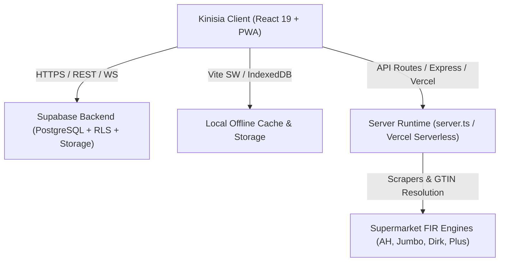
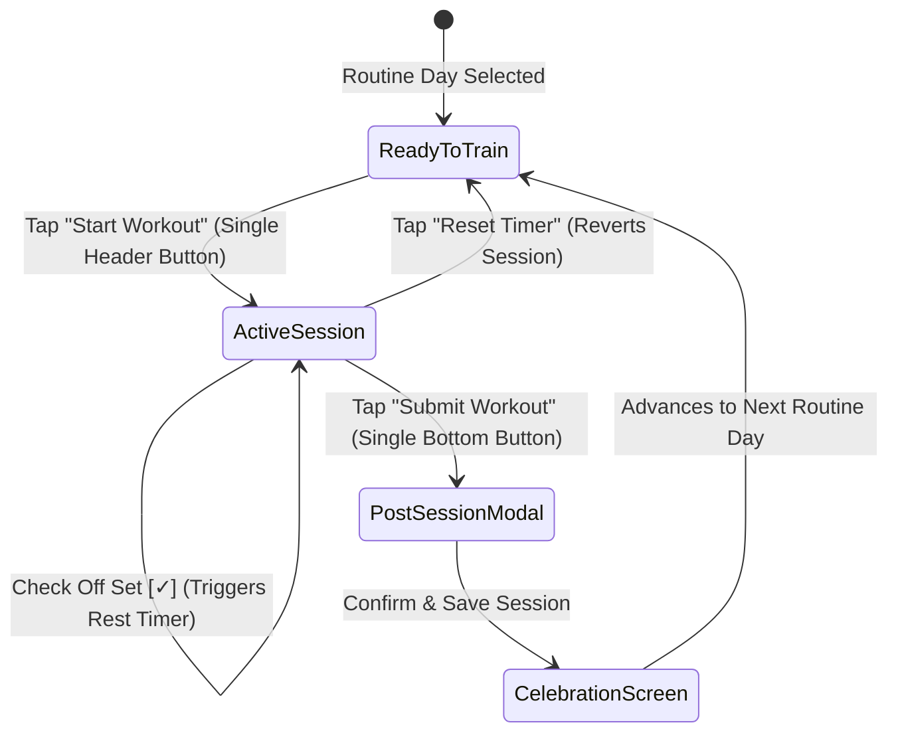
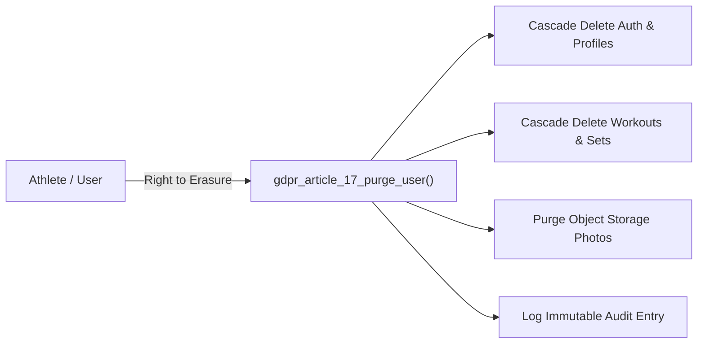

# Kinisia — The Minimalist Progressive Overload Engine
## Master Architectural, Functional & Design Specification

---

## 1. Executive Summary & The Core Manifesto

> **"NO FLUFF. LOG SETS & LEAVE."**

Modern fitness applications are overwhelmed with social feeds, influencer paywalls, gamified clutter, unverified exercises, and latency-heavy interfaces that disrupt focus inside the gym. 

**Kinisia** (`https://kinisia.nl`) is engineered around a singular truth of exercise physiology:
**Progressive Overload is the primary driver of muscular hypertrophy and strength adaptation.**

Every design choice, backend table, frontend component, and interaction pattern in Kinisia serves this objective:
1. **Zero-Lag Logging**: Sub-10ms UI responsiveness inside the weight room.
2. **Automated Discipline**: Live workout stopwatch, automatic rest interval timers triggered on set checkoff, and haptic vibration feedback.
3. **100% Visual Accuracy**: A library of 1,573 remote/offline verified animated demonstration GIFs from ExerciseDB.
4. **Adaptive Intelligence**: Algorithmic progressive overload recommendations computed dynamically from historical set data without requiring manual calculation.
5. **Privacy by Design**: Fully compliant with European Union regulations (GDPR Art. 9 Special Category Health Data, GDPR Art. 17 Right to Erasure, CRA, and NIS2).

---

## 2. Platform Architecture & Technology Stack

### 2.1 Frontend Architecture
- **Framework**: React 19 (SPA) with TypeScript 5.8.
- **Bundler & Tooling**: Vite 6, Tailwind CSS v4, Workbox PWA.
- **State Machine**: Custom reactive hook architecture ([src/components/workout/tracker/useWorkoutSession.ts](src/components/workout/tracker/useWorkoutSession.ts)) with real-time localStorage draft sync and IndexedDB photo persistence.
- **Styling**: High-contrast dark aesthetic (`#050505` background, `#121212` elevated cards, `#C0FF00` electric lime accents, pure white primary text).
- **Accessibility**: Strict WCAG 2.2 Level AA compliance, minimum 48px touch targets, `aria-live` timers, screen reader labels, and keyboard navigability.

### 2.2 Backend & Data Storage
- **Database**: Supabase PostgreSQL with strict Row Level Security (RLS) on all public tables (`workouts`, `exercises`, `workout_exercises`, `sessions`, `sets`, `body_logs`, `dietary_logs`, `coach_athlete_links`).
- **Storage**: Supabase Object Storage buckets (`workout_photos`, `progress_photos`) with client-side compression.
- **Edge Routing**: Vercel Serverless Functions + Express companion server (`server.ts`) with custom negative lookahead rewrites preserving static assets (`/sitemap.xml`, `/robots.txt`).

---

## 3. Core Functional Pillars

### Pillar 1: Training & The Start-to-Finish Workout Lifecycle

The workout tracking experience is designed for seamless, friction-free gym execution:

1. **Split Routine Navigation ([src/components/workout/tracker/RoutineSplitSelector.tsx](src/components/workout/tracker/RoutineSplitSelector.tsx))**:
   - Organizes athlete training into structured split days (e.g., *Day 1: Upper Body A*, *Day 2: Lower Body A*, *Day 3: Upper Body B*, *Day 4: Lower Body B*).
   - Features consecutive routine streak tracking (`X consecutive routines completed`).
   - Integrated `[Edit]` button opens the full routine builder to reorder days, swap movements, and configure target rep ranges.

2. **Start-Before-Submit Lifecycle ([src/components/workout/tracker/ActiveWorkoutHeaderBar.tsx](src/components/workout/tracker/ActiveWorkoutHeaderBar.tsx), [src/components/workout/tracker/WorkoutSubmitButton.tsx](src/components/workout/tracker/WorkoutSubmitButton.tsx))**:
   - **Single Start Workout Button**: Prominently displayed in the header card showing routine title, total exercises, total sets, and estimated workout duration.
   - **Single Submit Workout Button**: Positioned at the bottom of the exercises list. It is visibly disabled until `Start Workout` is tapped, eliminating accidental submissions or un-timed sessions.
   - **Vice Versa Reset**: A reset button allows athletes to cancel or restart an active session, instantly reverting elapsed time and submission locks.

3. **Recovery & Readiness Benchmarking ([src/components/workout/tracker/RecoveryAndReadinessCard.tsx](src/components/workout/tracker/RecoveryAndReadinessCard.tsx))**:
   - Positioned at the top of the session view.
   - Captures sleep duration (hours), subjective energy readiness score (1–10 scale), daily bodyweight (kg), and qualitative session notes.

4. **Dynamic Progressive Overload Engine ([src/engine.ts](src/engine.ts))**:
   - Compares the athlete's current performance against historical benchmark sets.
   - If the upper rep ceiling was achieved on previous sets (e.g., target 8–12 reps and completed 12 reps), the engine prescribes a micro-increment (+2.5 kg).
   - If rep targets were missed, the engine advises volume consolidation at the current working load.

5. **Exercise Card & Form Guidance ([src/components/workout/ExerciseCard.tsx](src/components/workout/ExerciseCard.tsx), [src/components/workout/ExerciseGuideDrawer.tsx](src/components/workout/ExerciseGuideDrawer.tsx))**:
   - Clean collapsible card layout showing exercise thumbnail, equipment type, target sets, and rep ranges.
   - Inline `(i)` button opens a comprehensive drawer with animated demonstration GIFs, targeted muscle groups, setup cues, peak contraction mechanics, and common execution faults.
   - Skip button with draft persistence for injured or substituted muscle groups.

6. **Automatic Rest Interval Timer ([src/components/workout/tracker/AutoRestTimerModal.tsx](src/components/workout/tracker/AutoRestTimerModal.tsx))**:
   - Checking off any set (`[✓]`) automatically initiates the rest countdown (default 90s, customizable in Settings).
   - Triggers subtle haptic pulses on supported mobile devices and plays non-intrusive completion chimes.

7. **Finish Workout & Celebration Modal ([src/components/workout/tracker/FinishWorkoutModal.tsx](src/components/workout/tracker/FinishWorkoutModal.tsx), [src/components/workout/tracker/WorkoutCompletionModal.tsx](src/components/workout/tracker/WorkoutCompletionModal.tsx))**:
   - Final review summary showing total elapsed duration, sets completed, bodyweight check-in, notes, and up to 5 progress photos.
   - Calculates **total tonnage** (kg volume lifted), total reps, and highlights **all-time estimated 1RM personal records** broken during the session.

---

### Pillar 2: The Exercise Catalog & Media Pipeline

Kinisia combines offline performance with comprehensive cloud scale:

- **Core Offline Precache (47 Foundation Exercises)**: Compound movements (Barbell Squat, Bench Press, Deadlift, Overhead Press, Pull-ups, Dips, Treadmill, etc.) are bundled directly within client memory for 0ms initial load time.
- **Cloud Library (1,573 Animated GIF Exercises)**: Stored in remote PostgreSQL (`public.exercises`) with high-resolution demonstration animations from ExerciseDB.
- **Offline Persistence ([src/lib/supabaseData.ts](src/lib/supabaseData.ts))**: Eagerly prefetched on app startup and serialized to local storage (`kinisia_catalog_exercises_v1`), ensuring installed mobile PWA users retain 100% access without internet connectivity.
- **Fuzzy Search Engine ([src/lib/exerciseSearch.ts](src/lib/exerciseSearch.ts))**: Built with Fuse.js for typo-tolerant searching across exercise names, equipment types, and muscle anatomy.

---

### Pillar 3: Log Book & Workout History

The Log Book ([src/components/workout/WorkoutHistory.tsx](src/components/workout/WorkoutHistory.tsx)) provides a permanent record of athletic progress:

- **Chronological Session Feed**: Grouped by date and routine day.
- **Set-by-Set Historical Breakdown**: Exact weights lifted, reps logged, rest durations, and completed timestamps.
- **Physique Progress Gallery**: Securely displays session photos captured during training.
- **Shareable Public Session Cards ([src/components/workout/PublicSessionView.tsx](src/components/workout/PublicSessionView.tsx))**: Generates read-only shareable links using the existing `?session=<sessionId>` query contract, allowing athletes to share workouts without exposing private account tokens.

---

### Pillar 4: Hypertrophy & Performance Insights

The Insights Module ([src/components/insights/InsightsView.tsx](src/components/insights/InsightsView.tsx)) translates raw logged data into actionable athletic intelligence:

- **Volume Distribution Heatmap**: Tracks weekly sets per major muscle group against scientific Maximum Recoverable Volume (MRV) and Minimum Effective Volume (MEV) thresholds.
- **Estimated 1RM Trajectory**: Visualizes calculated 1-rep maximum trends using the Brzycki formula across key compound movements.
- **Bodyweight & Composition Correlation**: Tracks weight changes against training volume to identify surplus or deficit trends.

---

### Pillar 5: Dutch Supermarket Nutrition Engine

Dietary discipline is directly integrated alongside training ([src/components/dietary/DietaryView.tsx](src/components/dietary/DietaryView.tsx)):

- **GTIN Barcode Scanning ([src/lib/barcodeService.ts](src/lib/barcodeService.ts))**: Real-time barcode scanning against Albert Heijn, Jumbo, Dirk, and Plus food catalog APIs.
- **Direct Product Link Resolution ([api/product-link.ts](api/product-link.ts))**: Paste supermarket product URLs to automatically scrape FIR nutritional tables (Calories, Protein, Carbs, Fats, Fiber).
- **Daily Macro Breakdown**: Real-time progress bars tracking daily intake against personalized macronutrient goals.
- **Shared Grocery List ([api/grocery-list.ts](api/grocery-list.ts))**: Multi-user shared grocery list synchronization with proxy-assisted supermarket pricing.

---

### Pillar 6: Coach & Athlete Collaboration Portal

Coaching functionality ([src/components/coach/CoachPortalView.tsx](src/components/coach/CoachPortalView.tsx)) empowers personal trainers and athletes:

- **Cryptographic 8-Character Invite Links**: Coaches invite clients using secure invite tokens.
- **Real-Time Client Dashboard**: Coaches monitor client workout completion, set checkoffs, sleep scores, and volume trends.
- **Set-by-Set Form Feedback**: Coaches leave targeted technical cues and weight adjustment instructions on individual sets.
- **Dual-Mode Coach Persona**: Coaches can seamlessly toggle between "Client Oversight Mode" and "Personal Workout Mode" without managing separate accounts.

---

## 4. Privacy, Security & EU Regulatory Compliance

Kinisia adheres to enterprise European privacy and security standards:

1. **GDPR Article 9 (Special Category Health & Biometric Data)**:
   - Bodyweight, BMI, recovery scores, and workout logs are classified as health data.
   - Enforced by PostgreSQL Row Level Security (RLS); users only read and write their own data.
   - Zero third-party telemetry, zero advertising trackers, zero data sharing.

2. **GDPR Article 17 (Right to Erasure)**:
   - Built-in one-click permanent account deletion ([src/components/settings/DeleteAccountModal.tsx](src/components/settings/DeleteAccountModal.tsx)).
   - Executes an atomic database function (`gdpr_article_17_purge_user`) that cascades across users, workouts, exercises, sessions, sets, photos, and coach links.

3. **EU Cyber Resilience Act (CRA) & NIS2**:
   - Zero hardcoded production secrets in client artifacts.
   - Server-side rate limiting and SSRF protection on supermarket scraping APIs.
   - Static file isolation in [vercel.json](vercel.json) ensuring crawlers receive raw XML/TXT assets while keeping application routes guarded.

---

## 5. Technical Verification & Test Architecture

Kinisia maintains a comprehensive test suite across frontend, backend, and domain logic:

| Test Domain | Target Scope | Coverage Focus |
| :--- | :--- | :--- |
| **Frontend Workouts** | [tests/frontend/components/workout/WorkoutDayTracker.test.tsx](tests/frontend/components/workout/WorkoutDayTracker.test.tsx) | Single start button, single submit button, set inputs, Finish Modal flow |
| **Reactive State Machine** | [tests/frontend/hooks/useWorkoutSession.test.ts](tests/frontend/hooks/useWorkoutSession.test.ts) | Start-before-submit lifecycle, vice versa cancel/reset, draft persistence |
| **SEO & Crawlers** | [tests/frontend/seo/sitemapAndRobots.test.ts](tests/frontend/seo/sitemapAndRobots.test.ts) | Search Console sitemap routes, robots directives, static header verification |
| **Domain Engines** | `tests/shared/domain/` | Progressive Overload algorithms, 1RM formulas, streak calculations |
| **Security & Privacy** | `tests/backend/` | RLS isolation, GDPR purge cascade, SSRF prevention on link scrapers |

**Total Suite**: 121 test files, 543 automated unit and integration tests passing green.

---

## 6. Summary of Key User Interactions

- **Starting a Workout**: Open the Tracker tab, select your split day, review the exercise summary, and tap the single **Start Workout** button in the header card.
- **Tracking a Set**: Enter weight and reps on the active exercise card. Tap the checkmark `[✓]` to log the set and automatically launch the rest timer.
- **Reviewing Form**: Tap the `(i)` icon on any exercise card to inspect the animated demonstration GIF and technical execution cues.
- **Finishing a Workout**: Scroll to the single **Submit Workout** button at the bottom. Review your total volume, log recovery scores, attach optional physique photos, and tap **Save & Complete Session**.
- **Reviewing Progress**: Navigate to the **Log Book** to review completed sessions, or open **Insights** to monitor volume distribution and strength curves.
