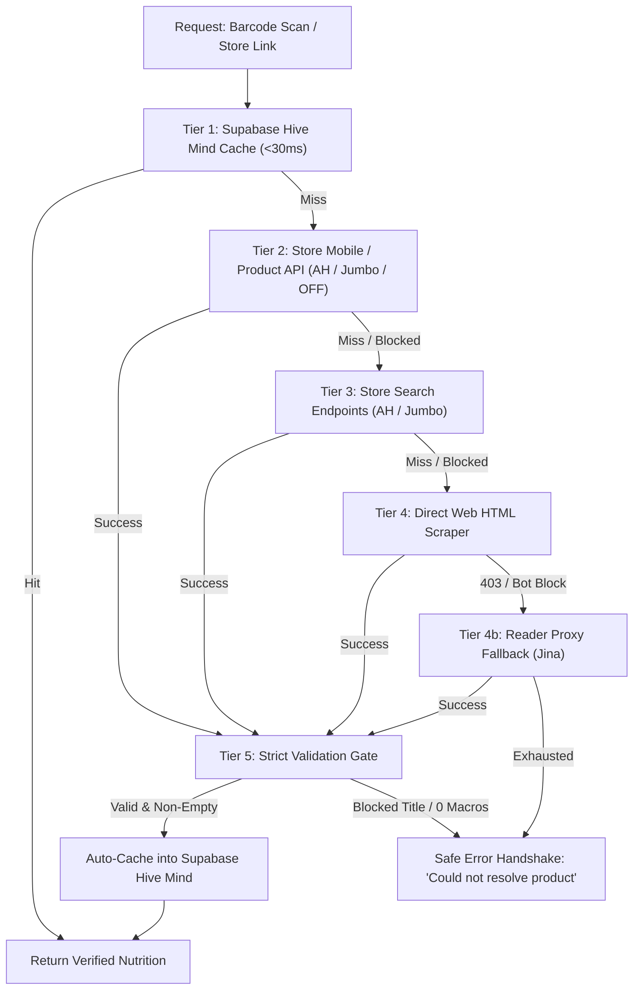
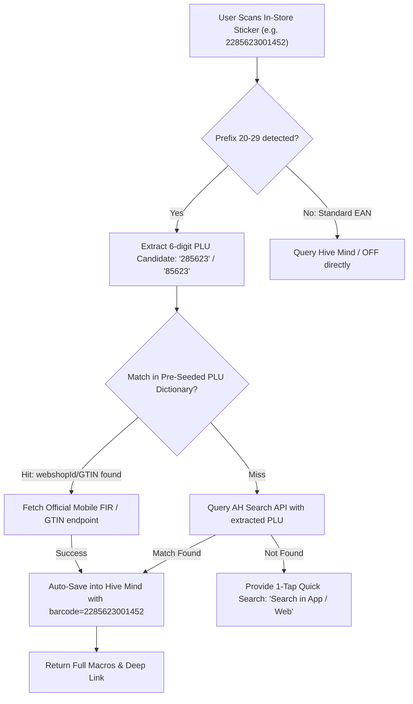

# Nutrition & Barcode Resolution Architecture

This document describes the multi-tier dietary resolution pipeline and the in-store scale barcode (PLU) alias resolution engine.

---

## 1. Multi-Tier Resolution Pipeline

---

## 2. In-Store Scale Barcode & PLU Alias Resolution Engine

---

## 3. Component Details & Fallback Sequence

| Tier | Component | Strategy | Latency |
| :--- | :--- | :--- | :--- |
| **Tier 1** | Supabase `food_items` | Checks `barcode`, `id = ean_{barcode}`, or `id = ah_wi{webshopId}` | `< 30ms` |
| **Tier 1.5** | PLU Alias Mapper | `extractScalePluCandidates()` + `BAKERY_PLU_DICTIONARY` | `< 1ms` |
| **Tier 2** | Mobile Services API | Anonymous mobile token + direct GTIN & FIR webshop ID endpoints | `~150ms` |
| **Tier 3** | Store Search Endpoints | Store search query resolution via store search APIs | `~300ms` |
| **Tier 4** | Web HTML Scraper | Server-side parsing of structured JSON-LD and Dutch nutrition tables | `~500ms` |
| **Tier 4b** | Proxy Reader | Fallback proxy when supermarket bot mitigations trigger | `~1.2s` |
| **Tier 5** | Strict Quality Gate | Verifies title cleanliness, non-zero macro validation, and unit normalization | `< 1ms` |

---

## 4. Open-Source Reverse-Engineering Research & Fallback Ecosystem

The application's supermarket resolution and shopping list ingestion pipelines incorporate architectural research and patterns from community-maintained open-source projects:

### 4.1 SupermarktConnector (Python)
- **Repo**: [robin-v/SupermarktConnector](https://github.com/robin-v/SupermarktConnector)
- **Ecosystem**: Python package (`pip install SupermarktConnector`)
- **Key Concepts Adopted**:
  - Clean anonymous mobile token acquisition (`/mobile-auth/v1/auth/token/anonymous`) with `clientId: 'appie'`.
  - Multi-retailer mapping (Albert Heijn, Jumbo, PLUS, Dirk, Aldi, Lidl).
  - Normalization of package weights and serving units (`g` vs. `ml`).

### 4.2 appie-go (Go) & appie-cli
- **Repo**: [appie-go](https://github.com/appie-go)
- **Ecosystem**: Go module and command-line tool
- **Key Concepts Adopted**:
  - High-throughput concurrency handling for resolving multi-item shopping lists in parallel.
  - Native mobile header rotation (`Appie/8.8.2 iOS/17.0`, `Host: api.ah.nl`) to ensure reliable upstream response rates.
  - Clean error categorization distinguishing expired shared lists from missing products.

### 4.3 albert-heijn-graphql-api (Python)
- **Repo**: [albert-heijn-graphql-api](https://github.com/albert-heijn-graphql-api)
- **Ecosystem**: GraphQL schema definitions & query tools
- **Key Concepts Adopted**:
  - Documented GraphQL queries (`sharedList`, `favoriteListV2`, `productSearch`) against `api.ah.nl/graphql`.
  - Application identification header (`x-application: AH-ShoppingList-Next`).
  - Handling of nested product fragments and sales unit sizing attributes.

### 4.4 albert-heijn-api (Node.js)
- **Repo**: [albert-heijn-api](https://github.com/albert-heijn-api)
- **Ecosystem**: Node.js & TypeScript microservice wrappers
- **Key Concepts Adopted**:
  - Server-side CORS proxy architecture implemented in `/api/grocery-list.ts` and `/api/product-link.ts`.
  - FIR (Food Information Regulation) nutritional table regex and structured schema parsing.
  - Automated database indexing ensuring every resolved item is permanently cached for all users.

