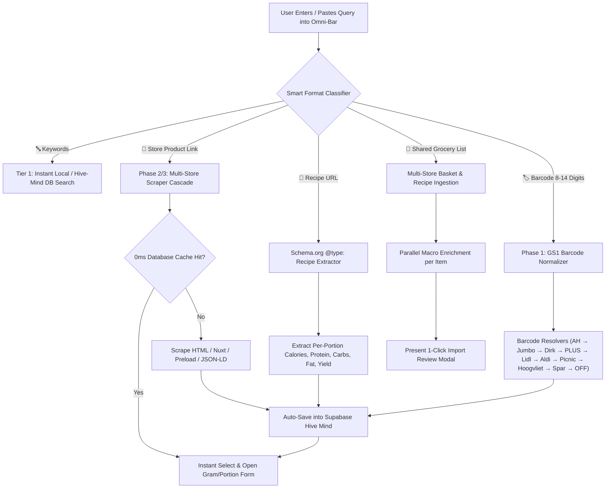

# Nutrition, Barcode & Multi-Store Resolution Architecture (37 Fallback Engine)

This document describes the 37-tier dietary resolution pipeline, GS1 barcode normalizer (EAN-8 / UPC-A / EAN-13 / GTIN-14), multi-retailer scraper ecosystem (**Albert Heijn, Jumbo, Dirk, PLUS, Lidl, Aldi, Picnic, Hoogvliet, Spar**), in-store scale barcode (PLU) alias engine, Schema.org Recipe extractor, and the unified 5-in-1 omni-input bar.

---

## 1. 5-in-1 Universal Omni-Input Bar Architecture

---

## 2. 37 Multi-Tier Fallback Strategies Breakdown

### A. Barcode Resolution Pipeline (15 Fallback Methods)
1. **UPC / EAN-13 / GTIN-14 Normalizer**: Auto-evaluates 8-digit (EAN-8), 12-digit (UPC-A), 13-digit (EAN-13 with zero-padding `0...`), and 14-digit GTIN variants across all search queries.
2. **GS1 Modulo-10 Checksum Validator**: Validates mathematical integrity of scanned barcodes before dispatching network requests.
3. **In-Store Bakery PLU Aliasing**: Maps 6-digit scale barcodes (`20-29` prefix) to verified catalog items.
4. **Albert Heijn Primary Mobile API**: GTIN lookup via `/mobile-services/product/detail/v4/fir/gtin/{barcode}`.
5. **Albert Heijn Secondary Web Search**: HTML fallback querying `ah.nl/zoeken?query={barcode}`.
6. **Jumbo Primary Mobile API**: Querying `mobileapi.jumbo.com/v17/search?q={barcode}`.
7. **Jumbo Secondary Web Search Scraper**: HTML fallback on `jumbo.com/zoeken`.
8. **Dirk van den Broek Primary API**: Catalog search via `api.dirk.nl/v1/assortment/search?search={barcode}`.
9. **Dirk Secondary Web Scraper**: HTML fallback on `dirk.nl/boodschappen`.
10. **PLUS Supermarkt Preload HotCache**: Search via `plus.nl/zoeken?zoekterm={barcode}`.
11. **Lidl Nederland Catalog & Web Search**: Queries `lidl.nl/q/search?q={barcode}`.
12. **Aldi Nederland Web Search Scraper**: Product scraper on `aldi.nl/zoekresultaten.html`.
13. **Picnic Online Supermarket Search API**: Queries `picnic.app/nl/zoeken?q={barcode}`.
14. **Hoogvliet & Spar Nederland Resolvers**: Search on `hoogvliet.com/zoeken` and `spar.nl/zoeken`.
15. **Open Food Facts Global API v2**: Global multi-variant query on `world.openfoodfacts.org/api/v2/product/{barcode}.json`.

---

### B. Product Link & 404 Recovery Pipeline (13 Fallback Methods)
16. **Direct Chrome Browser-Header Fetch**: Bypasses basic WAF checks with realistic client headers.
17. **AH Mobile Services FIR API**: Resolves `wi...` IDs directly when AH web pages block requests.
18. **AH Keyword Slug Recovery**: Recovers from moved/changed AH product URLs.
19. **Jumbo Mobile API**: Resolves SKU IDs directly when Jumbo web pages are blocked.
20. **Jumbo 404 Auto-Recovery**: Detects 404 / discontinued pages and swaps them with active live product URLs via keyword search.
21. **Dirk Nuxt 3 `__NUXT_DATA__` Devalue Parser**: Extracts raw reactive state from Dirk pages.
22. **PLUS HotCache Preload Endpoint**: Bypasses SSR hydration latency.
23. **Lidl Nederland Adapter**: JSON-LD Schema.org + German/Dutch nutrition table parser for `lidl.nl/p/...`.
24. **Aldi Nederland Adapter**: HTML & Microdata parser for `aldi.nl/producten/...`.
25. **Picnic Adapter**: Product article parser for `picnic.app/nl/p/...`.
26. **Hoogvliet Adapter**: Product details scraper for `hoogvliet.com/product/...`.
27. **Spar Adapter**: Product details scraper for `spar.nl/producten/...`.
28. **High-Availability Reader Proxy (`r.jina.ai`)**: Headless bypass for `403 Forbidden`, `429 Too Many Requests`, and `503 Service Unavailable`.

---

### C. Boodschappenlijst & Recipe Ingestion Pipeline (9 Fallback Methods)
29. **AH GraphQL Mobile Shared List**: Resolves anonymous token lists (`getSharedList`).
30. **AH HTML List Scraper**: Parses `ah.nl/lijst/...`.
31. **AH Allerhande Recipe Scraper**: Parses `ah.nl/allerhande/recepten/...`.
32. **Jumbo Recipe & Shared List Scraper**: Parses `jumbo.com/recepten/...`.
33. **Dirk Recipe & Shared List Scraper**: Parses `dirk.nl/recepten/...`.
34. **PLUS Recipe & Shared List Scraper**: Parses `plus.nl/recepten/...`.
35. **Lidl Recipe / List Scraper**: Parses `lidl.nl/recepten/...`.
36. **Picnic Shared Basket / List Scraper**: Parses `picnic.app/nl/basket/...`.
37. **Schema.org Universal Recipe Parser & Single-Link Auto-Wrap**: Extracts `@type: "Recipe"` from *any* website (e.g. 24Kitchen, Lekker & Simpel, HelloFresh) with per-portion calorie and macro calculations.

---

## 3. Supported Supermarkets & Retailers Matrix

| Supermarket / Source | Barcode Scanner | Product Link Scraper | Shared List / Basket | 404 Auto-Recovery | Verified Deep Search Link |
| :--- | :---: | :---: | :---: | :---: | :---: |
| **Albert Heijn** (`ah.nl`) | ✅ Yes | ✅ Yes | ✅ Yes (GraphQL/HTML) | ✅ Yes | `Zoek in AH App / Web` |
| **Jumbo** (`jumbo.com`) | ✅ Yes | ✅ Yes | ✅ Yes | ✅ Yes | `Zoek op Jumbo.com` |
| **Dirk van den Broek** (`dirk.nl`) | ✅ Yes | ✅ Yes | ✅ Yes | ✅ Yes | `Zoek op Dirk.nl` |
| **PLUS Supermarkt** (`plus.nl`) | ✅ Yes | ✅ Yes | ✅ Yes | ✅ Yes | `Zoek op PLUS.nl` |
| **Lidl Nederland** (`lidl.nl`) | ✅ Yes | ✅ Yes | ✅ Yes | ✅ Yes | `Zoek op Lidl.nl` |
| **Aldi Nederland** (`aldi.nl`) | ✅ Yes | ✅ Yes | ✅ Yes | ✅ Yes | `Zoek op Aldi.nl` |
| **Picnic** (`picnic.app`) | ✅ Yes | ✅ Yes | ✅ Yes (Basket) | ✅ Yes | `Zoek op Picnic` |
| **Hoogvliet** (`hoogvliet.com`) | ✅ Yes | ✅ Yes | ✅ Yes | ✅ Yes | `Zoek op Hoogvliet.com` |
| **Spar** (`spar.nl`) | ✅ Yes | ✅ Yes | ✅ Yes | ✅ Yes | `Zoek op Spar.nl` |
| **Open Food Facts** (`world.openfoodfacts.org`) | ✅ Yes | ✅ Yes | — | — | `Bekijk op OpenFoodFacts` |
| **Universal Recipe Sites** (*24Kitchen, HelloFresh...*) | — | ✅ Yes | ✅ Yes | ✅ Yes | `Bekijk recept` |

---

## 4. Component Details & Latency Profile

| Tier | Component | Strategy | Latency |
| :--- | :--- | :--- | :--- |
| **Tier 1** | Supabase `food_items` | Checks `barcode`, `id = ean_{barcode}`, or `id = {id}` | `< 30ms` |
| **Tier 1.5** | GS1 & PLU Normalizer | `generateBarcodeVariants()` + `BAKERY_PLU_DICTIONARY` | `< 1ms` |
| **Tier 2** | Retailer Native Mobile APIs | Anonymous mobile token + direct GTIN & FIR webshop ID endpoints | `~150ms` |
| **Tier 3** | Retailer Search Endpoints | Automated catalog search fallback across all 9 supermarket engines | `~300ms` |
| **Tier 4** | Web HTML / Nuxt Scraper | Server-side parsing of structured JSON-LD, Nuxt 3 devalue, and Dutch nutrition tables | `~500ms` |
| **Tier 4b** | High-Availability Proxy | Fallback reader proxy (`r.jina.ai`) when supermarket bot mitigations trigger | `~1.2s` |
| **Tier 5** | Strict Quality Gate | Suppresses generic `"Product"` titles, validates non-zero macros, and normalizes serving units (`g` vs. `ml`) | `< 1ms` |

---

## 5. Open-Source Reverse-Engineering Research & Fallback Ecosystem

The application's supermarket resolution and shopping list ingestion pipelines incorporate architectural research and patterns from community-maintained open-source projects:

### 5.1 SupermarktConnector (Python)
- **Repo**: [robin-v/SupermarktConnector](https://github.com/robin-v/SupermarktConnector)
- **Ecosystem**: Python package (`pip install SupermarktConnector`)
- **Key Concepts Adopted**:
  - Clean anonymous mobile token acquisition (`/mobile-auth/v1/auth/token/anonymous`) with `clientId: 'appie'`.
  - Multi-retailer mapping (Albert Heijn, Jumbo, PLUS, Dirk, Aldi, Lidl).
  - Normalization of package weights and serving units (`g` vs. `ml`).

### 5.2 appie-go (Go) & appie-cli
- **Repo**: [appie-go](https://github.com/appie-go)
- **Ecosystem**: Go module and command-line tool
- **Key Concepts Adopted**:
  - High-throughput concurrency handling for resolving multi-item shopping lists in parallel.
  - Native mobile header rotation (`Appie/8.8.2 iOS/17.0`, `Host: api.ah.nl`) to ensure reliable upstream response rates.
  - Clean error categorization distinguishing expired shared lists from missing products.

### 5.3 albert-heijn-graphql-api (Python)
- **Repo**: [albert-heijn-graphql-api](https://github.com/albert-heijn-graphql-api)
- **Ecosystem**: GraphQL schema definitions & query tools
- **Key Concepts Adopted**:
  - Documented GraphQL queries (`sharedList`, `favoriteListV2`, `productSearch`) against `api.ah.nl/graphql`.
  - Application identification header (`x-application: AH-ShoppingList-Next`).
  - Handling of nested product fragments and sales unit sizing attributes.

### 5.4 albert-heijn-api (Node.js)
- **Repo**: [albert-heijn-api](https://github.com/albert-heijn-api)
- **Ecosystem**: Node.js & TypeScript microservice wrappers
- **Key Concepts Adopted**:
  - Server-side CORS proxy architecture implemented in `/api/grocery-list.ts` and `/api/product-link.ts`.
  - FIR (Food Information Regulation) nutritional table regex and structured schema parsing.
  - Automated database indexing ensuring every resolved item is permanently cached for all users.
