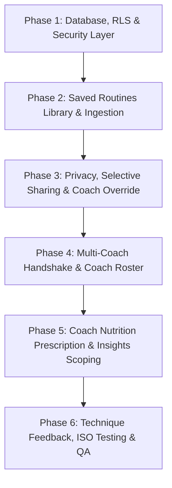

# Comprehensive Roles & Coach-Athlete RBAC Implementation Plan (`roles_implementation_plan.md`)

This document outlines the phased, end-to-end technical implementation plan for **Role-Based Access Control (RBAC)**, **Multi-Coach Specialization & Mutual Handshake**, **Athlete Privacy & Selective Sharing**, **Saved Routines Library**, **Coach Nutrition Prescription**, and **Data Scope Segregation (Global vs. Routine-Scoped Insights)** in Workout Tracker.

---

## 1. Quality Standards & Compliance Alignment

- **ISO/IEC 25010 (System and Software Quality Requirements)**:
  - **Security (Confidentiality & Access Control)**: Enforced via PostgreSQL Row-Level Security (RLS) policies. Private logs and biometrics remain isolated; connected coaches receive scoped access only upon an active mutual handshake.
  - **Functional Suitability (Completeness & Correctness)**: Explicit role-based capabilities tailored to Athletes, Strength Coaches, Dietitians, Administrators, and Public Guests.
  - **Reliability (Fault Tolerance & Data Integrity)**: Non-destructive routine proposals and complete data preservation on coaching relationship termination.
  - **Usability (Learnability & Error Protection)**: Unambiguous "View As Client" banners prevent coaches from accidentally editing client data or confusing accounts with their own personal workouts.
- **ISO/IEC/IEEE 29119 (Software Testing Documentation)**:
  - Strict BDD/Gherkin acceptance criteria mapped 1:1 with frontend happy flows.

---

## 2. Roles, Specializations & Permission Matrix

| Capability / Action | Guest | Athlete | Strength Coach | Nutrition Coach | Administrator |
| :--- | :---: | :---: | :---: | :---: | :---: |
| **View Public Session via Share Link** | ✅ | ✅ | ✅ | ✅ | ✅ |
| **Log Personal Workouts & Track Sets** | ❌ | ✅ | ✅ *(own)* | ✅ *(own)* | ✅ *(own)* |
| **Log Daily Nutrition & Barcode Scan** | ❌ | ✅ | ✅ *(own)* | ✅ *(own)* | ✅ *(own)* |
| **Manage Personal Saved Routines Library** | ❌ | ✅ | ✅ *(own)* | ✅ *(own)* | ✅ *(own)* |
| **Configure Granular Public/Peer Privacy** | ❌ | ✅ | ✅ *(own)* | ✅ *(own)* | ✅ *(own)* |
| **Send Coach Connection Invitation** | ❌ | ❌ | ✅ | ✅ | ❌ |
| **Accept / Revoke Coach Connection** | ❌ | ✅ | ❌ | ❌ | ❌ |
| **Inspect Connected Athlete Log Book** | ❌ | ❌ | ✅ *(linked)* | ✅ *(linked)* | ✅ |
| **Propose Training Program to Athlete** | ❌ | ❌ | ✅ *(linked)* | ❌ | ❌ |
| **Prescribe Daily Nutrition / Macro Targets**| ❌ | ❌ | ❌ | ✅ *(linked)* | ❌ |
| **Annotate Sets / Form Check Videos** | ❌ | ❌ | ✅ *(linked)* | ❌ | ❌ |
| **Monitor Client Roster Compliance Badges**| ❌ | ❌ | ✅ | ✅ | ✅ |
| **Moderate Global Exercise & Food Index** | ❌ | ❌ | ❌ | ❌ | ✅ |
| **Approve Coach Promotion Requests** | ❌ | ❌ | ❌ | ❌ | ✅ |

---

## 3. Core Architectural Mechanisms

### 3.1 Two-Way Mutual Handshake & Multi-Coach Support
1. **Coach Specializations**: Coaches hold specialty tags (`'strength'`, `'nutrition'`, `'head_coach'`). An athlete can connect with both a Strength Coach and a Dietitian simultaneously.
2. **Hybrid Invitation Engine**: Coaches generate shareable QR codes/links or send direct email invitations.
3. **Strict Athlete Consent**: The coach has zero visibility until the athlete confirms the invitation in their privacy settings.
4. **Instant Revocation & Data Retention**: If either party disconnects:
   - Coach access is immediately revoked in RLS.
   - The athlete retains full ownership of active routines, saved programs, historical logs, and coach notes.

### 3.2 Granular Privacy & Coach Override
1. **Public Profile Controls**: Athletes can set their profile to Private or toggle public visibility module-by-module (`workouts`, `biometrics`, `dietary`, `photos`).
2. **Selective Peer Sharing**: Athletes can grant read access to specific training partners (e.g., share workout volume and 1RM progression, while hiding bodyweight and dietary logs).
3. **Full Coach Override**: An accepted coach connection (`coach_athlete_links.status = 'accepted'`) acts as an authorized bypass in RLS, granting the verified coach 360° visibility required for coaching.

### 3.3 Saved Routines Library & Non-Destructive Proposals
1. **Multi-Program Library**: Athletes store multiple named training splits in `saved_routine_programs`. Only one program is flagged `is_active = true` at any given time.
2. **Proposal Ingestion**: When a coach sends a program, it arrives as a proposal in `routine_proposals`. The athlete reviews and clicks *"Save to My Routines & Activate"*, cloning the program into their library without overwriting existing splits.

### 3.4 Data Scope Segregation: Global vs. Routine-Scoped
- **100% Global (Shared Across Routines)**:
  - Daily Dietary Logs, Macronutrient Totals, and Water Intake.
  - Bodyweight, Body Measurements, and BMI Timeline.
- **Dual Scope (Global Overview + 1-Click Routine Filter)**:
  - 90-Day Volume & Tonnage.
  - Workout Activity Heatmap.
  - Exercise 1RM and Strength Progression Trajectories.

---

## 4. Complete Relational Database Schema & RLS

```sql
-- ============================================================================
-- 1. USER ROLES & COACH SPECIALIZATION
-- ============================================================================
CREATE TYPE app_role AS ENUM ('athlete', 'coach', 'admin');
CREATE TYPE coach_specialty AS ENUM ('strength', 'nutrition', 'head_coach');

CREATE TABLE IF NOT EXISTS user_roles (
  user_id UUID PRIMARY KEY REFERENCES auth.users(id) ON DELETE CASCADE,
  role app_role NOT NULL DEFAULT 'athlete',
  specialty coach_specialty DEFAULT NULL,
  is_approved BOOLEAN NOT NULL DEFAULT FALSE,
  created_at TIMESTAMPTZ NOT NULL DEFAULT NOW(),
  updated_at TIMESTAMPTZ NOT NULL DEFAULT NOW()
);

-- ============================================================================
-- 2. COACH-ATHLETE MUTUAL RELATIONSHIPS
-- ============================================================================
CREATE TYPE link_status AS ENUM ('pending', 'accepted', 'declined', 'revoked');

CREATE TABLE IF NOT EXISTS coach_athlete_links (
  id UUID PRIMARY KEY DEFAULT gen_random_uuid(),
  coach_id UUID NOT NULL REFERENCES auth.users(id) ON DELETE CASCADE,
  athlete_id UUID NOT NULL REFERENCES auth.users(id) ON DELETE CASCADE,
  specialty coach_specialty NOT NULL DEFAULT 'strength',
  status link_status NOT NULL DEFAULT 'pending',
  invite_code TEXT UNIQUE,
  notes TEXT,
  created_at TIMESTAMPTZ NOT NULL DEFAULT NOW(),
  updated_at TIMESTAMPTZ NOT NULL DEFAULT NOW(),
  CONSTRAINT unique_coach_athlete_pair UNIQUE (coach_id, athlete_id, specialty)
);

-- ============================================================================
-- 3. ATHLETE PRIVACY & SELECTIVE PEER SHARING
-- ============================================================================
CREATE TABLE IF NOT EXISTS user_privacy_settings (
  user_id UUID PRIMARY KEY REFERENCES auth.users(id) ON DELETE CASCADE,
  is_public_profile BOOLEAN NOT NULL DEFAULT FALSE,
  share_workouts BOOLEAN NOT NULL DEFAULT TRUE,
  share_biometrics BOOLEAN NOT NULL DEFAULT FALSE,
  share_dietary BOOLEAN NOT NULL DEFAULT FALSE,
  share_photos BOOLEAN NOT NULL DEFAULT FALSE,
  created_at TIMESTAMPTZ NOT NULL DEFAULT NOW(),
  updated_at TIMESTAMPTZ NOT NULL DEFAULT NOW()
);

CREATE TABLE IF NOT EXISTS user_peer_shares (
  id UUID PRIMARY KEY DEFAULT gen_random_uuid(),
  owner_id UUID NOT NULL REFERENCES auth.users(id) ON DELETE CASCADE,
  grantee_id UUID NOT NULL REFERENCES auth.users(id) ON DELETE CASCADE,
  share_workouts BOOLEAN NOT NULL DEFAULT TRUE,
  share_biometrics BOOLEAN NOT NULL DEFAULT FALSE,
  share_dietary BOOLEAN NOT NULL DEFAULT FALSE,
  created_at TIMESTAMPTZ NOT NULL DEFAULT NOW(),
  CONSTRAINT unique_peer_share UNIQUE (owner_id, grantee_id)
);

-- ============================================================================
-- 4. SAVED ROUTINES LIBRARY & PROGRAM SWITCHING
-- ============================================================================
CREATE TABLE IF NOT EXISTS saved_routine_programs (
  id UUID PRIMARY KEY DEFAULT gen_random_uuid(),
  user_id UUID NOT NULL REFERENCES auth.users(id) ON DELETE CASCADE,
  title TEXT NOT NULL,
  description TEXT,
  is_active BOOLEAN NOT NULL DEFAULT FALSE,
  source_coach_id UUID REFERENCES auth.users(id) ON DELETE SET NULL,
  program_data JSONB NOT NULL,
  created_at TIMESTAMPTZ NOT NULL DEFAULT NOW(),
  updated_at TIMESTAMPTZ NOT NULL DEFAULT NOW()
);

-- ============================================================================
-- 5. ROUTINE PROPOSALS (COACH -> ATHLETE)
-- ============================================================================
CREATE TYPE proposal_status AS ENUM ('proposed', 'applied', 'rejected');

CREATE TABLE IF NOT EXISTS routine_proposals (
  id UUID PRIMARY KEY DEFAULT gen_random_uuid(),
  coach_id UUID NOT NULL REFERENCES auth.users(id) ON DELETE CASCADE,
  athlete_id UUID NOT NULL REFERENCES auth.users(id) ON DELETE CASCADE,
  title TEXT NOT NULL,
  description TEXT,
  program_payload JSONB NOT NULL,
  status proposal_status NOT NULL DEFAULT 'proposed',
  created_at TIMESTAMPTZ NOT NULL DEFAULT NOW(),
  updated_at TIMESTAMPTZ NOT NULL DEFAULT NOW()
);

-- ============================================================================
-- 6. COACH NUTRITION & MACRO TARGET PRESCRIPTION
-- ============================================================================
CREATE TABLE IF NOT EXISTS coach_macro_prescriptions (
  id UUID PRIMARY KEY DEFAULT gen_random_uuid(),
  coach_id UUID NOT NULL REFERENCES auth.users(id) ON DELETE CASCADE,
  athlete_id UUID NOT NULL REFERENCES auth.users(id) ON DELETE CASCADE,
  target_kcal INTEGER NOT NULL,
  target_protein_g NUMERIC NOT NULL,
  target_carbs_g NUMERIC NOT NULL,
  target_fat_g NUMERIC NOT NULL,
  target_fiber_g NUMERIC DEFAULT NULL,
  notes TEXT,
  is_active BOOLEAN NOT NULL DEFAULT TRUE,
  created_at TIMESTAMPTZ NOT NULL DEFAULT NOW(),
  updated_at TIMESTAMPTZ NOT NULL DEFAULT NOW()
);

-- ============================================================================
-- 7. SET ANNOTATIONS & FORM CHECK VIDEOS
-- ============================================================================
CREATE TABLE IF NOT EXISTS workout_set_coach_feedback (
  id UUID PRIMARY KEY DEFAULT gen_random_uuid(),
  set_id UUID NOT NULL,
  session_id UUID NOT NULL,
  coach_id UUID NOT NULL REFERENCES auth.users(id) ON DELETE CASCADE,
  athlete_id UUID NOT NULL REFERENCES auth.users(id) ON DELETE CASCADE,
  video_url TEXT,
  timestamp_marker TEXT,
  cue_text TEXT NOT NULL,
  created_at TIMESTAMPTZ NOT NULL DEFAULT NOW()
);
```

---

## 5. Phased Implementation Breakdown



### Phase 1: Database Foundation, RLS Policies & Auth Integration
- **Objective**: Establish server-managed roles, tables, and Postgres RLS security policies.
- **Tasks**:
  1. Apply Drizzle/Supabase migration for `user_roles`, `coach_athlete_links`, `saved_routine_programs`, `routine_proposals`, and `coach_macro_prescriptions`.
  2. Implement RLS policies ensuring athletes only access their own data and authorized coaches only access accepted clients.
  3. Extend `AuthContext.tsx` to expose `userRole`, `specialty`, `isCoach`, `isAdmin`, and `isAthlete`.
- **Testing Gate**: Unit tests verify that unauthenticated requests and unauthorized athletes receive 403 / zero rows.

### Phase 2: Saved Routines Library & Program Activation
- **Objective**: Allow athletes to archive, switch, and clone workout splits without data loss.
- **Tasks**:
  1. Implement `SavedRoutinesLibraryModal.tsx` in the Settings and Tracker views.
  2. Add `"Save Current Split As New Program"` and `"Activate Program"` actions.
  3. Update `useWorkoutSession.ts` to switch active routines non-destructively.
- **Testing Gate**: Verify switching from a 3-day PPL to a 4-day Upper/Lower split preserves all exercise configurations.

### Phase 3: Privacy Controls, Selective Sharing & Handshake Bypass
- **Objective**: Give athletes granular visibility control over their profile while granting full access to connected coaches.
- **Tasks**:
  1. Build `PrivacySettingsModal.tsx` with module-level toggles (`workouts`, `biometrics`, `dietary`, `photos`).
  2. Implement `SelectivePeerShareModal.tsx` for granting peer access to training partners.
  3. Configure RLS rules ensuring connected coaches (`status = 'accepted'`) bypass public privacy restrictions.
- **Testing Gate**: Verify a private athlete's profile is hidden from guests but fully visible to their accepted coach.

### Phase 4: Multi-Coach Connection Handshake & Coach Roster
- **Objective**: Implement hybrid invitations, multi-coach connections, and the coach management dashboard.
- **Tasks**:
  1. Build `CoachClientRoster.tsx` with adherence badges (🟢 On Track, 🟡 In Progress, 🔴 Inactive).
  2. Create `CoachInviteModal.tsx` supporting QR code, shareable link, and email lookup.
  3. Build `CoachViewAsBanner.tsx` displayed prominently when a coach inspects a client's dashboard.
  4. Build `RoutineProposalComposer.tsx` and `ProposedRoutineReviewModal.tsx` for non-destructive program assignment.
  5. Implement the `"Disconnect Coach"` protocol ensuring athlete data retention.
- **Testing Gate**: Full handshake flow tested from invitation generation to acceptance and routine proposal ingestion.

### Phase 5: Coach Nutrition Prescription & Insights Routine Scoping
- **Objective**: Allow nutrition coaches to set daily macro targets and add routine filtering to Insights.
- **Tasks**:
  1. Build `CoachMacroPlannerModal.tsx` for prescribing calorie/macro targets.
  2. Update `DietaryDailyMacroTotals.tsx` to render "Coach Target vs. Actual" progress rings when a prescription is active.
  3. Implement `ProgramScopeSelector.tsx` on the Insights tab allowing 1-click filtering between Global volume and individual routine blocks.
- **Testing Gate**: Verify nutrition targets update in real time on the athlete's Dietary view and Insights filters volume accurately.

### Phase 6: Technique Feedback, ISO/IEC 29119 Test Suite & QA
- **Objective**: Deliver video technique feedback and complete automated QA verification.
- **Tasks**:
  1. Implement `WorkoutSetCoachFeedback.tsx` for timestamped coaching cues on form videos.
  2. Implement Vitest frontend test suites covering all role combinations (`athlete`, `coach`, `admin`, `guest`).
  3. Audit compliance against ISO/IEC 25010 security, usability, and functional correctness.
- **Testing Gate**: 100% pass rate across frontend unit, integration, and BDD Gherkin acceptance criteria.

---

## 6. Architecture Component Map

```text
src/
├── context/
│   ├── AuthContext.tsx                   # User auth + role state (isCoach, isAdmin, specialty)
│   └── CoachClientContext.tsx            # Active client inspection context & "View As" state
├── components/
│   ├── coach/
│   │   ├── CoachClientRoster.tsx         # Client list with compliance badges (On Track/Inactive)
│   │   ├── CoachInviteModal.tsx          # Hybrid QR / link / email invitation generator
│   │   ├── CoachViewAsBanner.tsx         # Prominent top bar during client inspection
│   │   ├── RoutineProposalComposer.tsx   # Compose multi-day split proposals for clients
│   │   ├── CoachMacroPlannerModal.tsx    # Prescribe daily calories and macro targets
│   │   └── WorkoutSetCoachFeedback.tsx   # Timestamped form check video annotations
│   ├── routine/
│   │   ├── SavedRoutinesLibraryModal.tsx # Multi-program archive, rename, switch active split
│   │   └── ProposedRoutineReviewModal.tsx# Review coach split & "Save to Library & Activate"
│   ├── insights/
│   │   └── ProgramScopeSelector.tsx      # Filter Insights by "All Programs" vs specific routine
│   ├── dietary/
│   │   └── DietaryCoachTargetRing.tsx    # "Target vs Actual" visualization in Dietary view
│   └── settings/
│       ├── PrivacySettingsModal.tsx      # Granular module-level public visibility toggles
│       ├── SelectivePeerShareModal.tsx   # Grant read access to specific athlete friends
│       └── CoachConnectionsSection.tsx   # Manage active coaches & pending invitations
└── lib/
    ├── supabaseData.ts                   # Role-aware DB queries and RLS handlers
    └── insightsEngine.ts                 # Scoped routine calculations for volume and 1RM
```

