# Entity Relationship Diagram (ERD)

This document provides a comprehensive, production-grade specification of the relational database schema, all 21 entities, explicit attributes, PostgreSQL data types, primary and foreign key constraints, default values, and relational cardinalities for the Workout Tracker platform.

---

## 📊 Visual Entity Relationship Diagram

```mermaid
erDiagram
    users {
        uuid id PK
        text user_id UK
        text email
        text name
        date date_of_birth
        text gender
        numeric height_cm
        numeric weight_kg
        text fitness_level
        text training_location
        int4 last_completed_workout_order
        int4 max_workout_order
        jsonb last_set_summary_per_exercise
        jsonb metrics
        timestamptz created_at
        timestamptz updated_at
    }

    body_logs {
        text id PK
        text user_id FK
        date log_date UK
        numeric weight_kg
        numeric height_cm
        numeric calculated_bmi
        numeric waist_cm
        numeric body_fat_percentage
        text notes
        text source
        timestamptz created_at
        timestamptz updated_at
    }

    workouts {
        text id PK
        text user_id FK
        text name
        int4 order
        text_array exercise_ids
        timestamptz created_at
    }

    exercises {
        text id PK
        text user_id FK
        text name
        text type
        int4 target_sets
        int4 target_rep_min
        int4 target_rep_max
        boolean is_custom
        jsonb custom_cues
        text category
        text image_url
        timestamptz created_at
    }

    workout_exercises {
        uuid id PK
        text user_id FK
        text workout_id FK
        text exercise_id FK
        int4 sort_order
        int4 position
        timestamptz created_at
    }

    sessions {
        text id PK
        text user_id FK
        text workout_id FK
        text status
        numeric sleep_hours
        int4 energy_score
        timestamptz started_at
        timestamptz completed_at
        text notes
        text coach_notes
        text coach_name
        timestamptz reviewed_at
        uuid reviewed_by_coach_id FK
        text reviewed_by_coach_name
        jsonb photos
    }

    sets {
        text id PK
        text session_id FK
        text user_id FK
        text exercise_id FK
        int4 set_number
        numeric weight
        int4 reps
        int4 rir
        int4 duration_seconds
        int4 pain_score
        timestamptz logged_at
        timestamptz started_at
        int4 rest_seconds
    }

    workout_drafts {
        uuid id PK
        uuid user_id FK
        text workout_id FK
        jsonb inputs
        numeric sleep_hours
        int4 energy_score
        text notes
        numeric body_weight_kg
        timestamptz session_date
        timestamptz updated_at
    }

    user_roles {
        uuid user_id PK
        text role
        text specialty
        boolean is_approved
        timestamptz created_at
        timestamptz updated_at
    }

    coach_athlete_links {
        uuid id PK
        uuid coach_id FK
        uuid athlete_id FK
        text specialty
        text status
        text invite_code UK
        text notes
        text coach_name
        text coach_email
        text athlete_name
        text athlete_email
        timestamptz created_at
        timestamptz updated_at
    }

    user_privacy_settings {
        uuid user_id PK
        boolean is_public_profile
        boolean share_workouts
        boolean share_biometrics
        boolean share_dietary
        boolean share_photos
        boolean share_review_receipts
        timestamptz created_at
        timestamptz updated_at
    }

    user_peer_shares {
        uuid id PK
        uuid owner_id FK
        uuid grantee_id FK
        text grantee_name
        text grantee_email
        boolean share_workouts
        boolean share_biometrics
        boolean share_dietary
        timestamptz created_at
    }

    saved_routine_programs {
        uuid id PK
        uuid user_id FK
        text title
        text description
        boolean is_active
        uuid source_coach_id FK
        text source_coach_name
        jsonb program_data
        timestamptz created_at
        timestamptz updated_at
    }

    routine_proposals {
        uuid id PK
        uuid coach_id FK
        uuid athlete_id FK
        text title
        text description
        jsonb program_payload
        text status
        text coach_name
        timestamptz created_at
        timestamptz updated_at
    }

    coach_macro_prescriptions {
        uuid id PK
        uuid coach_id FK
        uuid athlete_id FK
        int4 target_kcal
        numeric target_protein_g
        numeric target_carbs_g
        numeric target_fat_g
        numeric target_fiber_g
        text notes
        boolean is_active
        text coach_name
        timestamptz created_at
        timestamptz updated_at
    }

    workout_set_coach_feedback {
        uuid id PK
        text set_id FK
        text session_id FK
        uuid coach_id FK
        uuid athlete_id FK
        text video_url
        text timestamp_marker
        text cue_text
        text coach_name
        timestamptz created_at
    }

    food_items {
        text id PK
        text name
        text brand
        text serving_unit
        numeric kcal_per_100g
        numeric protein_per_100g
        numeric carbs_per_100g
        numeric sugar_per_100g
        numeric fat_per_100g
        numeric fiber_per_100g
        text source_url
        text created_by
        timestamptz created_at
        timestamptz updated_at
        text user_id FK
        boolean is_custom
        numeric package_weight_grams
        numeric piece_count
        text barcode
    }

    dietary_logs {
        text id PK
        text user_id FK
        date log_date UK
        numeric total_kcal
        numeric total_protein
        numeric total_carbs
        numeric total_sugar
        numeric total_fat
        numeric total_fiber
        jsonb entries_json
        timestamptz created_at
        timestamptz updated_at
    }

    dietary_log_entries {
        text id PK
        text dietary_log_id FK
        text user_id FK
        text food_item_id FK
        text name
        text brand
        numeric amount_grams
        numeric kcal_per_100g
        numeric protein_per_100g
        numeric carbs_per_100g
        numeric sugar_per_100g
        numeric fat_per_100g
        numeric fiber_per_100g
        numeric calculated_kcal
        numeric calculated_protein
        numeric calculated_carbs
        numeric calculated_sugar
        numeric calculated_fat
        numeric calculated_fiber
        timestamptz logged_at
        timestamptz created_at
    }

    missing_product_reports {
        uuid id PK
        text barcode
        text name
        text brand
        text store
        text notes
        text user_id FK
        text status
        timestamptz created_at
        timestamptz updated_at
    }

    system {
        text id PK
        text seed_version
        timestamptz updated_at
    }

    %% Core Workout & Biometric Relationships
    users ||--o{ workouts : "owns"
    users ||--o{ exercises : "creates"
    users ||--o{ sessions : "logs"
    users ||--o{ sets : "performs"
    users ||--o{ body_logs : "records_daily_weight"
    users ||--o{ workout_drafts : "saves"
    users ||--o{ workout_exercises : "configures"

    workouts ||--o{ workout_exercises : "contains"
    exercises ||--o{ workout_exercises : "referenced_by"

    workouts ||--o{ sessions : "executed_in"
    workouts ||--o{ workout_drafts : "drafted_for"

    sessions ||--o{ sets : "contains"
    exercises ||--o{ sets : "tracked_in"

    %% Coaching, Social & Governance Relationships
    users ||--o| user_roles : "assigned_role"
    users ||--o| user_privacy_settings : "configures_privacy"
    users ||--o{ user_peer_shares : "shares_with_peer"
    users ||--o{ coach_athlete_links : "coaches_or_coached_by"
    users ||--o{ saved_routine_programs : "archives_routines"
    users ||--o{ routine_proposals : "proposes_or_receives"
    users ||--o{ coach_macro_prescriptions : "prescribes_or_receives"
    users ||--o{ workout_set_coach_feedback : "feedback_sender_or_receiver"
    sessions ||--o{ workout_set_coach_feedback : "reviewed_in"
    sets ||--o{ workout_set_coach_feedback : "annotated_by"

    %% Dietary, Food Catalog & Feedback Relationships
    users ||--o{ food_items : "creates_custom_food"
    users ||--o{ dietary_logs : "records_daily_nutrition"
    users ||--o{ dietary_log_entries : "logs_food_entry"
    users ||--o{ missing_product_reports : "submits_product_report"

    dietary_logs ||--o{ dietary_log_entries : "aggregates"
    food_items ||--o{ dietary_log_entries : "supplies_nutrition_profile"
```



---

## 🏷️ Custom PostgreSQL Types & ENUMs

The database utilizes explicit PostgreSQL enumerated types to ensure strict integrity:

```sql
CREATE TYPE public.exercise_type AS ENUM ('strength', 'timed');
CREATE TYPE public.session_status AS ENUM ('in_progress', 'completed');
CREATE TYPE public.app_role AS ENUM ('athlete', 'coach', 'admin');
CREATE TYPE public.coach_specialty AS ENUM ('strength', 'nutrition', 'head_coach');
CREATE TYPE public.link_status AS ENUM ('pending', 'accepted', 'declined', 'revoked');
CREATE TYPE public.proposal_status AS ENUM ('proposed', 'applied', 'rejected');
```

---

## 🗄️ Tables & Attributes Specification

### 1. `users`
Represents athlete and coach profiles with explicit biometric columns and client fast-read caches.

| Attribute | Data Type | Constraint | Default | Description |
|---|---|---|---|---|
| `id` | `uuid` | **PK** | `gen_random_uuid()` | Internal unique identifier |
| `user_id` | `text` | **Unique / Indexed** | | Supabase auth UID mapping (`auth.users.id`) |
| `email` | `text` | Not Null | | Primary email address |
| `name` | `text` | Nullable | | Display name |
| `date_of_birth` | `date` | Nullable | | Athlete birthdate |
| `gender` | `text` | Nullable | | Gender identity (`male`, `female`, `other`, `prefer_not_to_say`) |
| `height_cm` | `numeric(5,2)` | Nullable | | Baseline height in centimeters |
| `weight_kg` | `numeric(5,2)` | Nullable | | Baseline bodyweight in kilograms |
| `fitness_level` | `text` | Nullable | | Experience level (`beginner`, `intermediate`, `advanced`) |
| `training_location` | `text` | Nullable | | Facility preference (`gym`, `home`, `hybrid`) |
| `last_completed_workout_order` | `integer` | Default `0` | `0` | Sequence index of the last completed split |
| `max_workout_order` | `integer` | Default `0` | `0` | Maximum split order before cycling back to Day 1 |
| `last_set_summary_per_exercise` | `jsonb` | | `'{}'::jsonb` | Write-through cache of latest exercise benchmarks |
| `metrics` | `jsonb` | | `'{}'::jsonb` | Extended biometric payload & custom somatotype settings |
| `created_at` | `timestamptz` | Default `now()` | `now()` | Account registration timestamp |
| `updated_at` | `timestamptz` | Default `now()` | `now()` | Profile last modified timestamp |

---

### 2. `body_logs` (Daily Weight & BMI History)
Stores time-series daily bodyweight and calculated BMI entries (1 entry per user per day).

| Attribute | Data Type | Constraint | Default | Description |
|---|---|---|---|---|
| `id` | `text` | **PK** | | Unique log ID format (`blog_{user_id}_{date}`) |
| `user_id` | `text` | **FK** $\rightarrow$ `users.user_id` | | Athlete UID |
| `log_date` | `date` | **UK (per user)** | | Date of measurement (`YYYY-MM-DD`, unique with `user_id`) |
| `weight_kg` | `numeric(5,2)` | Not Null | | Bodyweight logged on this day in kg |
| `height_cm` | `numeric(5,2)` | Nullable | | Snapshot height used for BMI computation |
| `calculated_bmi` | `numeric(4,1)` | Nullable | | Historical BMI calculated snapshot |
| `waist_cm` | `numeric(5,2)` | Nullable | | Optional waist circumference in cm |
| `body_fat_percentage` | `numeric(4,1)` | Nullable | | Optional body fat % |
| `notes` | `text` | Nullable | | User measurement reflection notes |
| `source` | `text` | Default `'profile'` | `'profile'` | Origin (`'profile'`, `'workout_session'`, `'manual'`) |
| `created_at` | `timestamptz` | Default `now()` | `now()` | Log creation timestamp |
| `updated_at` | `timestamptz` | Default `now()` | `now()` | Log update timestamp |

---

### 3. `workouts`
Represents workout splits / routines (e.g., Day 1 Push, Day 2 Pull, Day 3 Legs).

| Attribute | Data Type | Constraint | Default | Description |
|---|---|---|---|---|
| `id` | `text` | **PK** | `gen_random_uuid()` | Workout routine identifier (e.g. `w_1`) |
| `user_id` | `text` | **FK** $\rightarrow$ `users.user_id` | | Owner athlete UID |
| `name` | `text` | Not Null | | Split title (e.g. "Day 1 - Push Focus") |
| `order` | `integer` | Not Null | `1` | Split sequence order within the cycle (1, 2, 3...) |
| `exercise_ids` | `text[]` | | `'{}'::text[]` | Ordered array of exercise IDs for fast client queries |
| `created_at` | `timestamptz` | Default `now()` | `now()` | Routine creation timestamp |

---

### 4. `exercises`
Master and custom movement definitions, target parameters, motion cues, and media assets.

| Attribute | Data Type | Constraint | Default | Description |
|---|---|---|---|---|
| `id` | `text` | **PK** | `gen_random_uuid()` | Exercise identifier (e.g. `ex_bench`, `cat_ex_...`) |
| `user_id` | `text` | **FK** $\rightarrow$ `users.user_id` | | Creator UID or system owner identifier |
| `name` | `text` | Not Null | | Exercise name (e.g. "Barbell Bench Press") |
| `type` | `text` | Not Null | `'strength'` | Movement execution type (`'strength'` or `'timed'`) |
| `target_sets` | `integer` | Not Null | `3` | Recommended set count |
| `target_rep_min` | `integer` | Not Null | `8` | Lower bound of target rep range |
| `target_rep_max` | `integer` | Not Null | `12` | Upper bound of target rep range |
| `is_custom` | `boolean` | Default `false` | `false` | Distinguishes custom user exercises from master catalog |
| `custom_cues` | `jsonb` | Nullable | `NULL` | Biomechanical cue phases (`{ setup?, peak?, cues? }`) |
| `category` | `text` | Nullable | | Muscle group category (`'Chest'`, `'Back'`, `'Legs'`, etc.) |
| `image_url` | `text` | Nullable | | Direct CDN/asset link to animated exercise GIF/image |
| `created_at` | `timestamptz` | Default `now()` | `now()` | Creation timestamp |

---

### 5. `workout_exercises`
Junction table acting as the normalized relational source of truth for workouts and exercises.

| Attribute | Data Type | Constraint | Default | Description |
|---|---|---|---|---|
| `id` | `uuid` | **PK** | `gen_random_uuid()` | Unique relation record identifier |
| `user_id` | `text` | **FK** $\rightarrow$ `users.user_id` | | User identifier |
| `workout_id` | `text` | **FK** $\rightarrow$ `workouts.id` (CASCADE) | | Target workout split |
| `exercise_id` | `text` | **FK** $\rightarrow$ `exercises.id` (CASCADE) | | Target exercise movement |
| `sort_order` | `integer` | Not Null | `0` | Sort index |
| `position` | `integer` | Default `0` | `0` | Execution sequence position |
| `created_at` | `timestamptz` | Default `now()` | `now()` | Relation creation timestamp |

---

### 6. `sessions`
Logs workout execution instances, athlete readiness, coach annotations, and review receipts.

| Attribute | Data Type | Constraint | Default | Description |
|---|---|---|---|---|
| `id` | `text` | **PK** | `gen_random_uuid()` | Session record identifier (e.g. `s_1714000000000`) |
| `user_id` | `text` | **FK** $\rightarrow$ `users.user_id` | | Athlete UID who performed the workout |
| `workout_id` | `text` | **FK** $\rightarrow$ `workouts.id` (SET NULL) | | Workout routine executed |
| `status` | `text` | Not Null | `'completed'` | Status (`'in_progress'` or `'completed'`) |
| `sleep_hours` | `numeric(5,2)` | Default `8.0` | `8.0` | Pre-workout sleep duration in hours |
| `energy_score` | `integer` | Default `7` | `7` | Athlete energy score (1–10) |
| `started_at` | `timestamptz` | Default `now()` | `now()` | Workout start timestamp |
| `completed_at` | `timestamptz` | Nullable | `now()` | Workout completion timestamp |
| `notes` | `text` | Nullable | | Athlete reflection / workout notes |
| `coach_notes` | `text` | Nullable | `NULL` | Coach feedback / reflection on the overall session |
| `coach_name` | `text` | Nullable | `NULL` | Name of coach providing session feedback |
| `reviewed_at` | `timestamptz` | Nullable | `NULL` | Timestamp when coach marked session as reviewed |
| `reviewed_by_coach_id` | `uuid` | **FK** $\rightarrow$ `auth.users.id` | `NULL` | Coach UID who confirmed the review receipt |
| `reviewed_by_coach_name` | `text` | Nullable | `NULL` | Coach display name on review receipt |
| `photos` | `jsonb` | Nullable | `'[]'::jsonb` | Array of uploaded progress photo URLs |

---

### 7. `sets`
Individual sets executed during a workout session with granular telemetry.

| Attribute | Data Type | Constraint | Default | Description |
|---|---|---|---|---|
| `id` | `text` | **PK** | `gen_random_uuid()` | Set identifier (e.g. `set_1714000000000_1`) |
| `session_id` | `text` | **FK** $\rightarrow$ `sessions.id` (CASCADE) | | Associated workout session |
| `user_id` | `text` | **FK** $\rightarrow$ `users.user_id` | | Athlete UID |
| `exercise_id` | `text` | **FK** $\rightarrow$ `exercises.id` (RESTRICT) | | Exercise performed |
| `set_number` | `integer` | Not Null | | Sequential set index (1, 2, 3...) |
| `weight` | `numeric(6,2)` | Nullable | | Weight lifted in kg (`null` for timed exercises) |
| `reps` | `integer` | Nullable | | Completed reps (`null` for timed exercises) |
| `rir` | `integer` | Nullable | | Reps in Reserve (0–4) |
| `duration_seconds` | `integer` | Nullable | | Isometric / timed duration in seconds |
| `pain_score` | `integer` | Default `0` | `0` | Discomfort / pain scale (0–10) |
| `logged_at` | `timestamptz` | Default `now()` | `now()` | Timestamp set was logged |
| `started_at` | `timestamptz` | Nullable | | Set execution initiation timestamp |
| `rest_seconds` | `integer` | Default `0` | `0` | Rest interval elapsed before next set |

---

### 8. `workout_drafts`
Autosaved draft session state for local-first resilience across page reloads.

| Attribute | Data Type | Constraint | Default | Description |
|---|---|---|---|---|
| `id` | `uuid` | **PK** | `gen_random_uuid()` | Draft identifier |
| `user_id` | `uuid` | **FK** $\rightarrow$ `users.id` | | Athlete identifier |
| `workout_id` | `text` | **FK** $\rightarrow$ `workouts.id` | | Routine being drafted (unique with `user_id`) |
| `inputs` | `jsonb` | Not Null | `'{}'::jsonb` | Uncommitted set inputs and temporary UI values |
| `sleep_hours` | `numeric` | Nullable | | Pre-workout readiness sleep hours |
| `energy_score` | `integer` | Nullable | | Pre-workout energy rating |
| `notes` | `text` | Nullable | | Draft workout notes |
| `body_weight_kg` | `numeric` | Nullable | | Session bodyweight snapshot |
| `session_date` | `timestamptz` | Nullable | | Scheduled or initiated timestamp |
| `updated_at` | `timestamptz` | Default `now()` | `now()` | Last autosave timestamp |

---

### 9. `system`
Global singleton state and database schema version migration tracking.

| Attribute | Data Type | Constraint | Default | Description |
|---|---|---|---|---|
| `id` | `text` | **PK** | | System config key (e.g. `'singleton'`) |
| `seed_version` | `text` | Not Null | | Applied database schema / seed version |
| `updated_at` | `timestamptz` | Default `now()` | `now()` | Last updated timestamp |

---

### 10. `user_roles`
Role-Based Access Control (RBAC) linking Supabase auth accounts with platform permissions.

| Attribute | Data Type | Constraint | Default | Description |
|---|---|---|---|---|
| `user_id` | `uuid` | **PK, FK** $\rightarrow$ `auth.users.id` (CASCADE) | | Supabase auth UID |
| `role` | `app_role` | Not Null | `'athlete'` | Platform role: `'athlete'`, `'coach'`, or `'admin'` |
| `specialty` | `coach_specialty` | Nullable | `NULL` | Coach specialty: `'strength'`, `'nutrition'`, `'head_coach'` |
| `is_approved` | `boolean` | Not Null | `false` | Approval flag set by platform admin |
| `created_at` | `timestamptz` | Not Null | `now()` | Role assignment timestamp |
| `updated_at` | `timestamptz` | Not Null | `now()` | Last role update timestamp |

---

### 11. `coach_athlete_links`
Mutual coach-athlete links, specialty assignments, and secure invitation code pairing.

| Attribute | Data Type | Constraint | Default | Description |
|---|---|---|---|---|
| `id` | `uuid` | **PK** | `gen_random_uuid()` | Unique relationship ID |
| `coach_id` | `uuid` | **FK** $\rightarrow$ `auth.users.id` (CASCADE) | | Coach account identifier |
| `athlete_id` | `uuid` | **FK** $\rightarrow$ `auth.users.id` (CASCADE) | `NULL` | Athlete account identifier (nullable for pending invites) |
| `specialty` | `coach_specialty` | Not Null | `'strength'` | Specialty domain of the link |
| `status` | `link_status` | Not Null | `'pending'` | Relationship status: `'pending'`, `'accepted'`, `'declined'`, `'revoked'` |
| `invite_code` | `text` | **Unique (Indexed)** | | Unique short code used to claim invitation |
| `notes` | `text` | Nullable | | Coaching relationship notes |
| `coach_name` | `text` | Nullable | | Coach display name snapshot |
| `coach_email` | `text` | Nullable | | Coach email snapshot |
| `athlete_name` | `text` | Nullable | | Athlete display name snapshot |
| `athlete_email` | `text` | Nullable | | Athlete email snapshot |
| `created_at` | `timestamptz` | Not Null | `now()` | Creation timestamp |
| `updated_at` | `timestamptz` | Not Null | `now()` | Last status modification timestamp |

---

### 12. `user_privacy_settings`
Granular athlete privacy controls for profile, workout data, biometric history, and nutrition.

| Attribute | Data Type | Constraint | Default | Description |
|---|---|---|---|---|
| `user_id` | `uuid` | **PK, FK** $\rightarrow$ `auth.users.id` (CASCADE) | | Athlete UID |
| `is_public_profile` | `boolean` | Not Null | `false` | Make basic profile publicly viewable |
| `share_workouts` | `boolean` | Not Null | `true` | Allow assigned coach / peers to view workout logs |
| `share_biometrics` | `boolean` | Not Null | `false` | Allow assigned coach / peers to view bodyweight & BMI |
| `share_dietary` | `boolean` | Not Null | `false` | Allow assigned coach / peers to view nutrition logs |
| `share_photos` | `boolean` | Not Null | `false` | Allow assigned coach to view workout progress photos |
| `share_review_receipts`| `boolean` | Not Null | `true` | Allow coach to confirm reviewed status on sessions |
| `created_at` | `timestamptz` | Not Null | `now()` | Record creation timestamp |
| `updated_at` | `timestamptz` | Not Null | `now()` | Record update timestamp |

---

### 13. `user_peer_shares`
Selective peer-to-peer sharing grants with training partners and athlete peers.

| Attribute | Data Type | Constraint | Default | Description |
|---|---|---|---|---|
| `id` | `uuid` | **PK** | `gen_random_uuid()` | Unique sharing grant identifier |
| `owner_id` | `uuid` | **FK** $\rightarrow$ `auth.users.id` (CASCADE) | | Athlete granting access |
| `grantee_id` | `uuid` | **FK** $\rightarrow$ `auth.users.id` (CASCADE) | | Peer receiving access (unique with `owner_id`) |
| `grantee_name` | `text` | Nullable | | Grantee display name snapshot |
| `grantee_email` | `text` | Nullable | | Grantee email snapshot |
| `share_workouts` | `boolean` | Not Null | `true` | Grant permission to view workouts & history |
| `share_biometrics` | `boolean` | Not Null | `false` | Grant permission to view bodyweight/BMI |
| `share_dietary` | `boolean` | Not Null | `false` | Grant permission to view dietary intake |
| `created_at` | `timestamptz` | Not Null | `now()` | Grant creation timestamp |

---

### 14. `saved_routine_programs`
Library of archived and active routine programs with full workout snapshots.

| Attribute | Data Type | Constraint | Default | Description |
|---|---|---|---|---|
| `id` | `uuid` | **PK** | `gen_random_uuid()` | Unique program identifier |
| `user_id` | `uuid` | **FK** $\rightarrow$ `auth.users.id` (CASCADE) | | Owner athlete UID |
| `title` | `text` | Not Null | | Program title (e.g. "Hypertrophy Block A") |
| `description` | `text` | Nullable | | Program overview and methodology |
| `is_active` | `boolean` | Not Null | `false` | Indicates whether program is the active split cycle |
| `source_coach_id` | `uuid` | **FK** $\rightarrow$ `auth.users.id` (SET NULL) | | Originating coach UID (if prescribed) |
| `source_coach_name` | `text` | Nullable | | Originating coach display name |
| `program_data` | `jsonb` | Not Null | | Normalized JSON array of workouts & exercise configurations |
| `created_at` | `timestamptz` | Not Null | `now()` | Program creation timestamp |
| `updated_at` | `timestamptz` | Not Null | `now()` | Last modification timestamp |

---

### 15. `routine_proposals`
Asynchronous routine proposals submitted by coaches for athlete approval and adoption.

| Attribute | Data Type | Constraint | Default | Description |
|---|---|---|---|---|
| `id` | `uuid` | **PK** | `gen_random_uuid()` | Proposal identifier |
| `coach_id` | `uuid` | **FK** $\rightarrow$ `auth.users.id` (CASCADE) | | Submitting coach UID |
| `athlete_id` | `uuid` | **FK** $\rightarrow$ `auth.users.id` (CASCADE) | | Target athlete UID |
| `title` | `text` | Not Null | | Proposed program title |
| `description` | `text` | Nullable | | Instructions and rationale |
| `program_payload` | `jsonb` | Not Null | | Full workout and exercise structure proposed |
| `status` | `proposal_status` | Not Null | `'proposed'` | Lifecycle: `'proposed'`, `'applied'`, `'rejected'` |
| `coach_name` | `text` | Nullable | | Coach display name |
| `created_at` | `timestamptz` | Not Null | `now()` | Proposal submission timestamp |
| `updated_at` | `timestamptz` | Not Null | `now()` | Status update timestamp |

---

### 16. `coach_macro_prescriptions`
Prescribed daily nutritional targets set by coaches for athlete calorie & macro tracking.

| Attribute | Data Type | Constraint | Default | Description |
|---|---|---|---|---|
| `id` | `uuid` | **PK** | `gen_random_uuid()` | Prescription identifier |
| `coach_id` | `uuid` | **FK** $\rightarrow$ `auth.users.id` (CASCADE) | | Prescribing coach UID |
| `athlete_id` | `uuid` | **FK** $\rightarrow$ `auth.users.id` (CASCADE) | | Recipient athlete UID |
| `target_kcal` | `integer` | Not Null | | Daily caloric ceiling / target |
| `target_protein_g` | `numeric` | Not Null | | Daily protein target in grams |
| `target_carbs_g` | `numeric` | Not Null | | Daily carbohydrate target in grams |
| `target_fat_g` | `numeric` | Not Null | | Daily fat target in grams |
| `target_fiber_g` | `numeric` | Nullable | `NULL` | Daily fiber target in grams |
| `notes` | `text` | Nullable | | Coaching nutritional guidelines |
| `is_active` | `boolean` | Not Null | `true` | Active status flag for current nutrition phase |
| `coach_name` | `text` | Nullable | | Coach display name |
| `created_at` | `timestamptz` | Not Null | `now()` | Prescription timestamp |
| `updated_at` | `timestamptz` | Not Null | `now()` | Last modification timestamp |

---

### 17. `workout_set_coach_feedback`
Biomechanical video feedback, timestamp markers, and technique cues on specific sets.

| Attribute | Data Type | Constraint | Default | Description |
|---|---|---|---|---|
| `id` | `uuid` | **PK** | `gen_random_uuid()` | Feedback record identifier |
| `set_id` | `text` | **FK** $\rightarrow$ `sets.id` | | Target set record identifier |
| `session_id` | `text` | **FK** $\rightarrow$ `sessions.id` | | Target session record identifier |
| `coach_id` | `uuid` | **FK** $\rightarrow$ `auth.users.id` (CASCADE) | | Authoring coach UID |
| `athlete_id` | `uuid` | **FK** $\rightarrow$ `auth.users.id` (CASCADE) | | Recipient athlete UID |
| `video_url` | `text` | Nullable | | Form check video URL (Supabase Storage / external) |
| `timestamp_marker` | `text` | Nullable | | Video timestamp position (e.g. "0:14") |
| `cue_text` | `text` | Not Null | | Form correction guidance and cues |
| `coach_name` | `text` | Nullable | | Coach display name |
| `created_at` | `timestamptz` | Not Null | `now()` | Feedback creation timestamp |

---

### 18. `food_items`
Food catalog containing normalized per-100g nutritional values, barcodes, and package metrics.

| Attribute | Data Type | Constraint | Default | Description |
|---|---|---|---|---|
| `id` | `text` | **PK** | | Unique food identifier (`food_...` or Barcode) |
| `name` | `text` | Not Null | | Product / food item name |
| `brand` | `text` | Nullable | | Manufacturer / supermarket brand (e.g. "Albert Heijn") |
| `serving_unit` | `text` | Default `'gram'` | `'gram'` | Base unit (`'gram'`, `'ml'`, `'piece'`) |
| `kcal_per_100g` | `numeric(7,2)` | Default `0` | `0` | Energy content in kilocalories per 100g/ml |
| `protein_per_100g` | `numeric(7,2)` | Default `0` | `0` | Protein in grams per 100g/ml |
| `carbs_per_100g` | `numeric(7,2)` | Default `0` | `0` | Total carbohydrates in grams per 100g/ml |
| `sugar_per_100g` | `numeric(7,2)` | Default `0` | `0` | Sugar in grams per 100g/ml |
| `fat_per_100g` | `numeric(7,2)` | Default `0` | `0` | Total fat in grams per 100g/ml |
| `fiber_per_100g` | `numeric(7,2)` | Default `0` | `0` | Dietary fiber in grams per 100g/ml |
| `source_url` | `text` | Nullable | | Supermarket product link / OpenFoodFacts URL |
| `created_by` | `text` | Default `'community'` | `'community'` | Source category (`'community'`, `'user'`, `'verified'`) |
| `created_at` | `timestamptz` | Default `now()` | `now()` | Catalog creation timestamp |
| `updated_at` | `timestamptz` | Default `now()` | `now()` | Catalog modification timestamp |
| `user_id` | `text` | **FK** $\rightarrow$ `users.user_id` | `NULL` | Owner athlete UID if custom food item |
| `is_custom` | `boolean` | Default `false` | `false` | True for private user-created items |
| `package_weight_grams` | `numeric` | Nullable | | Net package weight in grams |
| `piece_count` | `numeric` | Nullable | | Total piece count in package |
| `barcode` | `text` | Nullable, Indexed | | EAN-13 / UPC / PLU product barcode |

---

### 19. `dietary_logs`
Daily nutritional totals and JSON snapshot rollups (1 entry per user per day).

| Attribute | Data Type | Constraint | Default | Description |
|---|---|---|---|---|
| `id` | `text` | **PK** | | Unique daily log ID (`dlog_{user_id}_{date}`) |
| `user_id` | `text` | **FK** $\rightarrow$ `users.user_id` | | Athlete UID |
| `log_date` | `date` | **UK (per user)** | | Date of dietary intake (`YYYY-MM-DD`, unique with `user_id`) |
| `total_kcal` | `numeric(7,2)` | Default `0` | `0` | Aggregated daily kilocalories |
| `total_protein` | `numeric(7,2)` | Default `0` | `0` | Aggregated daily protein in grams |
| `total_carbs` | `numeric(7,2)` | Default `0` | `0` | Aggregated daily carbohydrates in grams |
| `total_sugar` | `numeric(7,2)` | Default `0` | `0` | Aggregated daily sugar in grams |
| `total_fat` | `numeric(7,2)` | Default `0` | `0` | Aggregated daily fat in grams |
| `total_fiber` | `numeric(7,2)` | Default `0` | `0` | Aggregated daily fiber in grams |
| `entries_json` | `jsonb` | Default `'[]'::jsonb`| `'[]'::jsonb` | Write-through cache of meal entries for quick rendering |
| `created_at` | `timestamptz` | Default `now()` | `now()` | Daily log creation timestamp |
| `updated_at` | `timestamptz` | Default `now()` | `now()` | Daily log update timestamp |

---

### 20. `dietary_log_entries`
Granular meal entries with recorded weights and calculated nutritional consumption.

| Attribute | Data Type | Constraint | Default | Description |
|---|---|---|---|---|
| `id` | `text` | **PK** | | Unique log entry identifier (`dentry_{id}`) |
| `dietary_log_id` | `text` | **FK** $\rightarrow$ `dietary_logs.id` (CASCADE) | | Daily dietary log parent |
| `user_id` | `text` | **FK** $\rightarrow$ `users.user_id` | | Athlete UID |
| `food_item_id` | `text` | **FK** $\rightarrow$ `food_items.id` (SET NULL) | | Linked food catalog item (indexed) |
| `name` | `text` | Not Null | | Consumed item name snapshot |
| `brand` | `text` | Nullable | | Brand snapshot |
| `amount_grams` | `numeric(7,2)` | Not Null | | Quantity consumed in grams or ml |
| `kcal_per_100g` | `numeric(7,2)` | Default `0` | `0` | Base energy per 100g |
| `protein_per_100g` | `numeric(7,2)` | Default `0` | `0` | Base protein per 100g |
| `carbs_per_100g` | `numeric(7,2)` | Default `0` | `0` | Base carbohydrates per 100g |
| `sugar_per_100g` | `numeric(7,2)` | Default `0` | `0` | Base sugar per 100g |
| `fat_per_100g` | `numeric(7,2)` | Default `0` | `0` | Base fat per 100g |
| `fiber_per_100g` | `numeric(7,2)` | Default `0` | `0` | Base fiber per 100g |
| `calculated_kcal` | `numeric(7,2)` | Default `0` | `0` | Computed consumed kilocalories |
| `calculated_protein` | `numeric(7,2)` | Default `0` | `0` | Computed consumed protein (g) |
| `calculated_carbs` | `numeric(7,2)` | Default `0` | `0` | Computed consumed carbohydrates (g) |
| `calculated_sugar` | `numeric(7,2)` | Default `0` | `0` | Computed consumed sugar (g) |
| `calculated_fat` | `numeric(7,2)` | Default `0` | `0` | Computed consumed fat (g) |
| `calculated_fiber` | `numeric(7,2)` | Default `0` | `0` | Computed consumed fiber (g) |
| `logged_at` | `timestamptz` | Default `now()` | `now()` | Time item was logged |
| `created_at` | `timestamptz` | Default `now()` | `now()` | Entry creation timestamp |

---

### 21. `missing_product_reports`
User-submitted feedback tracking missing barcodes for developer catalog enrichment.

| Attribute | Data Type | Constraint | Default | Description |
|---|---|---|---|---|
| `id` | `uuid` | **PK** | `gen_random_uuid()` | Unique report identifier |
| `barcode` | `text` | Nullable | | Scanned barcode missing from catalog |
| `name` | `text` | Nullable | | Product name reported by user |
| `brand` | `text` | Nullable | | Product brand reported |
| `store` | `text` | Nullable | | Store location (e.g. "Albert Heijn", "Jumbo") |
| `notes` | `text` | Nullable | | User notes or ingredients |
| `user_id` | `text` | **FK** $\rightarrow$ `users.user_id` | | Submitting athlete UID |
| `status` | `text` | Not Null | `'pending'` | Review status (`'pending'`, `'resolved'`, `'rejected'`) |
| `created_at` | `timestamptz` | Not Null | `now()` | Report creation timestamp |
| `updated_at` | `timestamptz` | Not Null | `now()` | Status update timestamp |

---

## 🔗 Foreign Key & Cardinality Summary

| Parent Entity | Cardinality | Child Entity | Foreign Key Column | On Delete Action | Description |
|---|:---:|---|---|:---:|---|
| `users` | 1 $\rightarrow$ N | `workouts` | `workouts.user_id` | CASCADE | Athlete owns their custom workout split routines |
| `users` | 1 $\rightarrow$ N | `exercises` | `exercises.user_id` | CASCADE | Athlete creates custom exercises alongside master library |
| `users` | 1 $\rightarrow$ N | `sessions` | `sessions.user_id` | CASCADE | Athlete executes and records workout sessions |
| `users` | 1 $\rightarrow$ N | `sets` | `sets.user_id` | CASCADE | Every completed workout set references the performing athlete |
| `users` | 1 $\rightarrow$ N | `body_logs` | `body_logs.user_id` | CASCADE | Daily time-series weight and BMI tracking |
| `users` | 1 $\rightarrow$ N | `workout_drafts` | `workout_drafts.user_id` | CASCADE | Autosaved in-progress session state |
| `users` | 1 $\rightarrow$ N | `workout_exercises` | `workout_exercises.user_id` | CASCADE | Junction configuration of routines |
| `users` | 1 $\rightarrow$ 1 | `user_roles` | `user_roles.user_id` | CASCADE | Assigned RBAC role and coach credentials |
| `users` | 1 $\rightarrow$ 1 | `user_privacy_settings` | `user_privacy_settings.user_id` | CASCADE | Granular visibility preferences |
| `users` | 1 $\rightarrow$ N | `user_peer_shares` | `user_peer_shares.owner_id` | CASCADE | Peer sharing permissions granted to training partners |
| `users` | 1 $\rightarrow$ N | `coach_athlete_links` | `coach_athlete_links.coach_id` | CASCADE | Links where user acts as coach |
| `users` | 1 $\rightarrow$ N | `coach_athlete_links` | `coach_athlete_links.athlete_id` | CASCADE | Links where user acts as athlete |
| `users` | 1 $\rightarrow$ N | `saved_routine_programs` | `saved_routine_programs.user_id` | CASCADE | Athlete's saved routine program library |
| `users` | 1 $\rightarrow$ N | `routine_proposals` | `routine_proposals.athlete_id` | CASCADE | Routine proposals sent to athlete |
| `users` | 1 $\rightarrow$ N | `coach_macro_prescriptions` | `coach_macro_prescriptions.athlete_id` | CASCADE | Nutritional macro prescriptions received by athlete |
| `users` | 1 $\rightarrow$ N | `workout_set_coach_feedback` | `workout_set_coach_feedback.athlete_id` | CASCADE | Form check feedback received by athlete |
| `users` | 1 $\rightarrow$ N | `food_items` | `food_items.user_id` | CASCADE | Custom food items created by user |
| `users` | 1 $\rightarrow$ N | `dietary_logs` | `dietary_logs.user_id` | CASCADE | Daily dietary rollup logs |
| `users` | 1 $\rightarrow$ N | `dietary_log_entries` | `dietary_log_entries.user_id` | CASCADE | Individual meals and food items logged |
| `users` | 1 $\rightarrow$ N | `missing_product_reports` | `missing_product_reports.user_id` | CASCADE | Scanned barcode product feedback reports |
| `workouts` | 1 $\rightarrow$ N | `workout_exercises` | `workout_exercises.workout_id` | CASCADE | Relational ordering of exercises within a routine |
| `exercises` | 1 $\rightarrow$ N | `workout_exercises` | `workout_exercises.exercise_id` | CASCADE | Exercise movement assigned into routine splits |
| `workouts` | 1 $\rightarrow$ N | `sessions` | `sessions.workout_id` | SET NULL | Completed session retains history if routine is deleted |
| `workouts` | 1 $\rightarrow$ N | `workout_drafts` | `workout_drafts.workout_id` | CASCADE | Active draft session tied to routine template |
| `sessions` | 1 $\rightarrow$ N | `sets` | `sets.session_id` | CASCADE | Sets executed within a workout session |
| `exercises` | 1 $\rightarrow$ N | `sets` | `sets.exercise_id` | RESTRICT | Preserves historical data integrity for logged sets |
| `sessions` | 1 $\rightarrow$ N | `workout_set_coach_feedback` | `workout_set_coach_feedback.session_id` | CASCADE | Coach video/cue feedback on specific session |
| `sets` | 1 $\rightarrow$ N | `workout_set_coach_feedback` | `workout_set_coach_feedback.set_id` | CASCADE | Coach annotations directly on an exercise set |
| `dietary_logs` | 1 $\rightarrow$ N | `dietary_log_entries` | `dietary_log_entries.dietary_log_id` | CASCADE | Aggregated daily log contains individual food entries |
| `food_items` | 1 $\rightarrow$ N | `dietary_log_entries` | `dietary_log_entries.food_item_id` | SET NULL | Log entry retains historical nutrition if catalog item removed |

---

## ⚡ Performance Indexes & Optimization

To guarantee sub-10ms query latency across mobile and desktop clients, the schema enforces the following indexes:

1. **Unique Constraints & Fast Lookups:**
   - `users (user_id)`: Primary auth identity lookup index.
   - `body_logs (user_id, log_date)`: Composite unique constraint ensuring 1 weight entry per athlete per day.
   - `dietary_logs (user_id, log_date)`: Composite unique constraint ensuring 1 nutrition rollup per athlete per day.
   - `workout_drafts (user_id, workout_id)`: Composite unique constraint guaranteeing 1 active draft per routine split.
   - `user_peer_shares (owner_id, grantee_id)`: Composite unique constraint preventing duplicate peer invitations.
   - `coach_athlete_links (invite_code)`: Partial B-Tree index on `invite_code WHERE status = 'pending'` for instant link resolution.

2. **Foreign Key & Query Optimization Indexes:**
   - `food_items (barcode)`: B-Tree index for sub-millisecond barcode scanner resolution.
   - `dietary_log_entries (food_item_id)`: B-Tree index for reverse catalog usage queries.
   - `dietary_log_entries (dietary_log_id)`: Fast cascade retrieval of meals for daily views.
   - `sets (session_id)`: Rapid collection of all completed sets for session rendering and PR evaluations.
   - `workout_exercises (workout_id, position)`: Sequential ordering index for active workout screen rendering.

---

## 🛡️ Security, RLS & GDPR Article 17 Erasure Compliance

1. **Row Level Security (RLS) Enforcement:**
   - All 20 user-facing tables enforce `ROW LEVEL SECURITY` (`ENABLE ROW LEVEL SECURITY` and `FORCE ROW LEVEL SECURITY`).
   - Athletes can only read and mutate their own records by default (`auth.uid() = user_id`).
   - Coaching and peer access are granted strictly via explicit join policies evaluating accepted `coach_athlete_links` or `user_peer_shares` subject to `user_privacy_settings`.
   - Admins operate under validated `user_roles.role = 'admin'` policies.

2. **GDPR Article 17 ("Right to be Forgotten") Cascade Erasure:**
   - The platform provides a production-verified atomic database function:
     ```sql
     public.purge_user_account_gdpr(target_user_id UUID)
     ```
   - When executed by an authenticated user on their own account (or by an admin), it deletes all associated personal and special-category biometric data in an atomic transaction across all 20 tables:
     - `body_logs`, `dietary_log_entries`, `dietary_logs`, `food_items`
     - `sets`, `sessions`, `workout_drafts`, `workout_exercises`, `exercises`, `workouts`
     - `saved_routine_programs`, `routine_proposals`, `coach_macro_prescriptions`, `workout_set_coach_feedback`
     - `coach_athlete_links`, `user_peer_shares`, `user_privacy_settings`, `missing_product_reports`, `user_roles`, `users`
     - `auth.users` authentication identity.
   - Concurrently, all progress photos, form check videos, and review receipts in Supabase Storage S3 buckets (`workout-media`, `avatars`) are deleted, preventing orphaned health telemetry.


