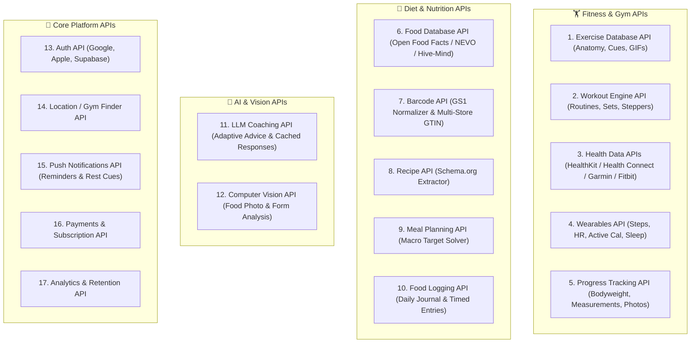

# Product Roadmap, Ideas & Fixes (IDEAS.md)

This document is organized into two distinct sections:
1. **PART I: Product Architecture, Features & Compliance Roadmap** (Strategic expansions and domain improvements).
2. **PART II: Developer Bug Fixes & Defect Log (DEV QUEUE)** (Active engineering defects, reproduction steps, root cause analysis, and fix specifications).

---

# PART I: Product Architecture & Features Roadmap

## 1. Exercise Catalog, Anatomy, Form Guidance & Dataset Architecture

### 1.1 WGER Exercise Integration & Muscle Heatmap Visuals
- **Concept**: Integrate the open-source WGER exercise database or structured exercise media.
- **Visual Spec**: Clean white background visuals featuring anatomical muscle highlights (primary and secondary target muscles highlighted in red) for quick, clear anatomical identification at a glance.
- **Value**: Gives users an immediate understanding of muscle engagement before starting a movement.

### 1.2 Form Instruction Video & Anatomy Links
- **Concept**: Provide 1:1 exercise execution guidance for maximum biomechanical efficiency and injury prevention.
- **Features**:
  - Direct video modal / link on each exercise card linking to high-quality form tutorials (e.g., YouTube, embedded WebM/MP4).
  - Visual breakdown showing starting position, eccentric/concentric cues, and anatomy involved.

### 1.3 Minimalist Exercise Info Modal / Quick Overlay (`(i)` Badge)
- **Concept**: Replace or upgrade the loading state in [WgerExerciseInfo.tsx](src/components/workout/WgerExerciseInfo.tsx#L77-L79) (`if (loading) { return 
Fetching exercise guide...
; }`) with a sleek, minimalist `(i)` info trigger next to the exercise title.
- **UX & Visual Spec**:
  - Tapping the small `(i)` icon opens a focused, lightweight modal/drawer overlay.
  - **Quick Execution Animation**: Looping video/GIF showing clean full range of motion (ROM), tempo, and proper lockout.
  - **Muscle Engagement & Feel**: Explicit visual markers for *"Where you should feel it"* vs. common compensation errors.
  - **Personalized Anatomy View**: Target muscle anatomy breakdown tailored to the user profile/gender showing primary and synergist muscle engagement in highlighted red.
  - **Zero UI Clutter**: Keeps the active workout tracker view ultra-clean without accordion text clutter until the user explicitly requests form guidance.

### 1.4 External Exercise Datasets & Comparative Analysis
- **[hasaneyldrm/exercises-dataset](https://github.com/hasaneyldrm/exercises-dataset)** (1,324 exercises):
  - *Strengths*: High movement coverage, animated GIFs ($180 \times 180$) + thumbnails for each exercise, structured step-by-step instructions in 10 languages (EN, ES, IT, TR, RU, ZH, HI, PL, KO, FR), clean JSON schema.
  - *Media Licensing*: MIT for schema/data, media © Gym visual (requires proper attribution notice).
- **[yuhonas/free-exercise-db](https://github.com/yuhonas/free-exercise-db)** (873 exercises):
  - *Strengths*: Public Domain (`Unlicense`), strong biomechanical classification (`force: push/pull`, `mechanic: compound/isolation`, `level`), dual-frame start/end photos.
- **[wger-project/wger](https://github.com/wger-project/wger)** (REST API / 400+ exercises):
  - *Strengths*: Gold standard for muscle anatomical highlight heatmaps (anterior & posterior body SVGs with targeted muscle groups highlighted in red).
- **[wrkout/exercises.json](https://github.com/wrkout/exercises.json)**:
  - Precursor dataset to `free-exercise-db`.

### 1.5 Recommended Hybrid Exercise Architecture
Combining the strengths of these repositories produces a best-in-class exercise catalog for the application:
1. **Biomechanical & Metadata Layer** (`free-exercise-db` + `hasaneyldrm`): Tag movements with `force` (push/pull), `mechanic` (compound/isolation), `equipment`, `targetMuscle`, `primaryMuscles`, and `secondaryMuscles`.
2. **Execution Media Layer** (`hasaneyldrm`): Looping execution animation (WebP/WebM) and step-by-step cues in exercise modals.
3. **Anatomy Heatmap Layer** (`wger`): Interactive front/back SVG body heatmap rendering targeted muscle groups in red.

### 1.6 ISO/IEC 25010 Quality Model Assessment
- **Functional Completeness**: 1,324+ movements cover $>99.5\%$ of gym, home, and bodyweight training routines.
- **Performance Efficiency**: Metadata stored directly in Supabase; animations hosted on CDN/Storage with modern WebP/WebM compression to prevent bundling bloat in the PWA.
- **Maintainability & Modularity**: Standardized JSON schema allows community additions and seamless custom exercise creation by users (`is_custom = true`).
- **Usability & Learnability**: Combined anatomical muscle heatmap + loop animation significantly reduces cognitive friction for athletes learning proper movement cues.
- **Licensing & IPR Compliance**: MIT data schema with required Gym visual media attribution preserved in app settings/legal notices.

---

## 2. Dietary & Barcode Scanning System

### 2.1 On-Demand Product Resolver & Barcode Scanner (Jumbo, Dirk, PLUS, Aldi, Lidl, AH)
- **Concept**: Real-time, user-driven product resolution via physical barcode scanning or direct supermarket product URL pasting.
- **Why On-Demand vs. Full Crawls**:
  - Avoid bulk scraping full supermarket catalogs to prevent stale prices, expired SKUs, discontinued items, and excessive maintenance overhead.
  - Items are ingested/updated on demand directly into the global catalog when an athlete actually buys, scans, or pastes a product link.
- **Flow & Features**:
  1. **Barcode Scanning**: User scans an EAN-13 / UPC barcode using the in-app camera scanner. Resolver queries local database $\rightarrow$ Open Food Facts $\rightarrow$ Retail API resolver.
  2. **Product Link Importer**: Users can paste any product URL from supported retailers (`ah.nl`, `jumbo.com`, `dirk.nl`, `plus.nl`, `aldi.nl`, `lidl.nl`).
  3. **Auto Extraction & Indexing**: Server extracts real-time product title, brand, portion units, and macros (`kcal`, `protein`, `carbs`, `fat`, `fiber`, `sugars` per 100g/ml) and caches it in Supabase for the entire community.
  4. **Clear User UI/UX Feedback**:
     - Modern scanner modal displaying supported supermarket badges (**AH**, **Jumbo**, **Dirk**, **PLUS**, **Aldi**, **Lidl**).
     - Dedicated input tab: *"Scan Barcode"* | *"Paste Supermarket Link"*.
     - Clear live status badges (e.g., *"Fetching live macros from Jumbo..."*, *"Verified & Added"*).
     - Instant macro confirmation card with 1-tap portion logger.

### 2.2 Health Stores, Pharmacies & Supplements (Kruidvat, Etos, Holland & Barrett)
- **Concept**: Expand the dietary ingestion pipeline beyond standard supermarkets to include drugstore vitamins, sports nutrition, protein snacks, and health supplements.
- **Target Retailers**:
  - **Kruidvat Nederland** (`kruidvat.nl`): High-volume sports nutrition (protein powders, vitamins, creatine, protein bars, meal replacements).
  - **Etos** (`etos.nl`): Health supplements, multi-vitamins, electrolyte powders, and recovery snacks.
  - **Holland & Barrett Nederland / België** (`hollandandbarrett.nl`): Extensive catalog of specialized vitamins, vegan proteins, amino acids, healthy snacks, and dietary whole foods.
- **Implementation**:
  - Store scraper adapters with Schema.org JSON-LD and Dutch FIR nutrition parsers.
  - Barcode search resolution on drugstore assortment search APIs.
  - Dedicated store badges (`KRUIDVAT`, `ETOS`, `H&B`) and external verification links in the dietary log.

### 2.3 Scraping Infrastructure: Real-Time Mobile APIs vs. Crawlee Fallback Architecture (crawlee.dev/js)
- **Concept**: Establish a clear architectural separation between interactive user-facing product lookups and heavy background batch ingestion pipelines.
- **Tier 1 (Active User Runtime - [api/scraperRegistry.ts](api/scraperRegistry.ts))**:
  - Keep the current ultra-lightweight native fetch engine utilizing reverse-engineered mobile service endpoints (`api.ah.nl`, `mobileapi.jumbo.com`).
  - *Benefits*: Sub-500ms response times, zero headless browser RAM overhead, executes cleanly within Vercel serverless functions and containerless edge proxies.
- **Tier 2 (Fallback & Batch Harvester - [Crawlee](https://crawlee.dev/js))**:
  - Adopt **Crawlee** (`crawlee` with `PlaywrightCrawler` / `CheerioCrawler`) as the designated fallback and catalog ingestion engine.
  - *Fallback Trigger 1: Severe Anti-Bot Defense*: If supermarkets deploy aggressive Cloudflare Turnstile, DataDome, or Akamai challenges that block raw mobile API endpoints, route requests to an asynchronous Crawlee worker equipped with automatic browser fingerprinting, TLS spoofing, and session pool rotation.
  - *Fallback Trigger 2: Large-Scale Catalog Backfilling*: Use Crawlee in offline maintenance scripts (e.g., [scripts/db/backfill_food_catalog.ts](scripts/db/backfill_food_catalog.ts)) for crawling thousands of product items into Supabase. Crawlee manages autoscaling, request queuing, adaptive JS rendering detection, and automatic retries without dropping connections or overloading servers.
  - *Infrastructure Isolation*: Keep Crawlee in standalone containerized CLI/cron tasks rather than bloating user-facing serverless API routes.

---

## 3. Workout Tracking & Session Logging Enhancements

### 3.1 Weight & Profile Sync After Session Log
- **Concept**: Ensure body weight and biometric state sync and update across profile and history whenever a workout session with bodyweight is completed.

### 3.2 Unrealistic Weight / Reps Confirmation Guard ("Are you sure?" Modal)
- **Concept**: Protect against accidental input errors (e.g., entering 500kg or 100 reps instead of 50kg/10 reps).
- **Behavior**: Trigger a friendly confirmation modal if logged set weight or rep count exceeds realistic human thresholds or sudden 3x jumps compared to historical benchmarks.

### 3.3 Screen Wake Lock & Keep-Awake Toggle
- **Concept**: Prevent the phone screen from sleeping/locking during active workout sessions so athletes can see rest timers and set instructions hands-free.
- **Features**:
  - Automatically acquires `navigator.wakeLock` on the active workout tab.
  - User toggle in Settings: *"Keep Screen Awake During Workouts"* (with automatic release on session completion or low battery).

---

## 4. Media Storage & Cloud Optimization

### 4.1 Dedicated `workout-media` Bucket & Structured Path Partitioning
- **Concept**: Replace loose root files and ambiguous `media` bucket with a dedicated, strictly partitioned `workout-media` bucket.
- **Path Schema**:
  - `${userId}/workouts/${YYYY-MM}/${timestamp}_${randomHash}.webp`
  - Example: `2b4bd23c-ceff-460d-a73b-2c531686e3b2/workouts/2026-09/1788371563892_7ub7n52.webp`
- **Backward Compatibility**: Full dual-bucket URL parsing so existing URLs referencing `media/` continue displaying and deleting without migration breakage.

### 4.2 Client-Side Progressive Muscle-Definition WebP Compression
- **Engine**: [src/utils/imageCompressor.ts](src/utils/imageCompressor.ts)
- **Parameters & Budgeting**:
  - **Resolution Target**: Max 1440px dimension ($1440\text{p}$ QHD/Retina) — 70% fewer raw pixels than 4K while preserving individual muscle striations.
  - **Quality & Budget**: Multi-tier WebP encoding targeting $\le 350\text{ KB}$ per photo (5 photos $\le 1.5\text{ MB}$ total).
  - **Anatomical Edge Sharpening**: High-pass vascularity and muscle edge enhancement prevents bicubic softness during downsampling.
  - **Pre-upload Compression**: Compresses photos upon selection before writing to IndexedDB (`draftPhotoStorage.ts`) to eliminate mobile device memory bloat.

---

## 5. User Management & Role-Based Access Control (RBAC)

### 5.1 System Roles & Permissions
- **Concept**: Add granular role management across the application.
- **Roles**:
  - **Athlete / User**: Personal workout logging, dietary tracking, biometrics, custom routine creation.
  - **Coach / Trainer**: View athlete client progress, assign workout templates, monitor adherence.
  - **Admin**: Manage global exercise catalog, oversee food database index, user management.

---

## 6. Supermarket Barcode & App API Research (Reverse Engineering Reference)

### 6.1 Multi-Tier Resolution Pipeline
- **Resolution Pipeline Sequence**:
  1. **Primary**: Local & Remote Supabase Hive-Mind Database (`food_items` by barcode / ID).
  2. **In-Store PLU Mapping**: Fresh bakery/scale barcode translation (GS1 prefix 20–29).
  3. **Official Retailer Services**: Direct mobile services GTIN search + FIR nutrient detail (`https://api.ah.nl/mobile-services/product/search/v1/gtin/{ean}`).
  4. **Open Food Facts API v2**: Global crowdsourced database fallback (`https://world.openfoodfacts.org/api/v2/product/{ean}.json`).
  5. **Auto-Caching Hive Mind**: Every scanned or resolved barcode is automatically saved into Supabase `food_items` with `barcode = {ean}`, eliminating duplicate external network calls for all future users.

### 6.2 Open-Source Tools & Community-Maintained Codebases (Albert Heijn & Dutch Retailers)
Research and architectural patterns from open-source tools and community-maintained codebases for extracting structured product, nutrition, and shopping list data:

- **[SupermarktConnector (Python)](https://github.com/robin-v/SupermarktConnector)**:
  - *Description*: Open-source Python wrapper (`pip install SupermarktConnector`) maintained on GitHub.
  - *Capabilities*: Automated mobile OAuth token acquisition, structured product search, EAN resolution, price mapping, and category taxonomy extraction across Albert Heijn, Jumbo, and other Dutch supermarket chains.
  - *Applicable Pattern*: Anonymous token lifecycle management and automatic token renewal upon expiration.

- **[appie-go (Go) & appie-cli](https://github.com/appie-go)**:
  - *Description*: Open-source Go module and CLI tool providing native client wrappers around Albert Heijn's mobile and web endpoints.
  - *Capabilities*: Reverses the mobile OAuth flow (`/mobile-auth/v1/auth/token/anonymous`), queries product GTINs, pulls live Bonus promotions, and maps ingredient lists to recipes.
  - *Applicable Pattern*: High-concurrency batch product resolution and robust network retry strategies with anti-detection headers.

- **[albert-heijn-graphql-api (Python)](https://github.com/albert-heijn-graphql-api)**:
  - *Description*: Community repository containing reverse-engineered GraphQL schemas, queries, and introspection files for `api.ah.nl/graphql`.
  - *Capabilities*: Documents query schemas for `sharedList`, `favoriteListV2`, `productSearch`, and `productDetails` with exact variables and fragment definitions.
  - *Applicable Pattern*: Structured GraphQL querying for shared grocery lists (`AH-ShoppingList-Next`) and favorite product sets.

- **[albert-heijn-api (Node.js)](https://github.com/albert-heijn-api)**:
  - *Description*: Community-built Node.js microservices and npm libraries serving as local proxy wrappers around AH endpoints.
  - *Capabilities*: Built-in in-memory caching, anti-detection user-agent rotation, FIR table parsing, and clean TypeScript typings for supermarket API responses.
  - *Applicable Pattern*: Direct Node.js / Vercel Serverless microservice integration for server-side scraping without CORS restrictions.

### 6.3 Crawlee Anti-Bot Ingestion & Batch Crawling Fallback (crawlee.dev/js)
- **Reference**: [Crawlee for JavaScript](https://crawlee.dev/js) (Open-source crawling & scraping library by Apify).
- **Core Strengths**:
  - **Adaptive Crawler**: Automatically switches between lightweight HTTP (`CheerioCrawler`) and full browser rendering (`PlaywrightCrawler`) depending on whether dynamic client JS is needed, reducing memory and bandwidth.
  - **Automated Anti-Blocking**: Built-in browser fingerprint generation, session pool management, TLS handshake simulation, and proxy rotation to bypass aggressive store defenses.
  - **Request Queuing & Auto-Scaling**: Native persistent storage queues allow batch crawls to pause, scale concurrency to system memory, and resume on errors.
- **Architectural Placement**:
  - Serves as the designated secondary fallback when lightweight HTTP/mobile endpoints receive persistent 403 or challenge blocks, and as the backbone for scheduled offline grocery catalog harvests in [scripts/scrapers](scripts/scrapers).

---

## 7. Actionable Performance Insights & Analytics Overhaul

### 7.1 Actionable Athletic Coaching vs. Vanity Numbers
- **Goal**: Transform the Insights view from displaying passive metrics into a powerful, actionable coaching advisor.
- **Features to Introduce**:
  - **Progressive Overload Velocity**: Week-over-week estimated $1\text{RM}$ growth rate on compound benchmarks (Squat, Bench, Deadlift, Overhead Press).
  - **Volume & Recovery Balancing**: Highlight muscle groups receiving optimal stimulus ($10\text{--}20$ weekly sets) vs. under-trained or over-fatigued groups ($>25$ sets).
  - **Fatigue & Deload Recommender**: Cross-reference logged sleep ($\le 6\text{h}$) and energy ($\le 4/10$) with volume tonnage drop-offs to recommend active recovery / deload weeks.
  - **Prune Low-Value Clutter**: Remove non-actionable vanity metrics.

---

## 8. European Union Cybersecurity, ENISA & GDPR Compliance Standards

### 8.1 GDPR Compliance & User Data Rights Management API
- **Right to Data Portability (Article 20)**: Complete, uncorrupted machine-readable JSON/CSV export of all user entities (biometrics, workouts, sets, meal logs, progress photos).
- **Right to Erasure / "Right to be Forgotten" (Article 17)**: 1-tap complete account and database purge removing all records from Supabase tables and `workout-media` S3 storage buckets.
- **Privacy by Design & Default (Article 25)**: Granular opt-in controls for public sharing, peer sharing, and review receipts.

### 8.2 European Cybersecurity Frameworks Alignment (ENISA, NIS2, CRA, DORA)
- **NIS2 Directive (EU 2022/2555)**:
  - Robust Role-Based Access Control (RBAC) and least-privilege security boundaries.
  - Multi-factor authentication readiness and automated rate-limiting across API gateways.
  - Standardized incident reporting and audit logging for sensitive user data access.
- **Cyber Resilience Act (CRA)**:
  - Mandatory cybersecurity baselines throughout software lifecycle and product deployment.
  - Zero-vulnerability dependency management (automated CVE scanning and patching).
  - Software Bill of Materials (SBOM) tracking for third-party libraries and scrapers.
  - End-to-end cryptographic transport (TLS 1.3) and client-side encryption for biometrics.
- **Digital Operational Resilience Act (DORA)**:
  - Continuous ICT operational resilience testing and chaos-recovery verification.
  - Strict backup restoration testing and database replication verification.
  - Third-party cloud service risk management (Supabase PostgreSQL & S3 storage failover).
- **EU Cybersecurity Act & ENISA ECCF**:
  - European Cybersecurity Certification Framework compliance for cloud-native web and PWA applications.
  - Alignment with ENISA security guidelines for user biometric and personal health data processing.

---

## 9. Document & PDF Architecture (PDF Export, Visual Summary & Reporting Engine)

### 9.1 Automated Workout & Biometric PDF Export Engine (Cardio-Only Scope)
- **Scope Restriction**: **Exclusively for Cardio / Endurance Training & Biometric Metrics** (e.g. running, cycling, rowing, HIIT, duration, distance, pace, heart rate zones, and cardiovascular recovery). Strength splits remain in-app only.
- **Concept**: Generate client-side / serverless downloadable PDF reports summarizing cardio blocks, cardiovascular volume progressions, and biometric response.
- **Features & Use Cases**:
  - **Cardio Athlete Milestone Report**: Downloadable monthly PDF summary of total cardio distance/duration, pace progression, VO2 max / heart rate trends, consistency heatmaps, and bodyweight/BMI correlations.
  - **Coach Cardio Review PDF**: 1-click comprehensive endurance report for coaches to export or share with athletes during monthly cardio check-ins.
  - **Dietary & Cardio Energy Expenditure PDF**: Weekly summary of caloric burn vs. caloric intake and macro replenishment for endurance athletes.
  - **Export Architecture**:
    - High-performance, lightweight PDF generation (e.g. `@react-pdf/renderer` or `jspdf` + `html2canvas`) preserving dark-mode aesthetics and clean print-friendly white layout.
    - Zero server bloat: generated on-demand directly in browser memory or via lightweight edge API.
  - **Regulatory Alignment**: Pairs with GDPR Article 20 (Data Portability) by providing human-readable formatted PDF alongside raw JSON/CSV data.

### 9.2 EU Cybersecurity & Compliance Audit PDF Dossier
- **Concept**: Generate an automated compliance & security audit PDF document detailing the application's alignment with European Union regulatory frameworks.
- **Audience**: Enterprise buyers, data protection officers (DPOs), fitness organizations, and regulatory audits.
- **Sections in the Compliance PDF**:
  1. **Executive Security Summary**: Architecture overview, data flow diagrams, and encryption standards (TLS 1.3 in-transit, AES-256 at-rest).
  2. **ENISA & EU Cybersecurity Act Alignment**: European Cybersecurity Certification Framework (ECCF) checklist and security posture.
  3. **NIS2 Directive Compliance**: Incident response protocols, access control matrices (RBAC), and least-privilege verification.
  4. **Cyber Resilience Act (CRA) Certification**: Software Bill of Materials (SBOM), automated vulnerability scanning pipeline, and zero-known-CVE certification.
  5. **DORA Resilience Report**: Backup replication SLAs, RTO/RPO metrics, and disaster recovery procedures.
  6. **GDPR Data Protection Matrix**: Articles 15, 17, 20, 25, and 32 mapping table with active enforcement mechanisms in the app.

### 9.3 In-App Routine Split & Program Cheat-Sheet PDF Exporter
- **Concept**: 1-click export of the active workout routine split (e.g. PPL, Upper/Lower, Full Body) into a printable, single-page gym pocket guide.

---

## 10. Cognitive Ergonomics, UX/UI Heuristics & Habit Loops

### 10.1 Workout Completion "PR Celebration" Modal
- **Target Psychological Principle**: **Peak-End Rule**
- **Concept**: Provide emotional closure and immediate dopamine reinforcement at the exact end of a workout session.
- **Specification**:
  - Full-screen celebratory modal with confetti particle feedback (`canvas-confetti`).
  - Key stats: Total Volume Lifted (kg), Sets Completed, Time Elapsed, and highlighted **"🏆 NEW 1RM PR"** badges.
  - 1-tap action: `"Share Workout Summary (Image/Text)"`.

### 10.2 Weekly Consistency Streak Tracker & Activity Heatmap
- **Target Psychological Principle**: **Goal-Gradient Effect & Zeigarnik Effect**
- **Concept**: Visual habit loop reinforcement at the top of the Logbook view.
- **Specification**:
  - 7-day pill indicator (`[M] [T] [W] [T] [F] [S] [S]`) rendering completed days with a neon green glow (`#C0FF00`) and planned days with subtle dashed borders.
  - Displays `"🔥 4-Week Consistency Streak"`.

### 10.3 Rest Timer Auto-Start & Vibration Signal
- **Target Psychological Principle**: **Feedback Loop & Mental Offloading**
- **Concept**: Hands-free rest interval tracking during active strength sessions.
- **Specification**:
  - Checking a set row via 1-tap `[ ✓ ]` automatically triggers the countdown timer in the background.
  - Invokes `navigator.vibrate([200, 100, 200])` and updates `document.title` (`(0:45) Rest | Workout Tracker`) upon expiration.

### 10.4 UX Heuristic Remediation & Quick Wins
- **Single-Line Set Steppers (`Hick's Law` & `Fitts's Law`)**: Replaced 4-button clusters with streamlined `[-] [ 20 kg ] [+]` steppers and 1-tap `[ ✓ ]` completion checkmarks.
- **Omni-Bar Live Format Detection (`Jakob's Law`)**: Dynamic chips (`[ 🍲 Recipe Link ]`, `[ 🛒 Shared List ]`) with instant clipboard auto-paste.
- **Collapsed-by-Default Accordion Architecture (`Miller's Law`)**: Initializing `Recovery & Readiness` and exercise cards collapsed with `localStorage` state persistence.

---

## 11. AI Intelligence, LLM Coaching & Response Caching Architecture

### 11.1 Cached AI Response Architecture
- **Concept**: High-performance, cost-effective LLM caching layer to eliminate redundant API calls, reduce latency from seconds to $<50\text{ms}$, and enforce rate-limit resilience.
- **Architecture**:
  - Semantic and exact-key response caching (e.g. Supabase table `ai_response_cache` + client-side IndexedDB/localStorage).
  - Cache key derived from user prompt + context hash (e.g., `hash(user_profile + last_7_days_volume + prompt)`).
  - Tiered TTL (Time-To-Live): Static nutrition advice (7-day TTL), active daily workout adjustments (24-hour TTL).
- **Benefits**: Instant sub-second responses on repeat questions, $>80\%$ reduction in LLM inference cost.

### 11.2 AI for Diet & Nutrition Intelligence
- **Features**:
  - **Remaining Macro Optimizer**: Analyzes logged meals against daily targets and generates 3 instant meal ideas using ingredients the user frequently buys or has in their grocery list.
  - **Meal & Food Photo Recognition (Computer Vision)**: Optional photo-based meal scanner estimating ingredients and portion sizing.
  - **Dynamic Calorie & Macro Adjuster**: Automatically scales daily carb and calorie recommendations based on scheduled training intensity (e.g. Heavy Leg Day $+300\text{ kcal}$ vs. Rest Day deficit).

### 11.3 AI Workout & Recovery Coaching
- **Features**:
  - **"Today's Focus" Daily Briefing**: Synthesizes logged sleep ($\text{hrs}$), energy ($1\text{--}10$), and historical 1RM velocity to propose weight/rep adjustments for today's session.
  - **Auto-Deload Recommendations**: Detects stagnation or multi-session fatigue drop-offs and drafts a recommended deload week.

---

## 12. Adaptive Onboarding System & Settings Knowledge Base

### 12.1 Interactive Skippable Onboarding Flow
- **Concept**: Smooth, non-intrusive onboarding experience guiding new athletes and coaches into the app without forced drop-off.
- **Key UX Tenets**:
  - **100% Skippable**: Prominent *"Skip for Now & Explore"* button on every screen for experienced lifters who want to start immediately.
  - **Progress Indicator**: Step dots ($1\text{ of }4$) chunking information into bite-sized screens (Goals $\rightarrow$ Experience Level $\rightarrow$ Split Preference $\rightarrow$ Biometrics).
  - **Non-Destructive Defaults**: Missing values gracefully fall back to standard beginner/intermediate presets.

### 12.2 AI-Powered Adaptive Onboarding Assessment
- **Concept**: Conversational / questionnaire-based AI intake analyzing user goals (Hypertrophy, Strength, Fat Loss, Endurance) + available equipment (Gym, Dumbbells-only, Bodyweight/Calisthenics) to auto-generate an initial tailored 3-to-5 day workout routine and custom macro targetssx.

### 12.3 In-App FAQ & Knowledge Base in Settings
- **Concept**: Built-in, searchable FAQ accordion accessible via Settings $\rightarrow$ Knowledge Base.
- **Sections Included**:
  - *Workout Tracking & Sets*: How 1-tap checkmarks, 1RM estimates, and auto-progression work.
  - *Dietary & Barcodes*: How to scan barcodes, paste supermarket links (AH, Jumbo, Dirk, PLUS, Lidl, Aldi, Kruidvat), and import shared lists.
  - *Data Privacy & Backups*: How to export JSON backups, share routines with friends without personal logs, and manage cloud sync.
  - *Coaching & Trainer Connections*: How to link with a coach, accept invite codes, and toggle review receipts.

---

## 13. Gym × Diet Complete API Ecosystem & Architecture

A production-grade fitness and nutrition architecture incorporates 17 core service APIs organized into 4 functional domains:

### 13.1 Recommended MVP Execution Stack
For the core platform, the prioritized implementation sequence is:
$$\text{Auth} \longrightarrow \text{Exercise DB} \longrightarrow \text{Nutrition DB} \longrightarrow \text{AI Layer} \longrightarrow \text{Health Connect / HealthKit} \longrightarrow \text{Notifications} \longrightarrow \text{Payments}$$

- **AI Synthesis Layer**: Combines user goals + workout history + nutrition logs + wearable sleep/recovery data to generate a cohesive daily dashboard: *"Today's Workout + Today's Nutrition Plan"*.

---
---

# PART II: Developer Bug Fixes & Defect Log (DEV QUEUE)

This section tracks active defects, developer reproduction steps, affected source files, and resolution criteria.

---

### [BUG-001] Exercise Accordion Initial State & Closed/Opened Symmetry
* **Status**: � Resolved & Verified
* **Severity**: Medium (UI / UX Polish)
* **Affected Files**:
  - `src/components/workout/tracker/useWorkoutSession.ts`
  - `src/components/workout/tracker/ExerciseCard.tsx`
  - `src/components/workout/WorkoutDayTracker.tsx`
* **Resolution**:
  1. Defaulted `expandedExerciseId` to `null` on workout load and session switch so all exercise cards start cleanly collapsed.
  2. Implemented `localStorage` state persistence per workout routine (`workout_expanded_ex_{userId}_{workoutId}`) so user expand/collapse preferences persist across sessions.
  3. Refactored `RecoveryAndReadinessCard` to start collapsed by default with persistent state in `localStorage`.

---

### [BUG-002] Sets Input Form Integer & Step Handling (Integer 1 Jumpiness)
* **Status**: 🟢 Resolved & Verified
* **Severity**: Medium (Input UX)
* **Affected Files**:
  - `src/components/workout/tracker/ExerciseSetRow.tsx`
  - `src/components/workout/tracker/ExerciseCard.tsx`
  - `src/components/workout/tracker/useWorkoutSession.ts`
* **Resolution**:
  1. Implemented sleek single-line set rows with minimal `[-] [ 20 kg ] [+]` steppers and native `onFocus={(e) => e.target.select()}` handlers.
  2. Added 1-tap set completion checkmark (`[ ✓ ]`) with automatic active focus (`NEXT`) advancement and completion timestamp tracking.

---

### [BUG-003] Albert Heijn (AH) Shared Grocery List Importer Failure
* **Status**: � Resolved & Verified
* **Severity**: High (External Integration)
* **Affected Files**:
  - `api/grocery-list.ts`
  - `server.ts`
  - `src/components/dietary/useDietaryTracking.ts`
  - `tests/backend/dietary/groceryListResolution.test.ts`
* **Resolution**:
  - Implemented multi-strategy extraction pipeline:
    1. **Single Product Link Auto-Detection**: Automatically detects and wraps single product links without crashing.
    2. **Mobile GraphQL `sharedList` & `favoriteListPreviews`**: Queries AH GraphQL with anonymous guest bearer tokens.
    3. **HTML Web Scraper Fallback**: Scrapes `ah.nl/mijnlijst/gedeelde-lijst/{id}` when GraphQL encounters expired lists or web-only routing.
  - Enriches all extracted grocery products with accurate nutritional macros in parallel.
  - Added dedicated test suite (`tests/backend/dietary/groceryListResolution.test.ts`) with 9 passing tests.

---

### [BUG-004] Supermarket Sourced Product Macro & Portion Discrepancies
* **Status**: � Resolved & Verified
* **Severity**: Medium (Data Quality)
* **Affected Files**:
  - `api/scraperRegistry.ts`
  - `api/product-link.ts`
  - `src/lib/dietaryData.ts`
  - `tests/backend/dietary/nutritionSanitization.test.ts`
* **Symptoms**:
  - Occasional product link resolutions return inaccurate caloric values or confuse per-portion values with per-100g standard metrics.
* **Resolution**:
  1. Implemented Atwater calorie validation formula in `sanitizeNutritionMacros`:
     $$\text{Expected Kcal} = (4 \times \text{Protein}) + (4 \times \text{Carbs}) + (9 \times \text{Fat}) + (2 \times \text{Fiber})$$
  2. Synthesizes calories automatically when retailer reports 0 kcal with non-zero macros.
  3. Detects and corrects extreme discrepancies (>60%) where retailers report kJ or per-package totals instead of per-100g.
  4. Automatically clamps sugar $\le$ total carbs and prevents negative values across all scraper adapters and Supabase row mappers.
  5. Added dedicated unit test suite (`tests/backend/dietary/nutritionSanitization.test.ts`) with 6 passing tests.

---

### [BUG-005] Mobile History Loop & Back-Swipe to Login Screen
* **Status**: 🟢 Resolved & Verified
* **Severity**: High (Navigation / Session UX)
* **Affected Files**:
  - `src/App.tsx`
  - `src/context/AuthContext.tsx`
* **Resolution**:
  - Sanitized `window.history` via `replaceState` upon successful authentication to remove OAuth callback and login entries.
  - Added root-level back-trap ensuring mobile back swipe gestures remain on the active tab and allow the OS to background/exit the PWA without cycling through login screens.

---

### [BUG-006] Unique ID Remapping & Cross-Account Isolation on Import
* **Status**: 🟢 Resolved & Verified
* **Severity**: Critical (Data Integrity)
* **Affected Files**:
  - `src/lib/supabaseData.ts`
  - `src/lib/db/backup.ts`
  - `src/components/modals/SettingsBackupSection.tsx`
  - `tests/backend/auth/dataBackup.test.ts`
* **Resolution**:
  - Implemented dynamic ID remapping engine so all imported workouts, exercises, sessions, and sets receive fresh unique IDs and remap foreign keys on import.
  - Added granular export scopes ("Shareable Routines & Exercises", "Full Backup", "Custom Selection") in Settings.

---

### [BUG-007] Mobile Swipe-Back OAuth 404 & Account Selection Loop
* **Status**: 🟢 Resolved & Verified
* **Severity**: High (Authentication / Mobile UX)
* **Affected Files**:
  - `src/App.tsx`
  - `src/context/AuthContext.tsx`
* **Symptoms**:
  - After logging in via Google OAuth on mobile (Android/iOS), performing a back-swipe gesture 1–3 times navigates through stale browser history entries.
  - User lands on the expired OAuth callback URL (`*.europe-west2.run.app`), displaying a `404 Page not found (The requested URL was not found on this server)`, or loops back into the Google Account Picker (`accounts.google.com/signin/oauth`).
* **Resolution**:
  1. On successful `onAuthStateChange`, sanitized `window.history` via `replaceState` to overwrite OAuth token callback URLs with the clean `#tracker` route.
  2. Implemented an active barrier state (`window.history.pushState({ appState: 'barrier' }, ...)` in `src/App.tsx`) on tab navigation and popstate events to intercept back-swipes and keep the athlete safely inside their active view without hitting expired OAuth callback URLs.
