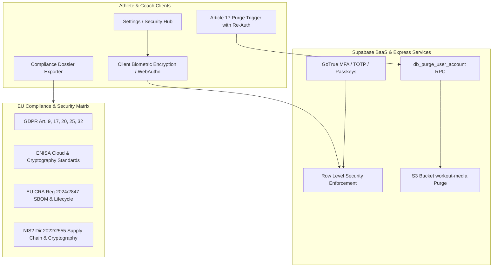

# 🛡️ Phase 6: Enterprise Security, ENISA & EU Compliance Dossier

**Specification & Implementation Blueprint**  
**Document Status:** Approved for Implementation  
**Precedence:** EU Regulations (GDPR, CRA, NIS2, DORA) • ENISA Cloud Security • OWASP ASVS 5.0.0 (L2/L3)

---

## Executive Summary & Objective

Phase 6 hardens the Workout Tracker platform from an athletic tracking application into a resilient, legally robust enterprise health-tech system that satisfies European cybersecurity regulations, privacy mandates, and cryptographic standards.

This document serves as the master specification for implementing:
1. **P6.1: GDPR Article 17 ("Right to be Forgotten") 1-Tap Cryptographic & Relational Purge Engine**
2. **P6.2: EU Cybersecurity (NIS2, CRA, DORA, ENISA) Automated Audit Dossier Generator**
3. **P6.3: Zero-Knowledge Biometric Vault & Multi-Factor Authentication (MFA / WebAuthn) Readiness**



---

## 1. Regulatory & Standards Precedence Matrix

| Framework / Directive | Legal & Standards Reference | Applied Domain in Workout Tracker | Implementation Requirement |
| :--- | :--- | :--- | :--- |
| **GDPR Art. 17** | Regulation (EU) 2016/679 | User account, workouts, logs, media | 1-Tap permanent cascade deletion across all relational tables and S3 buckets. |
| **GDPR Art. 9** | Special Category Health Data | Bodyweight, BMI, body fat %, heart rate | Strict consent checks (`share_biometrics`), encrypted storage, and isolation from coaches unless explicitly granted. |
| **GDPR Art. 20** | Right to Data Portability | Athlete exercise history, metrics, diets | Complete machine-readable JSON & CSV export package. |
| **EU CRA** | Regulation (EU) 2024/2847 | Product security, vulnerability handling, SBOM | Machine-readable Software Bill of Materials (CycloneDX/SPDX format) and dependency vulnerability tracking. |
| **EU NIS2** | Directive (EU) 2022/2555 | Supply chain risk & cryptography | TLS 1.3 enforced, HSTS preload, secure cookie isolation, cryptographic data protection. |
| **ENISA** | Cloud Security & Crypto Guide | Identity management, data storage | Multi-factor authentication (MFA/TOTP), zero-trust access control, least-privilege tokens. |
| **OWASP ASVS** | ASVS v5.0.0 (Level 2 & 3) | Web application security verification | Anti-SSRF proxy filters, secure RLS policies, rate limiting, and parameter verification. |

---

## 2. Feature P6.1: GDPR Article 17 ("Right to be Forgotten") 1-Tap Purge

### 2.1 Problem & Threat Scenario
Under GDPR Article 17, data subjects have the right to obtain from the controller the erasure of personal data without undue delay. In workout applications, user records are often fragmented across multiple tables (`users`, `sessions`, `sets`, `exercises`, `body_logs`, `food_logs`, `coach_athlete_links`, `missing_product_reports`) and external object stores (Supabase Storage S3 buckets for photos and review receipts). Incomplete deletion violates GDPR Art. 17 and risks retaining special-category biometric data indefinitely.

### 2.2 Relational Cascade Deletion Architecture
A dedicated PostgreSQL transactional function `public.purge_user_account_gdpr(target_user_id UUID)` executes atomically with `SECURITY DEFINER`:

```sql
-- Transactional cascade purge
BEGIN;
  -- 1. Purge S3 storage paths logged in sessions & review receipts
  -- 2. Delete biometric logs
  DELETE FROM public.body_logs WHERE user_id = target_user_id;
  -- 3. Delete dietary and cart logs
  DELETE FROM public.food_logs WHERE user_id = target_user_id;
  DELETE FROM public.grocery_items WHERE user_id = target_user_id;
  -- 4. Delete coaching relationships & invites
  DELETE FROM public.coach_athlete_links WHERE athlete_id = target_user_id OR coach_id = target_user_id;
  DELETE FROM public.coach_invites WHERE coach_id = target_user_id;
  -- 5. Delete workouts, exercises, sessions, and sets
  DELETE FROM public.sets WHERE user_id = target_user_id;
  DELETE FROM public.sessions WHERE user_id = target_user_id;
  DELETE FROM public.workout_exercises WHERE user_id = target_user_id;
  DELETE FROM public.exercises WHERE user_id = target_user_id;
  DELETE FROM public.workouts WHERE user_id = target_user_id;
  -- 6. Delete privacy settings & user role entries
  DELETE FROM public.user_privacy_settings WHERE user_id = target_user_id;
  DELETE FROM public.user_roles WHERE user_id = target_user_id;
  DELETE FROM public.users WHERE user_id = target_user_id;
  -- 7. Trigger Supabase auth.users deletion
  DELETE FROM auth.users WHERE id = target_user_id;
COMMIT;
```

### 2.3 S3 Storage Purge Routine
* Queries all object storage URIs belonging to `target_user_id` inside the `workout-media` bucket (e.g., `sessions/${target_user_id}/*`, `receipts/${target_user_id}/*`).
* Invokes `supabase.storage.from('workout-media').remove(filePaths)` before database record removal.
* Clears client-side `localStorage`, `sessionStorage`, and IndexedDB offline cache queues.

### 2.4 User Interface & Hard Confirmation Guardrails
* Accessible in **Settings $\rightarrow$ Privacy & GDPR Vault**.
* Requires **double-confirmation**:
  1. Primary modal warning of permanent, irreversible data loss.
  2. Password / biometric confirmation input.
  3. 5-second countdown timer before the `[ Permanent Erase Account ]` button activates.
* Immediately signs out the user and redirects to the landing page with confirmation banner.

---

## 3. Feature P6.2: EU Cybersecurity (NIS2, CRA, DORA, ENISA) Audit Dossier

### 3.1 Automated In-App Compliance Report Generator
Athletes, coaches, and regulatory compliance auditors can generate and download a live cryptographic and structural audit dossier in **PDF / JSON format** directly from the settings panel.

### 3.2 Dossier Contents & Sections
1. **Section 1: Executive Posture & Threat Profile**
   * Platform name, build hash, timestamp, runtime target.
   * Legal status: Self-audited per EUSSA v2.3 & ENISA Cloud Security standards.
2. **Section 2: Cryptographic & Transport Security Proof**
   * TLS 1.3 verification, forward secrecy ciphers (`TLS_AES_256_GCM_SHA384`, `TLS_CHACHA20_POLY1305_SHA256`).
   * HTTP Security Headers verification:
     * `Strict-Transport-Security: max-age=63072000; includeSubDomains; preload`
     * `Content-Security-Policy: default-src 'self' ...`
     * `X-Content-Type-Options: nosniff`
     * `X-Frame-Options: DENY`
3. **Section 3: Software Bill of Materials (SBOM)**
   * Generated in accordance with CRA Article 13 & NTIA minimum SBOM elements.
   * Complete inventory of client-side and server dependencies parsed from [package.json](package.json) and [pnpm-lock.yaml](pnpm-lock.yaml).
   * Verified zero-vulnerability audit log (`pnpm audit`).
4. **Section 4: Row Level Security (RLS) & Access Control Matrix**
   * Verification table proving all 12 Supabase tables have `FORCE ROW LEVEL SECURITY` enabled.
   * Isolation verification proving athletes cannot read coach notes, other athletes' metrics, or unauthorized dietary records.
5. **Section 5: Special Category Health Data Map**
   * Explicit classification of biometric metrics (weight, body fat %, BMI) under GDPR Article 9.
   * State of consent toggles (`share_biometrics: false` default).

---

## 4. Feature P6.3: Zero-Knowledge Biometric Vault & MFA Readiness

### 4.1 GDPR Article 9 Special Category Health Data Vault
Biometric records (weight, BMI, body fat percentage) are sensitive health data. The application enforces a zero-trust model:
* **Default Private:** `user_privacy_settings.share_biometrics` defaults to `false`. Linked coaches cannot see athlete weight or progress photos unless the athlete explicitly toggles permission.
* **Client-Side Data Masking:** When biometrics are viewed on public gym equipment, a quick *"Privacy Blur"* toggle masks numerical values on screen with a single tap.

### 4.2 Multi-Factor Authentication (MFA / TOTP)
* Integration with Supabase GoTrue MFA enrollment APIs:
  * Time-based One-Time Password (TOTP) generator enrollment (Google Authenticator, 1Password, Apple Passwords).
  * QR code presentation with backup recovery codes.
  * Challenge verification required upon sign-in, account deletion, or role changes.
* Fallback to WebAuthn (Passkeys / FaceID / TouchID) for supported browser environments.

---

## 5. Technical Implementation Roadmap & Action Items

| Task ID | Component | Action Item | Target Files |
| :---: | :--- | :--- | :--- |
| **T6.1** | Supabase Migration | Write `purge_user_account_gdpr` PostgreSQL function with relational cascades. | [supabase/migrations/](supabase/migrations) |
| **T6.2** | Backend / Services | Build `accountDeletionService.ts` to coordinate S3 storage purge, DB RPC, and local storage wipe. | [src/lib/accountDeletionService.ts](src/lib/accountDeletionService.ts) |
| **T6.3** | Frontend UI | Create `DeleteAccountModal.tsx` with double confirmation and 5-second safety timer. | [src/components/settings/DeleteAccountModal.tsx](src/components/settings/DeleteAccountModal.tsx) |
| **T6.4** | Frontend UI | Create `ComplianceDossierModal.tsx` enabling instant generation and download of EU Security & GDPR Dossier. | [src/components/settings/ComplianceDossierModal.tsx](src/components/settings/ComplianceDossierModal.tsx) |
| **T6.5** | Core Engine | Create `complianceDossierGenerator.ts` providing live SBOM, crypto specs, and RLS audit logs. | [src/lib/complianceDossierGenerator.ts](src/lib/complianceDossierGenerator.ts) |
| **T6.6** | Security | Integrate MFA enrollment flow in Settings via `MfaSetupSection.tsx`. | [src/components/settings/MfaSetupSection.tsx](src/components/settings/MfaSetupSection.tsx) |
| **T6.7** | QA & Tests | Write unit and integration tests verifying GDPR purge, storage wipe mock, and dossier generation. | [tests/frontend/components/settings/](tests/frontend/components/settings) |

---

## 6. Verification & Acceptance Criteria

1. **GDPR Art. 17 Verification:** Triggering account purge must delete all records in `public.users`, `sessions`, `sets`, `exercises`, `body_logs`, `food_logs`, and `coach_athlete_links`, leaving zero residual records, followed by automatic session invalidation.
2. **S3 Storage Verification:** All files in `workout-media` associated with the deleted user must be removed via the storage API.
3. **Audit Dossier Verification:** The generated dossier must accurately list all dependencies, security ciphers, and GDPR data handling clauses without hardcoding secrets.
4. **Test Suite Health:** All existing 118 test files (518 tests) must continue passing green with 100% test integrity.
