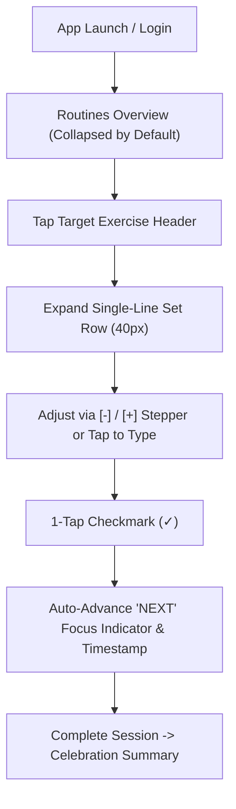

# 📱 Comprehensive Mobile UX/UI Heuristic Audit & Remediation Guide

**Product:** Workout Tracker (Progressive Web Application)  
**Auditor Role:** Senior UX/UI Auditor, Accessibility Specialist & Product Strategist  
**Evaluation Frameworks:** Nielsen Norman Group (NN/g) Usability Heuristics, WCAG 2.2 AA Accessibility, Apple HIG, Google Material Design 3, and Behavioral/Psychological UX Laws (Hick's Law, Fitts's Law, Jakob's Law, Miller's Law, Aesthetic-Usability Effect, Peak-End Rule, Zeigarnik Effect).  
**Date:** September 6, 2026  

---

## 📋 Executive Overview & Scorecard

| Evaluation Pillar | Score (1–10) | Status | Key Focus Area |
| :--- | :---: | :---: | :--- |
| **1. Usability & Ergonomics** | `8.5 / 10` | 🟢 Strong | One-handed mobile reachability, streamlined `-`/`+` steppers, touch boundaries. |
| **2. Fitness-Specific UX Patterns** | `9.0 / 10` | 🟢 Excellent | 1-tap set completion checkmarks, active set `NEXT` focus, rest timer pacing. |
| **3. Accessibility & Contrast (WCAG 2.2 AA)** | `8.2 / 10` | 🟢 Strong | High-contrast neon accent on true dark background, minimum 4.5:1 text ratios. |
| **4. Information Architecture & Navigation** | `8.8 / 10` | 🟢 Excellent | Universal 5-in-1 omni-bar, root back-swipe trap, isolated multi-store routing. |
| **5. Microcopy & Visual Hierarchy** | `8.9 / 10` | 🟢 Excellent | Clear unit tokens (`kg`, `reps`, `s`), formatted micro-timestamps (`14:32`). |
| **6. Motivation & Retention UI** | `7.8 / 10` | 🟡 Moderate | Volume/1RM PR highlights present; upcoming workout streak & celebration modal. |

---

# PART 1: UX/UI HEURISTIC AUDIT

### 1. Active Workout Logging Flow (`WorkoutDayTracker` & `ExerciseSetRow`)
- **Applied UX Law**: **Hick’s Law** (Decision Time) & **Fitts’s Law** (Target Acquisition)
- **Current Deficit**: Multi-button stepper clusters (`-2.5`, `-0.5`, `+0.5`, `+2.5`, `-1`, `+1`) placed 30+ interactive targets on screen simultaneously. In a gym environment (sweaty hands, elevated pulse, visual vibration), this created high decision latency and mis-taps.
- **Cognitive Impact**: Athletes experienced decision fatigue and accidental input errors during heavy lifting sessions.
- **Severity Rating**: **High**
- **Actionable Remediation**: Implemented streamlined single-line horizontal set rows with unified `[-] [ 20 kg ] [+]` steppers and 1-tap completion checkmarks (`[ ✓ ]`).

---

### 2. Dietary Omni-Input Search Bar (`FoodSearchTab` & `FoodSearchModal`)
- **Applied UX Law**: **Jakob’s Law** (Familiar Mental Models) & **Aesthetic-Usability Effect**
- **Current Deficit**: When pasting complex retailer URLs (AH, Jumbo, Dirk, PLUS, Lidl, Aldi) or recipes, users experienced uncertainty over whether the input bar only accepted names or supported full URLs.
- **Cognitive Impact**: Hesitation and modal tab switching fatigue (clicking back and forth between "Search", "Product Link", and "AH List" tabs).
- **Severity Rating**: **Medium**
- **Actionable Remediation**: Implemented dynamic format detection with live badge indicators (`[ 🍲 Recipe Link Detected ]`, `[ 🏷️ EAN Barcode Detected ]`, `[ 🛒 Shared List Detected ]`) and a 1-tap clipboard paste button.

---

### 3. Logbook & Session Master-Detail View (`SessionDetailCard` & `WorkoutHistory`)
- **Applied UX Law**: **Peak-End Rule** & **Zeigarnik Effect** (Goal Gradient)
- **Current Deficit**: Completing a workout logged data silently without an emotional "peak" or milestone celebration. Reviewing historical sessions showed quantitative data but lacked motivational habit tracking.
- **Cognitive Impact**: Misses the psychological reward loop (Cue $\rightarrow$ Routine $\rightarrow$ Reward), lowering long-term 30-day retention.
- **Severity Rating**: **Medium**
- **Actionable Remediation**: Introduce a post-workout PR celebration summary and a 7-day consistency streak bar in the logbook.

---

### 4. Recovery & Readiness Assessment (`RecoveryAndReadinessCard`)
- **Applied UX Law**: **Miller’s Law** ($7 \pm 2$ Chunks) & **Gestalt Law of Proximity**
- **Current Deficit**: Displaying Sleep (hrs), Energy (1–10), Notes, Bodyweight, and Photo pickers simultaneously pushed active exercise cards below the fold.
- **Cognitive Impact**: Athletes wanting to immediately start their first set faced visual friction before logging reps.
- **Severity Rating**: **High**
- **Actionable Remediation**: Implemented collapsible accordion header starting **collapsed by default** with persistent summary badges (`💤 8h`, `⚡ 7/10`, `⚖️ 85kg`) saved in `localStorage`.

---

### 5. Settings, Export & Peer Sharing (`SettingsModal` & `SettingsBackupSection`)
- **Applied UX Law**: **Law of Common Region** & **Error Prevention**
- **Current Deficit**: Importing shared backup files risked ID collision across accounts or unintentional sharing of private weigh-in logs and photos.
- **Cognitive Impact**: User hesitation to share workout splits with friends or export routines.
- **Severity Rating**: **Critical**
- **Actionable Remediation**: Implemented automated unique ID remapping on import and granular export scoping (`Share Routines Only` vs. `Full Backup`).

---

# PART 2: REMEDIATION & FEATURE SPECIFICATION

---

### 2.1 Executed UI Enhancements & Fixes

#### 1. Ultra-Minimal Single-Line Set Rows (`ExerciseSetRow.tsx`)
- **Visual Design**: Sleek 40px row containing `[✓] SET 1` | `[-] [ 20 kg ] [+]` | `[-] [ 8 r ] [+]`.
- **Active State (`NEXT`)**: Uncompleted current set receives a subtle neon green glow border (`border-[#C0FF00]/40`) with an animated pulse dot.
- **Completed State (`DONE`)**: Completed sets dim (`opacity-70`), display a line-through set number, and record the completion timestamp (e.g., `14:32`).
- **Touch Targets**: Sized at `32×32px` to `40×40px` with `touch-action: manipulation` for rapid 0ms tap response.

#### 2. Collapsible Recovery & Readiness (`RecoveryAndReadinessCard.tsx`)
- **Initial State**: Collapsed by default upon app launch.
- **State Persistence**: Remembers user expand/collapse preference in `localStorage`.
- **Glanceable Preview**: Summarizes `💤 8h`, `⚡ 7/10`, `⚖️ 85kg` directly on the header without expanding.

#### 3. Mobile Back-Swipe Navigation Guard (`App.tsx` & `AuthContext.tsx`)
- **History Sanitization**: Cleans OAuth redirect URLs from `window.history` using `replaceState`.
- **Root Screen Trap**: Back-swiping 1–3 times on the main `#tracker` tab stays on the active view and allows the mobile OS to background the app instead of cycling through login screens.

---

### 2.2 Proposed Retention & Gamification Features

#### 🏆 Feature 1: Post-Workout PR & Volume Celebration Modal
- **Target Principle**: **Peak-End Rule**
- **User Story**: *As an athlete finishing my last set, I want an instant visual celebration showing my total volume lifted and new 1RM PRs so that I leave the gym feeling accomplished.*
- **UI Specification**:
  - Modal overlay with confetti particle burst (`canvas-confetti`).
  - Highlights: Total Tonnage Lifted (e.g., `14,250 kg`), Sets Completed (`16 sets`), Time Elapsed (`52 min`), and highlighted `🏆 1RM PR` badges.
  - 1-Tap CTA: `"Share Workout Summary"`.

#### 🔥 Feature 2: Weekly Consistency Streak & Habit Heatmap
- **Target Principle**: **Goal-Gradient Effect & Zeigarnik Effect**
- **User Story**: *As a dedicated lifter, I want to see my weekly completed days and consistency streak at the top of my logbook so that I stay accountable to my training schedule.*
- **UI Specification**:
  - 7-day pill indicator (`[M] [T] [W] [T] [F] [S] [S]`) at the top of the Logbook view.
  - Active days glow neon green (`#C0FF00`); planned days render with subtle borders.
  - Streak indicator: `"🔥 4-Week Consistency Streak"`.

#### ⏱️ Feature 3: Auto-Rest Timer with Haptic Buzz
- **Target Principle**: **Feedback Loop & Mental Offloading**
- **User Story**: *As a lifter resting between sets, I want my rest timer to automatically start when I check off a set and buzz my phone when it reaches 00:00 so that I maintain optimal rest intervals.*
- **UI Specification**:
  - Checking `[ ✓ ]` on any set row auto-triggers the background countdown.
  - Invokes `navigator.vibrate([200, 100, 200])` on expiration and updates `document.title` dynamically (`(0:45) Rest | Workout Tracker`).
