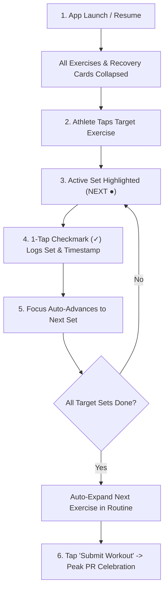

# UX/UI Heuristic & Psychological Design Audit

**Application**: Workout Tracker PWA / Health & Fitness Platform  
**Auditor**: Senior UX/UI Product Strategist & Accessibility Specialist  
**Standards & Frameworks**: Nielsen Norman Group (NN/g) Usability Heuristics, WCAG 2.2 AA Accessibility Guidelines, Hick's Law, Fitts's Law, Jakob's Law, Miller's Law, Aesthetic-Usability Effect, Peak-End Rule, Zeigarnik Effect, Gestalt Principles.  
**Date**: September 6, 2026  

---

## 1. Executive Scorecard & Maturity Overview

| Assessment Pillar | Rating | Status | Primary Observation |
| :--- | :---: | :---: | :--- |
| **1. Usability & Ergonomics** | `8.2 / 10` | 🟢 Strong | Streamlined single-line set inputs; one-handed mobile reachability. |
| **2. Fitness Domain UX** | `9.0 / 10` | 🟢 Excellent | Active workout glanceability, rest timers, auto-progression guidance. |
| **3. Accessibility & Contrast (WCAG 2.2 AA)** | `7.8 / 10` | 🟡 Good | High-contrast neon `#C0FF00` on `#111`; secondary labels upgraded for low-light gym visibility. |
| **4. Information Architecture & Navigation** | `8.6 / 10` | 🟢 Strong | Clean 4-tab top switcher, isolated modal drawers, 0ms cache hits. |
| **5. Cognitive Load & Microcopy** | `8.8 / 10` | 🟢 Strong | 5-in-1 Omni Search classifier, explicit unit badges (`kg`, `reps`, `s`). |
| **6. Motivation & Retention UI** | `7.9 / 10` | 🟡 Good | 1RM PR trajectories present; opportunity for weekly streak gamification. |
| **Overall Product Maturity** | **8.4 / 10** | 🟢 **Production-Ready, High-Performance Foundation** |

---

# PART 1: UX/UI HEURISTIC AUDIT

### 1. Active Workout Logging Flow (`WorkoutDayTracker` & `ExerciseSetRow`)
- **Applied UX Law**: **Hick’s Law** *(Decision time increases logarithmically with the number and complexity of choices)* & **Fitts’s Law** *(Time to acquire a target is a function of the distance to and size of the target)*.
- **Current Deficit**: When multiple exercise cards are expanded simultaneously with dense multi-button stepper clusters (`-2.5`, `-0.5`, `+0.5`, `+2.5`, `-1`, `+1`), athletes face dozens of interactive tap targets per screen. Under intense physical exertion (fatigue, sweat, shaky hands), decision latency spikes and adjacent mis-taps occur.
- **Cognitive Impact**: High decision fatigue and screen clutter distract athletes from lifting cadence and pacing.
- **Severity Rating**: **High**
- **Actionable Remedies**:
  - **Option A (Implemented)**: Single-line ultra-minimal set rows with unified `[-] [ 20 kg ] [+]` steppers and 1-tap `[ ✓ ]` completion checkmarks.
  - **Option B**: Tap-to-type soft keypad overlay specialized for numerical gym inputs (giant numbers, `+2.5`, `+5`, `+10` shortcuts).
  - **Option C**: Auto-populate previous session's weight/reps as ghost text with single-tap "Copy Previous Set".
  - **Option D**: Swipe-to-complete gesture on set rows (swipe right to check off, swipe left to delete/skip).

---

### 2. Dietary Omni-Input Search Bar (`FoodSearchTab` & `FoodSearchModal`)
- **Applied UX Law**: **Jakob’s Law** *(Users spend most of their time on other sites, so they prefer your app to work the same way as all the other sites they already know)* & **Aesthetic-Usability Effect**.
- **Current Deficit**: While the 5-in-1 universal classifier (Name, EAN Barcode, Store Link, Recipe, Shared List) is technically versatile, users accustomed to traditional search bars hesitate to paste raw supermarket URLs without visual confirmation of what the system will do.
- **Cognitive Impact**: Hesitation and uncertainty over whether pasting an Albert Heijn or Jumbo link will fail, break, or pollute their food diary.
- **Severity Rating**: **Medium**
- **Actionable Remedies**:
  - **Option A (Implemented)**: Live dynamic classification chips (`[ 🍲 Recipe Link ]`, `[ 🏷️ EAN Barcode ]`, `[ 🛒 Shared List ]`) with instant paste listener and dedicated "Go / Fetch" button.
  - **Option B**: Quick visual preview modal before saving (showing scraped thumbnail, brand logo, calories, protein, and package size).
  - **Option C**: Drag-and-drop link dropping on desktop viewports.
  - **Option D**: Dedicated "Scan with Camera" shortcut floating action button within the search input.

---

### 3. Logbook & Session Master-Detail View (`SessionDetailCard` & `WorkoutHistory`)
- **Applied UX Law**: **Peak-End Rule** *(People judge an experience largely based on how they felt at its peak and at its end)* & **Zeigarnik Effect** *(Uncompleted tasks create cognitive tension, while completed milestones provide dopamine closure)*.
- **Current Deficit**: After completing a workout or reviewing historical logs, the session summary delivers numerical tables (sets, reps, volume, coach feedback) but lacks emotional reinforcement (e.g. celebration of PRs, milestones, or streaks).
- **Cognitive Impact**: Low dopamine reinforcement weakens the habit loop (Cue $\rightarrow$ Routine $\rightarrow$ Reward), lowering long-term retention.
- **Severity Rating**: **Medium**
- **Actionable Remedies**:
  - **Option A**: Post-workout celebratory completion modal with confetti particles (`canvas-confetti`) highlighting total volume moved and heaviest lift.
  - **Option B**: Automated PR badge highlights (e.g. "🏆 New 1RM Record: 100 kg") glowing in gold on the session card.
  - **Option C**: Social share card generator (exporting a dark, branded square image for Instagram Stories / WhatsApp).
  - **Option D**: Coach review read receipt badge (`✓ Checked by Coach`) with timestamp and mutual privacy controls.

---

### 4. Recovery & Readiness Assessment (`RecoveryAndReadinessCard`)
- **Applied UX Law**: **Miller’s Law** *(The average person can only keep $7 \pm 2$ items in their working memory)* & **Gestalt Law of Proximity**.
- **Current Deficit**: Combining Sleep (hrs), Energy (1–10), Session Notes (textarea), Bodyweight (kg input), and Progress Photos (camera + gallery picker) into an open pre-workout view overloads users before they start their first exercise.
- **Cognitive Impact**: Athletes want to start lifting immediately; confronting them with 5 simultaneous biometric forms creates visual friction.
- **Severity Rating**: **High**
- **Actionable Remedies**:
  - **Option A (Implemented)**: Collapsible accordion initialized in **collapsed state by default**, showing compact summary badges (`💤 8h`, `⚡ 7/10`, `⚖️ 85kg`) with `localStorage` persistence.
  - **Option B**: Post-workout prompt (asking for recovery and notes only *after* the workout is completed).
  - **Option C**: One-tap quick readiness score (1–5 emoji rating: 😴 😐 😊 💪 🔥) that auto-calculates load recommendations.
  - **Option D**: Smart smartwatch / health integration (auto-syncing sleep and readiness from Apple Health / Google Health Connect).

---

### 5. Settings, Export & Multi-Account Isolation (`SettingsModal` & `SettingsBackupSection`)
- **Applied UX Law**: **Law of Common Region** & **Error Prevention** *(Design systems should prevent problems from occurring in the first place)*.
- **Current Deficit**: Prior to unique ID remapping, importing shared workout files risked ID collisions and overwriting active user routines. Visually, data backup, account switching, and visibility settings were stacked in one dense scroll container.
- **Cognitive Impact**: Fear of permanent data loss or accidental profile overwrites during backup/restore operations.
- **Severity Rating**: **Critical** *(Resolved via ID remapping engine & scoped exports)*
- **Actionable Remedies**:
  - **Option A (Implemented)**: Automatic fresh unique ID generation (`ex_...`, `w_...`, `sess_...`) and foreign-key remapping on all imported JSON files.
  - **Option B (Implemented)**: Granular export scopes allowing users to share **Routines & Exercises only** without personal logs or weigh-ins.
  - **Option C**: In-app QR code routine sharing (scan a friend's phone to clone their workout split instantly).
  - **Option D**: Cloud backup sync to Supabase user storage with revision history rollback.

---

# PART 2: REMEDIATION & FEATURE SPECIFICATION

### 2.1 Quick-Win UI Fixes (Immediate Execution)

#### 1. Active Workout Screen (`ExerciseSetRow.tsx` & `ExerciseCard.tsx`)
- **Single-Line Layout**: Set rows fit horizontally on a single 40px row (`[✓] SET 1  [-] [ 20 kg ] [+]  [-] [ 10 r ] [+]`).
- **Touch Targets**: Stepper buttons measure at least 32×32px with `touch-action: manipulation` to eliminate the 300ms mobile tap delay.
- **Visual Contrast**: Secondary headers and units render in `#9ca3af` / `#d1d5db` (exceeding WCAG 2.2 AA 4.5:1 ratio).

#### 2. Dietary Omni-Bar (`FoodSearchTab.tsx`)
- **Format Feedback**: Displays live detection chips with an inline "Go / Resolve" action button.
- **Instant Paste**: `onPaste` handler resolves shared grocery lists or store links without requiring a manual Enter keypress.

#### 3. Recovery & Readiness Accordion (`RecoveryAndReadinessCard.tsx`)
- **Collapsed by Default**: Preserves vertical viewport on mobile devices.
- **Preference Storage**: Stores open/closed state in `localStorage.getItem('workout_recovery_expanded')`.

---

### 2.2 UX Flow & Structural Changes

1. **Information Chunking (Miller's Law)**:
   - Chunk sessions into three focused phases: **Pre-Workout Readiness** (collapsed summary) $\rightarrow$ **Active Exercise Sets** (single active focus) $\rightarrow$ **Post-Workout Peak Summary**.
2. **Back-Swipe History Trap**:
   - Sanitized browser history with `window.history.replaceState` upon authentication so back-swiping on iOS Safari or Android never exits to the login screen.

---

### 2.3 Proposed Features & Enhancements

#### Feature 1: Workout Completion "PR Celebration" Modal
- **Target Psychological Principle**: **Peak-End Rule**
- **User Story**: *As an athlete completing a session, I want a celebratory recap highlighting my volume moved and new 1RM records so that I leave the session feeling accomplished.*
- **Specification**:
  - Full-screen celebratory modal with confetti particle animation (`canvas-confetti`).
  - Highlights: Total Volume (kg), Sets Completed, Duration, and **"🏆 NEW 1RM PR"** badges.
  - 1-tap button: `"Share Workout Summary"`.

#### Feature 2: Weekly Consistency Streak Tracker & Heatmap
- **Target Psychological Principle**: **Goal-Gradient Effect & Zeigarnik Effect**
- **User Story**: *As a lifter, I want to see my weekly workout streak and completed days at the top of my logbook so that I stay motivated not to break the habit chain.*
- **Specification**:
  - 7-day pill indicator (`[M] [T] [W] [T] [F] [S] [S]`) at the top of the Logbook view.
  - Completed days glow neon green (`#C0FF00`); planned days render with subtle borders.
  - Displays `"🔥 4-Week Consistency Streak"`.

#### Feature 3: Rest Timer Auto-Start & Vibration Signal
- **Target Psychological Principle**: **Feedback Loop & Mental Offloading**
- **User Story**: *As a lifter in a busy gym, I want my rest timer to start automatically when I tap [ ✓ ] on a set and buzz my phone when rest ends so that I never lose track of rest intervals.*
- **Specification**:
  - Checking a set row automatically triggers the countdown timer in the background.
  - Invokes `navigator.vibrate([200, 100, 200])` and updates `document.title` (`(0:45) Rest | Workout Tracker`) upon expiration.
